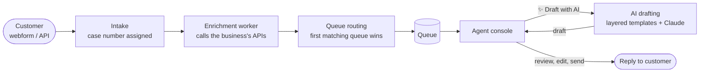

# Local CRM

A customer care **resolution engine**. It takes in customer cases, enriches them with data from the business's own systems, routes each one to the right queue, decides compensation with rules the business configures, and drafts replies with AI for an agent to review.

> **New here?** Business users: read the **[Business handbook](docs/handbooks/business-handbook.md)**. Connecting your own systems: the **[Integration guide](docs/handbooks/integration-guide.md)**. Working on the platform: the **[Developer handbook](docs/handbooks/developer-handbook.md)**.

This README is the **one place to start**. It explains what the product does and how it's built, and links to the detailed guide for each part. Each folder's own README goes deeper, but you shouldn't need to hunt through them.

---

## Contents

1. [Status](#1-status)
2. [How a case flows](#2-how-a-case-flows)
3. [Features](#3-features) (incl. [AI costs](#ai-costs))
4. [Architecture](#4-architecture)
5. [Quick start](#5-quick-start)
6. [Developing](#6-developing)
7. [Documentation map](#7-documentation-map)
8. [Principles](#8-principles)

---

## 1. Status

Early, but working end to end on a laptop.

| Area | State |
|---|---|
| Case intake (API + test webform), lifecycle, replies, internal notes, audit trail | ✅ Built |
| Queue routing (rule builder, priorities, live "which queue?" test), manual reroute | ✅ Built |
| Operations Portal: dashboard, queues, connectors, credentials, prompt templates, sample cases | ✅ Built |
| Enrichment: connectors to any HTTP API, shared credentials (API key, bearer, basic, OAuth 2.0, generated tokens), background worker | ✅ Built |
| Intake pipeline view: diagram of every step a case goes through, plus each case's run (Step Functions–style) | ✅ Built |
| AI reply drafting: layered Jinja prompt templates, PII masking, test lab across Claude models, cost projections | ✅ Built (needs an Anthropic API key) |
| Compensation matrix: rules, guardrails (approval threshold, repeat claims), approvals, backtest | ✅ Built |
| Payouts (actually issuing compensation) | ⏭️ Next |
| Real email / channel connectors, SLA timers, approvals, AI auto-send, sign-in | 🗓️ Planned |

---

## 2. How a case flows



Every case moves through a fixed set of statuses. The backend rejects any move that isn't allowed, and every change is written to the audit trail:

```
Intake ──▶ Queued ──▶ AssignedAgent / AssignedAI ──▶ WaitingApproval ──▶ Solved ──▶ Closed
  │                         │                                              │
  └─▶ EnrichmentFailed      └─▶ WaitingOnCustomer ──▶ Queued               └─▶ Queued (reopen)
```

Cases are identified by a **case number**, which is the creation time in Unix microseconds (e.g. `1790812345678901`).

---

## 3. Features

### Cases and the agent console
Agents see the conversation, case details, enrichment results, queue and history. From there they can reply, add internal notes, change status, reroute, or draft with AI. The test webform stands in for a business's website contact form.
→ [frontend/README.md](frontend/README.md) (routes and screens)

### Queue routing
Queues are checked in priority order, and the first one whose conditions match gets the case. Conditions can use case fields, custom attributes and enrichment data (e.g. *category is Delivery* and *orderTotal greater than 500*). The queue editor shows live which queue a real case would land in.
→ [Codebase guide §8](docs/dev/codebase-guide.md#8-queue-matching-routing)

### Enrichment (connectors and credentials)
A connector is an API call configured in the UI: the request (with `{{case fields}}` placeholders), authentication, which response fields to keep, when to run, and the retry policy. Credentials are shared across connectors. Secrets are encrypted and write-only, and generated tokens are cached and refreshed automatically. Calls run on a background worker and are protected against SSRF.
**Operations → Pipeline** draws the whole flow: ① ② ③ API steps in run order (with which step uses data from which), then routing and compensation. Its **Executions** tab shows every case's run step by step, with the request, timing and data returned, like an AWS Step Functions execution graph.
→ [Integration guide](docs/handbooks/integration-guide.md) (for your customers' engineers) · [Codebase guide §10](docs/dev/codebase-guide.md#10-enrichment-connectors-credentials-and-the-worker), [§13](docs/dev/codebase-guide.md#13-intake-pipeline-view)

### AI reply drafting
Each draft is built from **Jinja templates in layers**. If two layers conflict, the earlier one wins:

| # | Layer | Template | Who edits it |
|---|---|---|---|
| 1 | Platform rules | `_platform/guardrails.jinja` | Nobody (locked) |
| 2 | Baseline: tone and empathy for every reply | `base.jinja` | Each business |
| 3 | Persona: voice, empathy level, greeting, sign-off | `queue/<Queue>.jinja`, or the default persona | Each business |
| 4 | Case type: what to answer and how | `category/<Type>_<Category>_<Sub>.jinja`, falling back to broader templates | Each business |

Personal data is masked before the prompt is built and restored afterwards. Each draft is checked for word limits, required and banned phrases, and invented contact details, and an agent always reviews it before it's sent. Managers can preview the exact prompt for any case for free, compare Haiku / Sonnet / Opus in the **test lab** (quality, consistency, speed, cost), and see **monthly cost projections**.
→ [Template author guide](backend/app/ai/templates/README.md) · [Codebase guide §11](docs/dev/codebase-guide.md#11-ai-reply-drafting) · [Try it](docs/dev/local-setup.md)

### AI costs

Prices per million tokens (input / output): **Haiku 4.5** $1 / $5, **Sonnet 5** $2 / $10, **Opus 5** $5 / $25. Every cost in the app is calculated from the table in `backend/app/ai/models.py`.

A typical draft with the starter templates uses about **2,000 input tokens and 350 output tokens**:

| Model | Per reply | Per 1,000 replies | 10,000 replies / month |
|---|---|---|---|
| Haiku 4.5 | ~$0.004 | ~$4 | ~$38 |
| **Sonnet 5 (default)** | **~$0.0075** | **~$7.50** | **~$75** |
| Opus 5 | ~$0.019 | ~$19 | ~$190 |

**Measured live (1 Oct 2026, starter templates):**

| Test | Model | Cost per reply | Time | Result |
|---|---|---|---|---|
| Late-delivery case with a prompt-injection attempt | Sonnet 5 | $0.0077 | 6.3s | Passed every check, refused to promise a refund, flagged for an agent |
| Missing-parcel sample, 2 runs | Sonnet 5 | $0.0075 | 4.4s | Passed every check, flagged the refund demand both times |
| Missing-parcel sample, 2 runs | Haiku 4.5 | $0.0026 | 5.3s | Passed the automated checks, but invented a "2 business days" timeline and hinted at a refund |

**After tightening the rules (5 Oct 2026):** a platform rule against unsupported timeframes, an escalation rule for refund requests, reworded starter templates, and automatic warnings for invented timeframes and undecided offers.

| Test | Model | Cost per reply | Result |
|---|---|---|---|
| Missing-parcel sample, 2 runs | Haiku 4.5 | $0.0026 | No warnings, both flagged the refund request for an agent. One draft dropped the sign-off (now a check). |
| Missing-parcel sample, 2 runs | Sonnet 5 | $0.0076 | No warnings, both flagged the refund request, more consistent wording |

Notes:
- **Sonnet 5 is the default.** Haiku is about 3× cheaper. After the rule changes it behaved correctly in testing, but its wording varies more between runs. Compare models on your own cases in a template's **test lab** before switching a queue.
- The in-app **cost projection** uses measured usage once drafts or test runs exist. Before that it's an estimate, which ran about 30% low in testing.
- Prompt caching is set up but isn't reducing costs yet: the cached part of the prompt is probably below the minimum cacheable length.
- A test-lab run shows its estimated cost before you start it. The run above (4 drafts) cost $0.02.

### Compensation matrix
Each business writes its own rules for what a customer gets: a refund, credit, voucher, replacement, points, or nothing. They're checked in priority order and the first match decides. The amount is fixed or a percentage of a case value (e.g. 25% of the order total), with an optional cap. A decision goes to a person for approval when the rule says so, the amount is above the queue's threshold, or the customer was compensated recently. The **backtest** shows what the rules would have decided and cost on recent cases before you switch them on. AI drafts only mention compensation once it's approved.
→ [Codebase guide §12](docs/dev/codebase-guide.md#12-compensation-matrix)

### Operations Portal
This is for managers. It has a dashboard (open cases, a queue × status table), the intake pipeline view, and the editors for queues, connectors, credentials, compensation rules, prompt templates and sample cases.

---

## 4. Architecture

| Part | Technology |
|---|---|
| API | Python 3.12, FastAPI, Pydantic, SQLAlchemy 2, Alembic |
| Database | Postgres 17 (JSONB for flexible per-business data) |
| Background work | Worker process using a Postgres job queue (`FOR UPDATE SKIP LOCKED`) |
| AI | Anthropic Claude (Haiku 4.5, Sonnet 5, Opus 5) via the official SDK; Jinja2 sandbox for templates |
| UI | React 19, TypeScript, Vite, React Router |
| Local stack | Docker Compose |
| CI | GitHub Actions: lint, strict types and tests for backend and frontend, migrations against real Postgres |

The backend is layered: **api → services → domain / repositories → models**. Each layer only talks to the one below it, and every query is scoped to a tenant. Details: [Codebase guide §1](docs/dev/codebase-guide.md#1-the-layers).

**Docker Compose services**

| Service | What | Port |
|---|---|---|
| `db` | Postgres | 5432 |
| `api` | FastAPI (applies migrations on start) | 8000 (`/docs` for interactive API docs) |
| `worker` | Background jobs: enrichment, test-lab runs | – |
| `mocks` | Fake shop/shipping API for demos | 8100 |
| `ui` | React app | 5173 |

**Repository layout**

```
.
├── backend/              FastAPI API, worker, migrations, tests   → backend/README.md
│   └── app/ai/templates/ Prompt template layers + starter pack     → its README.md
├── frontend/             React UI                                  → frontend/README.md
├── docs/
│   ├── handbooks/        Business and developer handbooks (+ screenshots and the script that makes them)
│   ├── dev/              Developer guides (setup, codebase, database)
│   ├── 04-product-ideas.md  Running log of product ideas and feedback
│   ├── 05-data-model.md     Long-term data model
│   └── 01–03                Background architecture notes (sanitized)
├── docker-compose.yml    Local stack
└── .github/workflows/    CI
```

---

## 5. Quick start

Install [Docker Desktop](https://www.docker.com/products/docker-desktop/), then run:

```bash
docker compose up --build
```

- App: **http://localhost:5173** (agent console, test webform, Operations Portal)
- API docs: **http://localhost:8000/docs**

**To turn on AI drafting** you need an Anthropic API key (from https://console.anthropic.com → Settings → API keys):

```bash
cp .env.example .env          # then set ANTHROPIC_API_KEY=sk-ant-... in .env
docker compose up -d          # restart so the API and worker read it
```

`.env` is git-ignored. Never put the key anywhere else. Then tick **Allow AI to draft replies** on a queue. Step-by-step instructions and troubleshooting: [Turn on AI drafting](docs/dev/local-setup.md#turn-on-ai-drafting-anthropic-api-key).

**Load demo data** (a made-up shop with queues, connectors, compensation rules and cases):

```bash
cd backend && uv run python scripts/seed_demo.py
```

Then follow the [Business handbook](docs/handbooks/business-handbook.md). For running without Docker and step-by-step walkthroughs, see [docs/dev/local-setup.md](docs/dev/local-setup.md).

---

## 6. Developing

| Task | Command (from the folder) |
|---|---|
| Backend tests, types, lint | `cd backend && uv run pytest && uv run mypy app tests scripts && uv run ruff check .` |
| Frontend tests, types, build | `cd frontend && npm test && npm run typecheck && npm run build` |
| New database migration | `cd backend && uv run alembic revision --autogenerate -m "…"` (then read it) |

CI runs all of these on every pull request. To add a feature, follow the worked example in [Codebase guide §4](docs/dev/codebase-guide.md#4-adding-a-feature-worked-example).

---

## 7. Documentation map

| Document | For | What's in it |
|---|---|---|
| **This README** | Everyone | What it is, how it works, where everything is |
| [**Business handbook**](docs/handbooks/business-handbook.md) | Agents, team leads, managers | How to use every feature, with screenshots; recipes; troubleshooting |
| [**Integration guide**](docs/handbooks/integration-guide.md) | A business's own engineers | Connecting their APIs: request templates, authentication, picking fields, chaining steps, failures, executions, API automation, security, checklist |
| [**Developer handbook**](docs/handbooks/developer-handbook.md) | New engineers | Day-one setup with demo data, how a case flows through the code, feature map, rules, recipes, first week |
| [docs/dev/local-setup.md](docs/dev/local-setup.md) | Anyone running it | Docker and non-Docker setup, walkthroughs, AI key, troubleshooting |
| [docs/dev/codebase-guide.md](docs/dev/codebase-guide.md) | Developers | Layers, request walkthrough, conventions, routing / enrichment / AI / compensation internals, full API endpoint list |
| [docs/dev/database-guide.md](docs/dev/database-guide.md) | Developers | Tables today, columns vs JSON, migrations, transactions, locking (written for document-database developers) |
| [backend/README.md](backend/README.md) | Backend developers | Commands and a map of every backend folder |
| [frontend/README.md](frontend/README.md) | Frontend developers | Routes, components, conventions, tests |
| [backend/app/ai/templates/README.md](backend/app/ai/templates/README.md) | Template authors | Layers, naming, header checks, available variables, sandbox rules |
| [docs/05-data-model.md](docs/05-data-model.md) | Product / architecture | Long-term data model, including parts not built yet |
| [docs/04-product-ideas.md](docs/04-product-ideas.md) | Product | Running log of product ideas and feedback |
| [docs/README.md](docs/README.md) → 01–03 | Background | Sanitized architecture notes from earlier customer care and GenAI work that inspired this design |

**Keeping docs current:** when a change affects behavior, update the detailed guide it belongs to *and* the matching line here (status table, feature summary or documentation map).

---

## 8. Principles

1. **The AI never decides anything that matters.** Compensation comes from rules the business configures (the compensation matrix), and the AI only mentions it once it's approved. The model only writes the reply.
2. **A human reviews every draft** until a queue explicitly allows otherwise.
3. **The model never sees raw personal data.** It's masked before the prompt is built and restored afterwards.
4. **Everything is auditable.** Every status change, reroute, enrichment and draft is recorded with who did it and why.
5. **One business can never see another's data.** Every query is scoped to a tenant.
