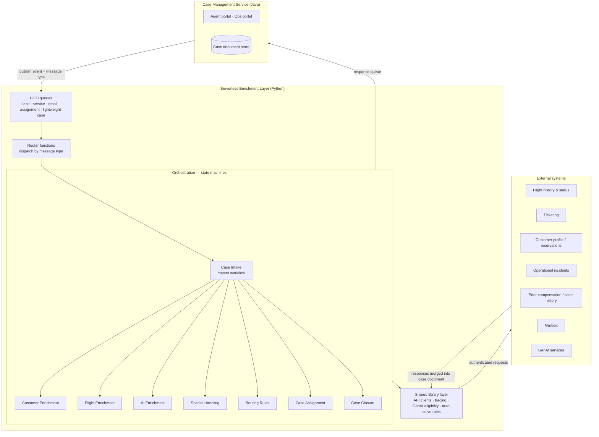

# 1. Customer Care Platform Architecture

> Sanitized architecture overview. Internal system names, queue names, hostnames and account details have been replaced with generic descriptions.

## 1.1 Purpose

When a passenger contacts customer care by webform or email, a case is created. Before an agent opens it, the platform **enriches** the case with everything the agent (and the GenAI drafting service) will need:

- who the customer is: profile, loyalty tier, prior contact history
- what actually happened to their trip: booked vs. flown itinerary, delays, cancellations, rebookings
- prior compensation and related cases
- AI-generated insights: summary, sentiment, categorization
- routing: which queue or agent the case belongs to, or whether it can be auto-resolved

The enrichment runs as an **event-driven serverless layer** behind a Java case-management application.

## 1.2 High-level architecture

### Supporting services

| Service | Role |
|---|---|
| Object storage | Offloads large queue payloads. Stores correspondence so it never travels inside messages. Holds deployment artifacts. |
| Scheduled event rules | Token refresh, batch email processing, attachment cleanup, customer and on-hold notifications. |
| Parameter store + shared layers | Versioned shared libraries (XML parsing, queue helpers, APM agent) resolved by environment. |
| Infrastructure as code | One nested stack per service directory, deployed per environment. |

## 1.3 Key flows

### Ingestion: queues and routers

- The case service publishes an event to one of several **FIFO queues**, tagged with a message-type attribute.
- **Per-case ordering is load-bearing.** The message group ID keys on the case, so events for the same case are processed strictly in order while different cases run in parallel.
- **Router functions** are the only entry point. They look up the message type in a mapping table and start the matching state machine or function.
- Routers handle three concerns centrally:
  - **large-payload offload** to object storage
  - **partial batch failure**, so only failed messages are retried
  - **FIFO group blocking**, so a failure doesn't let later events for the same case overtake it
- Executions are named `{caseId}_{uuid}` so every run can be traced back to a case.

### Orchestration: Case Intake

**Case Intake** is the master workflow (~26 steps). It threads a single mutable **case document** through every stage:

1. Validate the case and channel (webform / email / other)
2. **Customer Enrichment**: map over every passenger on the case
3. **Flight Enrichment**: the deepest sub-tree. The data provider for each segment is picked at runtime by live lookup rules:
   - full itinerary (authoritative source)
   - trip narrative / recent flights
   - operational incidents per segment
   - flight details and ticket data (XML)
4. Check for prior compensation or case history
5. **AI Enrichment**: summary, sentiment, coding and categorization
6. **Special Handling**: map over customers for special-service flags
7. Status updates and case modification
8. **Routing Rules** → **Case Assignment**: queue matching, auto-acknowledgement, GenAI eligibility
9. Case grouping and cleanup. **Case Closure** handles parent/child cases.

Intake is wrapped in a parallel state so the response-queue address is carried through every branch. The finished document goes back to the Java service on a response queue.

### Shared library layer

Every function uses one shared Python layer:

- **One HTTP transport** for every outbound call: a pooled client with built-in tracing and structured logs. Trace and span IDs come from the queue message attributes, so one case can be followed end to end across services.
- Domain helpers for internal APIs and external providers.
- **GenAI eligibility rules**: which cases may get an AI-drafted reply at all.
- **Auto-solve rules**: which cases can be resolved without an agent.

## 1.4 Conventions

- Consistent resource naming: `{app}-{env}-{logicalName}`.
- Each function is a small `lambda_handler → main()` module. Enrichments come in **API + merge pairs**: one function calls the provider, a second merges the result into the case document.
- Unit test suite per function (~150 functions, ~147 test suites).
- Deployment resolves cross-stack references to literal values at build time. That keeps rollback safe and avoids delete-ordering problems between stacks, and the build fails if any unresolved import remains.

## 1.5 Scale

| Dimension | Approx. |
|---|---|
| Serverless functions | ~150 |
| State machines | ~27 |
| Infrastructure stacks | ~22 |
| External providers | 9 |
| Runtime | Python 3.12 |

## 1.6 Lessons learned

- **Centralize credential refresh.** Tokens refreshed by a scheduled job that edits a hard-coded list of functions is fragile: every new function has to be remembered. A shared secret cache or a token-vending function scales better.
- **Ordering guarantees belong in the design doc.** FIFO group semantics were critical to correctness but invisible in the code.
- **API + merge pairs** keep provider failures isolated. A failed enrichment degrades the case instead of blocking it.

## 1.7 My enhancement ideas

> _Add your own architecture ideas here._

- [ ] Idea:
- [ ] Idea:
- [ ] Idea:
