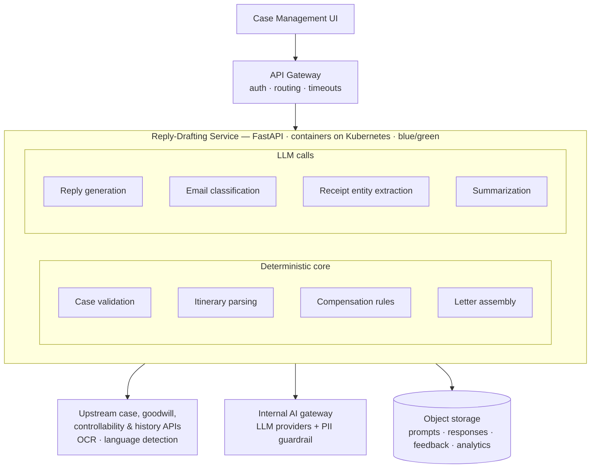
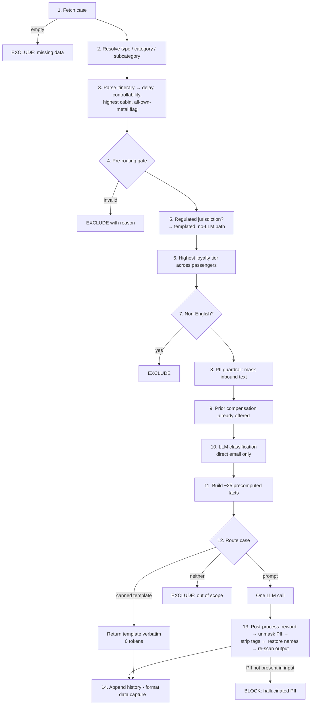
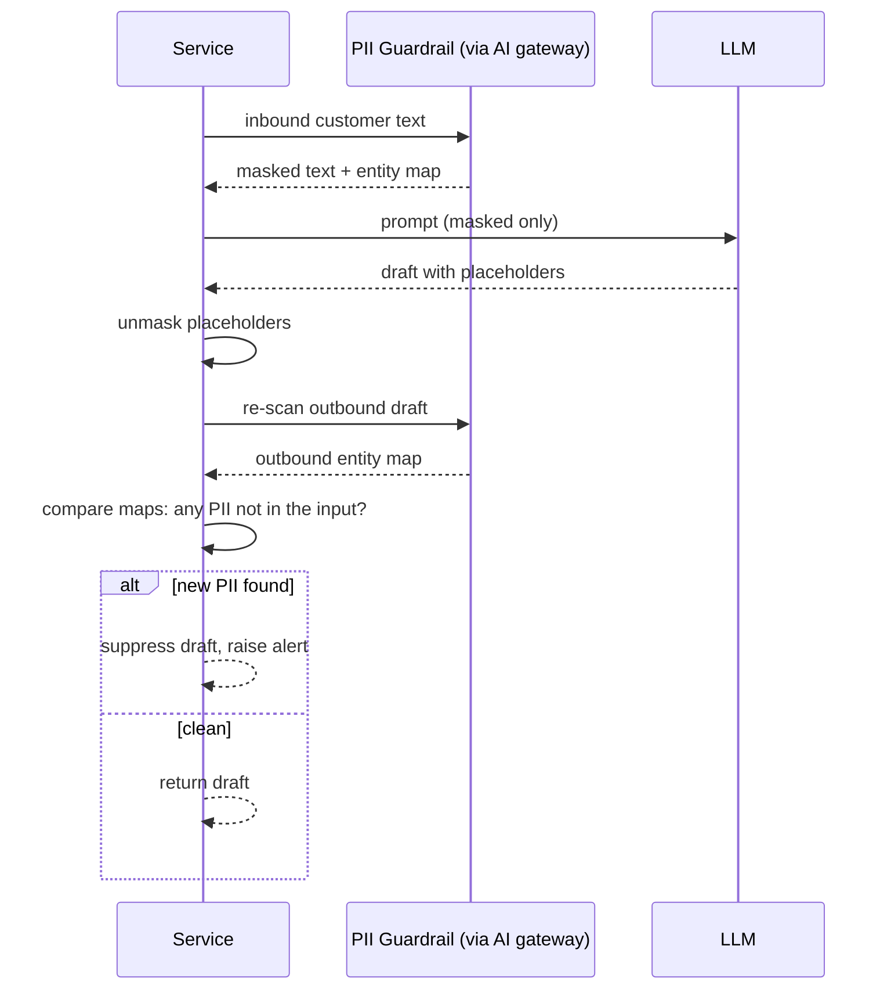

# 2. GenAI Reply-Drafting Service

> Sanitized architecture overview. Hostnames, credentials, internal platform names, repository paths and proprietary business thresholds have been removed or generalized.

## 2.1 What it does

Customer care agents work cases: a passenger writes in about a delay, a lost-bag expense, a rude interaction, or to compliment a crew member. The agent has to read the case, check the trip history, decide whether compensation is owed, and write a reply.

This service **drafts that reply**. It is a stateless Python/FastAPI service that:

1. takes a case ID
2. fetches everything known about the case from upstream systems
3. decides **deterministically** what the passenger is entitled to
4. asks an LLM to write the prose

The agent then reviews the draft and sends, edits or discards it.

It also produces:

- **case summaries** for the agent's sidebar (what the customer wants, plus a per-itinerary trip analysis)
- **Flight Disruption Verification letters**: formal delay-verification documents a passenger can give to an insurer or employer

## 2.2 Where it sits

**Every outbound AI call goes through an internal AI gateway**, both LLM calls and PII-guardrail calls. The application never calls a model vendor SDK directly. Egress uses short-lived, locally minted service tokens cached in-process with a safety margin before expiry.

## 2.3 Request lifecycle

The whole service is one pipeline. All mutable state lives on a single **response context** object that is passed through every stage and updated in place. Handlers communicate by writing to the context, not by returning values.

### Things worth knowing about this pipeline

- **One LLM call per reply.** No agent loop, no tool use, no self-critique. The handler builds one prompt and the response is post-processed. Only the verification-letter and reimbursement paths make extra LLM calls for sub-tasks.
- **The LLM never sees raw PII.** Names, emails, phone numbers and card numbers are replaced with placeholders (`Username_1`, `Email_2`) before the prompt is built and restored afterwards.
- **Audit trail.** A growing list of human-readable "case response checks" records every decision: why a case was excluded, what loyalty status was passed to the model, which data source won a conflict. It is returned to the caller and persisted, and it is the first thing to read when debugging a production case.
- **Evidence panel.** A fixed-shape set of `{checked, value}` entries that the UI renders, so the agent can see exactly what the recommendation was based on.

## 2.4 Case taxonomy and routing

Routing is **deterministic string matching** on type / category / subcategory, not model classification. The one exception is inbound direct email, where the category is unknown and an LLM classifies it first.

The dispatcher checks in a fixed order, and **order matters**: the verification-letter queue check comes before everything else.

| Order | Case | Handler | LLM calls |
|---|---|---|---|
| 1 | Flight disruption verification request | Verification-letter generator | 2 |
| 2 | Complaint / Flight disruption / Delay | Delay handler | 1 |
| 3 | Complaint / Flight disruption / Cancellation | Cancellation handler | 1 |
| 4 | Complaint or Question / Reimbursement / Disruption expenses | Reimbursement orchestrator | 1 + per receipt |
| 5 | Complaint / Inflight experience | Inflight handler | 1 |
| 6 | Complaint / Employee experience | Employee handler | 1 |
| 7 | Complaint / Airport experience | Airport handler | 1 |
| 8 | Compliment (any) | Compliment handler | 1 |
| 9 | Regulated-jurisdiction complaint | Templated regulatory letter | **0** |

Anything that matches no branch is excluded as out of scope.

### The pre-routing gate

Before any routing, a validation gate rejects cases with:

- an empty body
- an unsupported channel or locale
- a missing primary passenger
- attachments with too little text to act on
- third-party involvement

It also rejects **keyword hits across four families**:

| Family | Intent |
|---|---|
| Sensitive | Threats, abuse, security incidents, and similar |
| Medical / accessibility | Routed to specialist human teams |
| Regulatory | Jurisdictions with their own aviation regulators |
| Out of scope | Safety, security, unaccompanied minors, connectivity |

These are **word-boundary substring/regex matches with no semantic understanding**. They over-trigger on purpose, and they are the service's bluntest and most important safety mechanism. Individual handlers also carry their own subcategory deny-lists.

## 2.5 The LLM layer

- **One invocation path** wraps a platform LLM SDK (LangChain-based) and runs it in a thread-pool executor so the synchronous chain can be awaited.
- **Two model tiers**, both reached through the AI gateway via aliases rather than vendor model IDs:
  - **Primary tier**: all complaint and compliment replies, plus inbound-email classification
  - **Secondary tier**: verification-letter reasons, summaries and receipt extraction
- **Parameters:** low temperature (0.3), no max-token cap. `top_p` is left out because newer models reject it alongside `temperature`.
- **Traceability:** each call carries a session ID built from a random prefix plus the case ID. The same tag prefixes every log line for that request, which is the correlation key across the service and the AI platform.
- The **system prompt** comes from configuration. The **user message** is the fully rendered template. The response's answer field is the assistant text.

## 2.6 The deterministic core

This is where the real complexity lives, and it is all plain synchronous Python.

### Itinerary reconciliation

A case can contain several itineraries. For each one, a parser reconciles **intended** segments (what was booked) against **actual** segments (what was flown) to answer:

- How late did the passenger arrive?
- Whose fault was it (controllability)?
- What cabin were they in?
- Was the whole trip on the airline's own aircraft?

Key behaviours:

- **Controllability precedence is strict.** The itinerary-level value wins. The segment-level value is only used as a fallback, and when it is, that is flagged so downstream code knows the weaker source was used.
- **Rebooking is inferred.** An actual segment that matches no intended segment on carrier, flight number, date, origin and destination is marked as a rebooking.
- **Delay is read from authoritative upstream fields, never computed from timestamps.**

### Compensation

This part is **100% deterministic, with no LLM**. The rule inputs are:

- arrival delay
- premium-cabin flag
- loyalty mix across passengers
- controllability

The output is a per-passenger entitlement: travel credit, loyalty miles, or an apology only. Amounts come from an upstream goodwill API rather than hard-coded values. Loyalty members are compensated in miles and non-members in travel credit.

### Reimbursement: an eight-stage receipt pipeline

| Stage | What | Uses |
|---|---|---|
| 1 | Match receipt entries to case attachments | — |
| 2 | Build a currency-rate table from the case's own totals | — |
| 3 | Convert customer-entered amounts to base currency | — |
| 4 | OCR the receipts (PDFs split and batched), then PII-mask the text | OCR service |
| 5 | Language detection | NLP service |
| 6 | Extract merchant, total, currency, date, category and location from the masked text | LLM |
| 7 | Convert extracted amounts to base currency | — |
| 8 | Validate: required fields, language, category, currency match, agreement with the customer's figure within tolerance, date inside the disruption window | — |

The recommendation is then fully deterministic: a **cap** based on region, disruption duration and passenger count, with override conditions for top-tier customers, premium cabins and diversions. The payout is the lesser of the receipt total and the cap.

- **Customer-declared amounts drive the payout.** LLM-extracted amounts are used **only as a cross-check**.
- The reply-writing LLM gets **only the numeric decision and a few flags**. No receipt text, merchant names or line items are ever sent to it.
- If rendering fails, the service **declines rather than sending a half-built letter**.

### Verification letters

A single LLM call produces **only the reason description string**. The rest of the letter is assembled deterministically: dates, ordinals, 12-hour times, three itinerary renderings (intended / rebooked / actual), traveller list, and fixed opening and closing paragraphs. A second LLM call writes the covering note to the agent.

### Regulated jurisdictions: the zero-token path

For passengers covered by passenger-rights regulation in certain regions, the service:

1. computes eligibility from delay thresholds and disruption reason codes
2. maps the reason code to one of about ten **canned letter templates**
3. renders the template and returns it with **no LLM call at all** (token counts are logged as zero)

An unrecognised reason code **bails out instead of guessing**, which is the right behaviour for a legal document. Top-tier customers are excluded from this path completely and always go to a human.

## 2.7 Guardrails and PII

- **Inbound:** the guardrail masks entities (person, email, phone, card, government ID, bank details, and more), replacing the longest span first. If the guardrail fails, the **request fails outright** rather than degrading. That makes it a hard dependency, which is the right trade-off given what it protects.
- **Outbound:** a **hallucinated-PII detector**. If the draft contains personal data that was not in the input, the response is blocked and returned empty with the alert as the reason. This check blocks the draft; it is not just advisory.
- Where a letter legitimately quotes an identifier (such as the case number), it is swapped for a placeholder before the outbound scan and restored afterwards, so it doesn't cause a false positive.

## 2.8 Runtime and deployment

- Containerized FastAPI service on Kubernetes, one environment each for **dev / staging / production**, with more replicas in production.
- **Blue/green rollouts with manual promotion.**
- All traffic enters through an **API gateway** with path-based routing and long timeouts suited to LLM latency.
- Configuration has two layers:
  - committed defaults for local development
  - per-environment Helm values rendered into a ConfigMap that **replaces** the committed file at deploy time

  Secrets are injected separately from a secrets manager.
- Observability: APM auto-instrumentation plus structured JSON logs to stdout.

## 2.9 Telemetry and the quality loop

There is **no database**. Persistence is object-storage "data capture" per route: responses, summaries, analytics, feedback and batch runs.

Each generation captures:

- the full prompt and **prompt version**
- the response (both raw and post-processed)
- token counts and latency
- the audit trail and both PII entity maps
- a **per-phase timing trace**, so latency can be attributed to a stage

The quality loop comes from two signals:

- **Did the agent edit the draft before sending?** This is the most valuable business signal.
- Agent **feedback**: liked, rating, and categories.

A data-capture failure is logged and never fails the request.

> Because entity maps key on the real values, the capture store holds customer PII and must be governed as such.

### Other entry points

- **Batch generation:** up to a few hundred case IDs, run as a background task with a small concurrency limit and staggered starts to avoid LLM throttling. Results land as a file in object storage. This doubles as the **evaluation harness**.
- **Summarization:** the agent-sidebar summary, tightly constrained to be factual and to avoid inventing anything the flight data doesn't support.

## 2.10 Lessons learned

- **Keep the LLM on the phrasing side of the line.** Every number in an outgoing letter comes from a rules engine or an upstream API. That one decision removes most of the risk surface.
- **Treat refusal as a feature.** A large share of the code exists to *exclude* cases, and that is why the system is safe to put in front of real customers.
- **Resilience at the LLM boundary matters.** Timeouts, retries and circuit breakers should be explicit at the call site rather than left to the gateway's timeout.
- **Fail loudly on upstream errors.** Clients that return `None` on a non-200 surface later as confusing type errors.
- **Invest in CI gates early.** Linting, type checking and a regression run on pull requests pay for themselves quickly in an LLM app, where behaviour changes are subtle.
- **Log levels vs. production debugging.** If production only logs errors, the audit trail and data capture become the real debugging tools, so design them as such.

## 2.11 My enhancement ideas

> _Add your own architecture ideas here._

- [ ] Idea:
- [ ] Idea:
- [ ] Idea:
