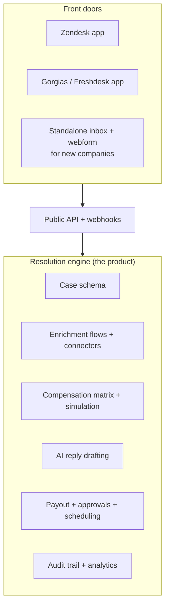
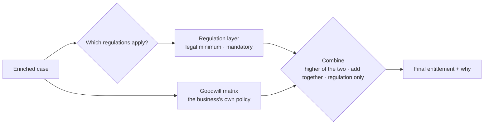
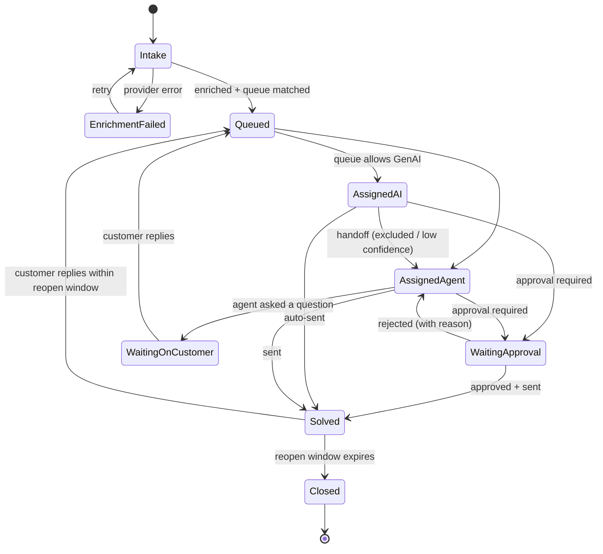

# 4. Product Ideas — Customer Care Resolution Platform

Running log of my product ideas, with feedback and open questions. Newest ideas at the bottom.

---

## Idea 1 — Build my own sellable platform

Sell it to small businesses first and grow into large enterprises.

**Feedback**
- Position it as a **resolution engine**, not a helpdesk. Enrichment, deterministic decisions, compensation and AI-written replies sitting on top of existing helpdesks (Zendesk, Salesforce, Freshdesk, Gorgias) is a clearer wedge than replacing them.
- Start with **one vertical**. E-commerce is the best small-business starting point: standard APIs (Shopify, Stripe, carrier tracking) and high volumes of refund and delay cases. Travel, hospitality and telecom outage credits come later.
- Enterprise needs more before it buys: SSO, audit logs, SOC 2, data residency, private networking. Plan pricing tiers around this.
- Pricing idea: charge **per resolved case** (outcome-based), not per seat.

## Idea 2 — Configurable case schema and enrichment flows

Keep the enrichment flow model, but let each customer configure it through a UI:
- design their own case document / intake form
- configure APIs, pick the response type, run a test call, choose which fields to keep for enrichment

**Feedback**
- **Case schema designer:** use versioned JSON Schema underneath. The hard part is schema changes when cases already exist, so plan for versioning and migration from day one. Start with templates plus custom fields rather than a blank canvas.
- **Connector builder flow:** auth type (API key, OAuth2, basic) → request template using case fields as variables → **test with a sample case** → auto-detect JSON/XML and infer the response shape → field picker that creates mappings into case fields → optional transforms (dates, currency, units).
- Auto-detect the response type instead of asking the user to pick it from a dropdown.
- **Pre-built connectors are the real value.** Most customers won't configure raw APIs. Consider embedding an integration provider (e.g. Nango, Merge, Paragon) instead of building everything yourself.
- **Flow engine:** run tenant flows on one generic engine (e.g. Temporal, or your own interpreter reading a flow definition) instead of deploying separate cloud state machines per tenant.
- Carry over the lessons from the airline project:
  - each enrichment step fails on its own and degrades the case instead of blocking it
  - timeouts and retries configurable per connector
  - events for the same case processed in order
  - end-to-end tracing per case
- **Security:** a secrets vault per tenant, and **SSRF protection**. Customers will be pointing your servers at URLs they choose.

## Idea 3 — Customer-designed compensation matrix and auto-resolution

- The customer builds their own compensation matrix.
- If an enriched case meets a rule's criteria, the compensation is attached to the case.
- Send options: send immediately, require approval, or delay the automatic response.

**Feedback**
- **Decision-table UI:** condition columns are case fields, output columns are compensation type and amount. Borrow DMN concepts such as hit policy (first match, priority, highest value).
- **Make the send option part of each rule, not a global setting.** For example: under $25 auto-send, $25–$200 manager approval, above $200 always human.
- **Guardrails:**
  - caps per customer per time period
  - total budget limits
  - repeat-claimant / fraud checks
- **Simulation / backtest before going live:** "run this matrix against the last 90 days of cases — here's what it would have cost." This is a strong selling point.
- **Audit and explainability:** version the matrix, give rules effective dates, and record why each rule fired on each case (the same idea as the "case response checks" audit trail).
- **Fulfillment:** issuing compensation needs payout connectors (refunds, gift cards, loyalty points, credits). **Idempotency is critical** so nobody is ever paid twice. *(Built for Stripe in Oct 2026: refunds, balance credit and voucher codes, one idempotency key per decision. Cash payouts and gift cards still to come.)* Delayed sends need a scheduler that can also cancel if the case changes.
- **Keep the core principle:** the matrix decides the money and the LLM writes the message. AI can also help with setup: suggesting field mappings, drafting a rule from plain English (stored as a deterministic rule), and classifying free-text cases into matrix categories.

## Gaps to think about

- **Intake channels:** email, webform, chat, helpdesk sync.
- **AI reply drafting:** the strongest part of the airline project, and not yet in this plan.
- **Agent workspace:** build your own, or embed into the helpdesk the customer already uses?
- **Analytics:**
  - auto-resolution rate
  - compensation spend
  - agent edit rate on drafts
  - time to resolution
- **Multi-tenancy model:** shared infrastructure with tenant isolation vs. dedicated deployments for enterprise.

## Suggested MVP

1. One vertical (e.g. e-commerce).
2. Intake from one helpdesk integration + email.
3. 3–5 pre-built connectors + a generic REST connector with test and field picker.
4. Compensation decision table with per-rule send options (auto, approval, delay) + simulation.
5. AI-drafted replies with human review.

## Open questions

- Which vertical first?
- Standalone product or add-on to existing helpdesks?
- Building solo or with a team? This affects how much to buy vs. build.

---

## Idea 4 — Standalone *and* add-on, solo founder, aiming for funding or acquisition

- No industry chosen yet.
- Wants both a standalone product (for new companies) and an add-on (for existing helpdesks).
- Solo for now. Long-term goal: funding or acquisition.

### Feedback: one core, two front doors

Build **one engine behind an API**. The add-on and the standalone app are just two ways into it.

- Each front door only converts that helpdesk's tickets into your case format and pushes results back (internal note, draft reply, tags).
- **Build order:** core + **one** helpdesk add-on → a basic standalone intake (webform + email) → more add-ons.
- A full standalone inbox is a big, commoditized build. Delay it until customers ask for it.

### Feedback: choosing an industry

Score each candidate on:

1. how many repetitive compensation or refund cases it has
2. whether those decisions follow rules
3. whether standard APIs exist
4. whether you can reach buyers through app marketplaces
5. your own edge in that industry

| Industry | Strengths | Weaknesses |
|---|---|---|
| **E-commerce / DTC** | Shopify + helpdesk app stores give you distribution. Standard APIs (orders, shipping, Stripe). Short sales cycles. | Crowded with AI support tools. The compensation matrix + simulation has to be the differentiator. |
| **Travel / hospitality** (tour operators, small airlines, hotels, bus/rail) | **Your domain expertise.** Regulated compensation (e.g. EU261) makes rules-based decisions valuable. Strong founder story. | Fragmented legacy systems. Slower, enterprise-style sales. Hard for one person. |
| **B2B SaaS / telecom / ISP outage credits** | Service-level credits are purely rule-based. Clean data (status page + billing). Less crowded. | Fewer cases per customer. Smaller market at the small-business end. |

**Leaning:** validate with **e-commerce as a helpdesk add-on** (fastest feedback, reachable alone), and keep **travel** as the expansion vertical where your experience stands out.

**Before committing:** have 10–15 conversations with support leads in two candidate industries. Ask how they decide compensation today, what it costs them, and what tools they use.

### Feedback: solo-founder scope

- Use managed services everywhere: Postgres, a managed workflow engine (Temporal Cloud / Inngest / Trigger.dev), and managed auth.
- Buy connectors where possible.
- Leave out SSO, custom roles and a full inbox until a paying customer needs them.
- Get working MVP software in front of design partners early. Paying pilots matter more than features.

### Feedback: getting to funding or acquisition

- **Investors look for** a sharp wedge, early revenue or active pilots, and founder–market fit. Your airline GenAI work is the founder–market-fit story.
- **Acquirers:** helpdesk and CX platforms buy automation that their customers already use inside their marketplace. Being a well-rated marketplace add-on makes you visible to them.
- **Keep your IP clean:** no client code or client business rules, everything built from scratch, and your own company holding the IP. Acquirers check this in due diligence.
- Consider a technical or sales co-founder once you have validation. It strengthens a fundraise.

### Open questions (updated)

- Which two industries to interview first?
- Which helpdesk to integrate with first (Zendesk vs. Gorgias vs. Freshdesk)?
- How much time per week can go into this right now?

---

## Idea 5 — Domain knowledge: how airline compensation decisions work

What I know from the airline side, written generically:

- **Controllability** is the main input:
  - *controllable*: aircraft technical issues, staffing
  - *uncontrollable*: weather, air traffic control
- **Delay severity bands**: each band (short / medium / long delay) maps to a compensation category.
- **Case category**, as selected by the customer on the webform.
- **Receipt reimbursement**: an LLM-based OCR reads receipts, and payment for the receipt value is issued through a payout provider.
- **Fraud and repeater checks**: was this customer compensated in the last N months? If so, an agent or manager decides.

### Feedback: this *is* the generic engine

Every piece of the airline model maps onto something every industry has:

| Airline concept | Generic engine concept | E-commerce example | SaaS / telecom example |
|---|---|---|---|
| Controllability | **Fault attribution** | Carrier lost it vs. merchant packed it wrong vs. customer error | Our outage vs. third-party provider |
| Delay bands | **Severity bands** | Days late | Hours of downtime |
| Webform category | **Case type** | Damaged / late / missing / wrong item | Outage / billing / performance |
| Loyalty tier / cabin | **Customer value tier** | VIP / repeat buyer | Plan tier |
| Receipt OCR + payout | **Evidence extraction + payout connector** | Photo of damage, proof of purchase | Invoice |
| Repeater search | **Compensation history check** | Serial refunders | Repeated credit claims |

The matrix editor should be built on these **generic dimensions**. The airline setup then becomes a **"Travel" preset**, which is a strong demo and shows your expertise.

### Product features this suggests

**Severity bands**
- Explicit boundary rules: does exactly 2h00m fall in the lower or upper band?
- A visual band editor.

**Fault attribution**
- Configurable **source precedence**: which data source wins when two disagree, with a fallback when data is missing.
- Record which source was used.

**Compensation history check** (turning the repeater search into rules)
- Configurable lookback window, plus count and amount thresholds.
- Action when triggered: send for approval, reduce the amount, or block.
- The approver sees a **one-screen history summary** instead of searching manually.

**Identity resolution:** fraud checks are only as good as matching the same person across different emails, phone numbers, addresses and payout accounts.

**Receipt pipeline**
- The customer-declared amount drives the payout. The extracted amount is a **cross-check within a tolerance**.
- The receipt date must fall within the incident window.
- **Duplicate receipt detection**: the same receipt submitted twice, or by different customers.
- Currency normalisation.

**Payout connectors**
- Several providers (bank or wallet payouts, card refunds, gift cards, credits/points).
- Idempotent issuing.
- Approval before release above a threshold.

**Fraud signals feeding the matrix:** repeat claims, duplicate evidence, mismatched amounts, new accounts. Combine them into a risk score, and let the matrix route high-risk cases to a human.

> Keep it clean: ship *configurable* dimensions and a travel preset built from public industry norms (e.g. EU261-style rules). Don't copy the former client's actual matrix values.

### Questions to sharpen the product

- What did agents or managers **override most often**? Each override is a missing rule or a missing data point.
- What made the repeater decision hard? Missing context, identity matching, or judgement calls?
- Where did receipt OCR fail most (handwritten receipts, foreign currency, multi-page PDFs)?

---

## Idea 6 — Regulations and priority queues with SLAs

- **Law-based conditions:** EU and UK passenger-rights rules were identified from the case data (e.g. the origin airport being in the EU or UK).
- **Sensitive cases** (harassment, assault) went to dedicated high-priority queues with shorter SLAs, so those customers got a fast response.

### Feedback: regulations as a separate, mandatory layer

Treat regulations as their own layer that sits *under* the customer's own compensation matrix:

- **Deciding which regulations apply is its own rule set.** It usually depends on more than one fact.
  - Example: EU261 generally covers flights *departing* the EU on any airline, and flights *arriving* in the EU on an EU carrier. Origin airport alone doesn't settle it.
  - Build it from multiple conditions: origin, destination, carrier, customer country.
- **Regulation packs:** versioned, ready-made rule sets such as "EU261", "UK261", EU consumer 14-day returns, and telecom outage-credit rules. This is a strong differentiator and a possible premium tier.
  - Include a clear disclaimer, or a legal review partner, because you would be encoding the law.
- **Locked letter templates:** for legally sensitive replies, use pre-approved wording (no AI, or AI allowed to fill only specific slots), like the zero-token regulatory path in the airline system.
- **Audit:** record which regulation applied, which facts triggered it, and which version of the rules was used.

### Feedback: triage → priority → queue → SLA

- **Detecting sensitive cases:** combine a keyword gate (deliberately over-triggers) with an AI classifier (catches phrasing the keywords miss). If either one fires, the case is treated as sensitive.
- **Safety rules for sensitive cases:**
  - never auto-resolve and never auto-send AI replies
  - route to trained specialist queues
  - optionally send an immediate, **pre-approved** acknowledgement so the customer hears back within minutes
- **SLA engine features:**
  - separate first-response and resolution SLAs
  - business-hours calendars and time zones
  - pause the clock while waiting on the customer
  - breach warnings and escalation paths (agent → lead → manager)
  - a hand-off workflow for cases needing legal or safety escalation
- **Deciding vs. enforcing** (architecture point for the dual product):
  - **Add-on mode:** your engine *decides* priority, queue and SLA tier and writes tags and fields back. The helpdesk's own SLA and routing features *enforce* them.
  - **Standalone mode:** you need your own queues and SLA timers. Keep this minimal at first.

### Questions

- How were SLA breaches handled: automatic escalation, reporting only, or both?
- Were there other high-priority categories besides harassment and assault (e.g. medical, accessibility, legal threats, media or social-media exposure)?
- Did regulatory cases ever conflict with goodwill policy? If so, how was the final amount decided?

---

## Idea 7 — Queue configuration, assignment and case lifecycle

### What I described

**Queues and assignment**
- Managers configure queues with **match criteria**: words in the correspondence, case categories, and so on.
- Managers set each queue's **priority**.
- Assignment works like a tree: priority first, then match criteria.
- Managers can **turn GenAI on or off per queue**.

**Lifecycle**
- Intake (created + enrichment) → Assigned to Queue → Assigned to Agent **or** Assigned to AI Agent (which may auto-send) → Waiting for Approval → Solved.
- While within the window, a customer reply sends the case back to an agent or the AI → Solved again, or Waiting for Approval, depending on the queue's settings.
- When the window ends → Closed, and the customer can no longer reply.

### Feedback: the pattern has names

What I built is a mix of three well-known patterns:

| Pattern | Where it shows up |
|---|---|
| **Content-Based Router** (Enterprise Integration Patterns) | Sends a message to a destination based on its content. This is the overall shape. |
| **Decision list / first-match rule engine** | Rules checked in priority order, and the first match wins. This is what "tree-esque by priority" really is. |
| **Specification pattern** | Each match criterion is a small predicate that can be combined with AND / OR / NOT (`keyword("refund") AND category("Delay") AND NOT tier("Top")`). |

**Product features this suggests**
- **A queue is a policy bundle,** not just a bucket:
  - match criteria
  - priority
  - SLA
  - GenAI on/off
  - auto-send allowed?
  - approval required above $X
  - reopen window
- **Safety overrides queue settings:** a sensitive-case flag or a regulatory lock disables AI even if the queue allows it.
- **Fallback queue** so no case ever goes unassigned.
- **Tie-breaking** when two queues share a priority.
- **"Which queue would this case land in?" tester + overlap warnings:** paste a sample case and see which rule matched and why. Warn when a new rule hides an existing one.
- **Queue → agent assignment strategies:** round-robin, least-loaded, skills-based, capacity limits, and "sticky" (a reopened case goes back to the same agent).

### Feedback: model the lifecycle as an explicit state machine

**States and transitions I'd add:**
- **Enrichment Failed / Needs Attention:** an error state, so broken cases don't sit silently in Intake.
- **Waiting on Customer:** the agent asked a question. Pauses the SLA clock.
- **Rejected by approver:** goes back to the agent or AI *with the reason*. That feedback is valuable training and evaluation data.
- **AI → human handoff:** the AI agent must be able to give a case back (excluded, low confidence, sensitive).
- **Reply after Closed:** instead of a dead end, create a **new linked follow-up case** so the history stays connected.
- Optional: **On Hold** (waiting on a third party) and **Merged / Duplicate**.

**Name the two timers separately:**
- **SLA** = how fast *we* must respond or resolve.
- **Reopen window** = how long the *customer* can reply before the case closes.

Keeping them separate avoids confusion in configuration and reporting.

**Implementation notes**
- **One transition table** (allowed from → to, guards, actor), not status fields updated all over the codebase.
- **Every transition is an event** with actor (human / AI / system), reason and timestamp. This gives you the audit trail, time-in-state analytics and SLA tracking for free.
- **Concurrency control:** a human and the AI must never act on the same case at once. Use a case lock or optimistic versioning.
- **Add-on mode:** map your states onto the helpdesk's statuses. For example, Zendesk's new / open / pending / on-hold / solved / closed lines up closely. Keep the finer-grained states in custom fields.

### Questions

- When the AI handled a reopened case, did it see the full earlier thread and its own previous reply?
- Could agents manually move cases between queues? If so, did that override the matching rules for future replies on that case?
- What was the typical reopen window, and did it vary by queue?

---

## Idea 8 — Full-thread context, AI recategorization, per-queue SLAs

### What I described

- **Reopened cases:** the AI analyses the whole thread, including its own earlier replies.
- **Rerouting:** agents reroute cases because customers pick the wrong category.
  - **Enhancement:** an AI agent that recategorizes wrongly filed cases.
  - Correspondence is a **case attribute** and stays with the case across queues. Earlier context is key to decisions.
- **SLAs vary by queue:**
  - harassment: ≤ 24h
  - receipt refunds: 3 days
  - highest loyalty tier: 8h

### Feedback: full-thread context

- **Right call. A few details make it robust:**
  - **Label the roles in the thread** (customer / human agent / AI / system). The model then knows which earlier replies were *its own* and stays consistent with them.
  - **Never contradict an earlier offer.** Anything already promised should be passed in as a fact, just like prior compensation offered.
  - **Keep customer-visible messages separate from internal notes.** Decide on purpose whether the AI sees internal notes, and never let them leak into a reply.
  - **Long threads:** summarize older turns and keep the latest few verbatim, to control context size and cost.
  - Apply PII masking to the **whole thread**, not just the latest message.

### Feedback: AI recategorization

A strong feature, and a natural selling point.

- **Run it at intake, before queue matching,** so wrong cases are corrected before they are routed rather than rerouted afterwards. Queue matching uses the *effective* category.
- **Keep both categories:** the customer-selected one and the corrected one. Never overwrite. The difference is labelled data.
- **Modes, set per queue or per tenant:**
  - suggest only (agent confirms)
  - auto-apply above a confidence threshold
  - always show the reason
- **Asymmetric safety:** the AI may *escalate* a case into a sensitive category automatically, but may **never downgrade** a sensitive case without a human.
- **Recategorizing must re-run downstream decisions.** Category feeds the compensation matrix, regulation checks and GenAI eligibility, so a category change → recompute, keeping the history of the earlier decision.
- **Manual reroute = pinned override.** When an agent moves a case, pin it (with a reason) so the rules engine doesn't send it back on the next customer reply.
- **Feedback loop:**
  - Every manual reroute is a training and evaluation label.
  - Report miscategorization rates per category. If one category is constantly wrong, **fix the webform** (wording, options), not just the classifier.

**Correspondence as a case attribute:** agreed, and generalize it. The **case owns everything**: the thread, the enrichment data, the decisions and the event log. A queue is just a pointer to where the case currently sits. Moving queues never loses context.

### Feedback: per-queue SLAs

- **Watch for queue explosion.** Making separate queues for "top-tier customer" multiplies with every category (tier × category × region...).
  - Alternative: **SLA = queue base SLA + modifiers** (customer tier, sensitivity, regulation), and the **strictest wins**.
  - Example: a top-tier customer with a receipt case → min(3 days, 8h) = **8h**, without a separate queue.
- **Calendar vs. business time:**
  - Sensitive cases likely run on **24/7 clock time**.
  - Refunds may run on **business days**.
  - Make this a per-SLA setting.
- **First-response vs. resolution SLA:** a sensitive queue may need a 1h first response and a 24h resolution.
- **Reporting:** SLA attainment by queue, by tier and by handler (human vs. AI). AI handling should visibly improve SLA numbers, which becomes part of your sales pitch.

### Questions

- When an agent rerouted a case, did its SLA clock reset or carry over from the original creation time?
- Were top-tier customers routed to *separate* queues, or did they share queues with a different SLA?
- Did the AI ever handle sensitive queues at all (e.g. drafting only), or were they fully human?

---

## Idea 9 — Case document shape

My first draft: [case.json](case.json). Suggested next version, using everything above: [case.v2.example.json](case.v2.example.json).

### Feedback on the first draft

| Draft | Issue | Suggested |
|---|---|---|
| `queue` holds description, created date, status | Copies the queue's *configuration* into every case, and it goes stale | Store `assignment.queueId` + which rule matched + when + pinned, plus an assignment **history** |
| `assignedTo: "Support Agent"` | Can't tell a human from the AI | `assignee: { type: human \| ai, id }` |
| `status: "Open"` | Free text | Enum from the lifecycle state machine (Idea 7) |
| Dates like `2024-06-10` | SLAs need times and time zones | ISO 8601 timestamps (`2026-09-28T14:05:12Z`) |
| `customerName` at top level | No stable ID, tier or identity linking | `customer` object: ID, tier, linked identities |
| `issue` as free text | No structure to route or decide on | `category.customerSelected` **and** `category.effective` (Idea 8) |
| `correspondenceType: "Emmail-Customer"` | Typo, and mixes channel + author into one string | Separate `direction`, `channel`, `author.type`, `visibility` |
| `resolution` = one refund | Real cases have several beneficiaries, approval and payout state | `decisions.compensation` (matrix version, rule, disposition) + `payouts[]` with idempotency keys |
| — | Missing | `schemaVersion`, `tenantId`, `sla`, `flags`, `enrichment` (per-connector status and timestamp), `checks` audit trail, tenant-defined `attributes` |

### Design notes

- **The case owns its context**, as agreed in Idea 8. Queue and agent are pointers.
- **Enrichment blocks record where the data came from** (connector, fetch time, status), so a failed provider shows up clearly instead of as missing data.
- **Tenant custom fields go in `attributes`**, validated against that tenant's schema version. The core fields stay fixed so the engine can rely on them.
- **Size:** keep the full event log (and possibly large message bodies and attachments) in separate storage, referenced by `eventsRef`. Case documents that grow without limit become slow and hit storage limits.
- **PII:** the document holds raw PII, so mask it before any AI call (Idea 2 / service doc §2.7) and control who can read which fields.

---

## Idea 10 — Multiple collections

Split data across collections: queues, compensation matrices and so on in their own collections, not just the case document.

**Feedback:** agreed. Worked out in [05-data-model.md](05-data-model.md):
- **Configuration vs. operational** collections.
- Cases refer to configuration by `{id, version}`.
- Messages, events and payouts are split out of the case.
- Every document carries `tenantId`.
- Payouts go through a transactional outbox.
- Recommendation: Postgres + JSONB over a pure document database.

---

## Idea 11 — Can Postgres handle production volume? And local dev setup

**Postgres at scale — rough numbers**

| Load | Cases/day | Writes/day (~20 per case: events, messages, enrichment, AI runs) | Average writes/sec | 10× peak |
|---|---|---|---|---|
| Early customers | 5,000 | 100k | ~1 | ~12 |
| Mid-market | 100,000 | 2M | ~23 | ~230 |
| Large enterprise | 1,000,000 | 20M | ~230 | ~2,300 |

- A single well-sized managed Postgres instance comfortably handles thousands of simple writes per second. The bottleneck will be LLM and external API latency, not the database.
- **Scaling path, in order, and only when needed:**
  1. Bigger instance + connection pooling (PgBouncer)
  2. Read replicas for dashboards and analytics
  3. Partition `caseEvents`, `messages` and `aiRuns` by month, and archive old partitions to object storage
  4. Shard by `tenantId` (e.g. Citus), or give the largest enterprise tenants dedicated databases
- **Managed options:** AWS RDS / Aurora, Google Cloud SQL, Neon, Supabase.

**Local dev: Docker Compose, not one big image or local Kubernetes**
- One container per service (db, api, worker, ui, mock APIs) with one `docker compose up`, mirroring production's separate services.
- Kubernetes is overkill for one person. Deploy to managed containers (ECS Fargate / Cloud Run / Render / Fly.io) first, and move to Kubernetes only if you need it later.

---

## Idea 12 — Backend language and the data-access layer

**Background:** at the airline, a Java service owned the document database and exposed APIs for reading and writing its collections. FastAPI was used only for GenAI generation.

**Feedback**
- **Keep the pattern, drop the extra network hop.** "One layer owns the data and everyone else goes through it" is right. In a solo-founder monolith that layer is a **module** (repositories + domain services), not a separate service. The API and the worker both import it, and nothing else touches the database directly. It can be split into its own service later if a team or scale needs it.
- **Language options**

| Option | Strengths | Weaknesses |
|---|---|---|
| **Python everywhere (FastAPI)** — recommended | One backend language. Best AI, OCR and data libraries. Existing FastAPI experience. API + worker share one codebase. | Needs discipline: strict mypy, Pydantic models, tests in CI from day one |
| Java (Spring Boot) core + Python AI service | Mirrors the airline setup; strong typing | Two languages, two toolchains, two deploy pipelines for one person |
| TypeScript everywhere (Node + React) | One language front to back | New ecosystem to learn; weaker for OCR and data work |

- **Suggested Python stack:**
  - FastAPI + Pydantic
  - SQLAlchemy 2.0 (or SQLModel) + Alembic migrations
  - Postgres
  - worker: a durable workflow/task runner (e.g. Temporal, Inngest, or Celery/Dramatiq to start)
  - strict mypy + pytest running on every PR

---

<!-- Add new ideas below -->
