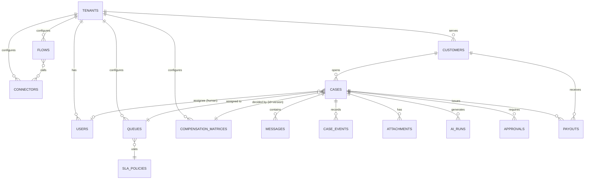

# 5. Data Model — Collections

Draft data model for the resolution platform. It builds on the case document in [case.v2.example.json](case.v2.example.json) and the ideas in [04-product-ideas.md](04-product-ideas.md).

## 5.1 Two kinds of data

| | **Configuration** | **Operational** |
|---|---|---|
| Who writes it | Managers and admins, through the UI | The engine, agents, the AI and customers |
| How often it changes | Rarely | Constantly |
| Shape | Versioned; published versions never change | Append-heavy; high volume |
| Examples | queues, compensation matrices, connectors, SLA policies | cases, messages, events, payouts |

**The key rule:** operational records point to configuration by **`{id, version}`**. A case decided under matrix v7 still says v7 after someone publishes v8. That is what makes decisions auditable and simulations reproducible.

## 5.2 Collections

### Configuration (tenant-scoped, versioned)

| Collection | Holds | Notes |
|---|---|---|
| `tenants` | Company account, plan, region, feature flags | Root of everything |
| `users` | Agents, managers, admins; roles, skills, capacity | Skills and capacity drive agent assignment |
| `caseSchemas` | Tenant's custom case fields (JSON Schema) | Versioned; each case records `schemaVersion` |
| `connectors` | API definitions: auth type, request template, field mappings, timeouts and retries | **Secrets live in a vault**; stored here only as a reference |
| `flows` | Enrichment flow definitions (steps, conditions, map-over-items) | Versioned; run by the flow engine |
| `queues` | Policy bundle: match criteria, priority, GenAI on/off, auto-send, approval thresholds, SLA policy ref, reopen window | Routing rules can live inside the queue |
| `slaPolicies` | Base targets (first response, resolution), clock type, modifiers (tier, sensitivity) | Strictest applicable target wins |
| `compensationMatrices` | Decision tables: conditions → outcome + disposition (auto / approval / delay) | Versioned; draft → published → archived |
| `regulationPacks` | EU261-style rule sets and applicability rules | Versioned; can be shared across tenants |
| `promptTemplates` | AI prompt templates | Versioned; ties to `ai.promptVersion` on messages |
| `letterTemplates` | Locked, pre-approved reply wording | No AI, or AI fills slots only |

### Operational (tenant-scoped, high volume)

| Collection | Holds | Notes |
|---|---|---|
| `customers` | Profile, tier, **identity links** (emails, phones, payout accounts) | Identity links power fraud and repeat-claim checks |
| `cases` | The case document: status, category, flags, assignment, SLA, enrichment, decisions | The "current state" view. Public ID = `case_number` (Unix microseconds); UUID `id` for internal links |
| `messages` | Correspondence, one document per message | Split out of `cases` so case documents don't grow without limit |
| `attachments` | File metadata + OCR/extraction results | Files themselves in object storage |
| `caseEvents` | Append-only state transitions and actions (actor, reason, timestamp) | Audit trail, SLA and time-in-state analytics |
| `approvals` | Pending and decided approvals | Queue of work for approvers |
| `payouts` | Each payment/credit with **idempotency key**, connector, status, schedule | Also the compensation history for repeat-claim lookback |
| `aiRuns` | Every LLM call: prompt version, model, tokens, latency, masked input/output refs | Data capture for evaluation and cost reporting |
| `simulations` | Backtest runs: matrix version × historical cases → projected cost | Powers "what would this matrix have cost" |

## 5.3 Relationships

## 5.4 Rules that keep it tidy

**Two kinds of ID.** Internal links use random UUIDs. People see a **case number**: the creation time in Unix microseconds (e.g. `1790812345678901`), unique, sortable by time, and readable over the phone.

1. **`tenantId` on every document**, and first in every index. That covers isolation and query performance.
2. **Published config never changes.** Editing creates a new draft version, and publishing makes it active. Cases keep the version they were decided with.
3. **Reference config, snapshot outcomes.** A case stores `{matrixId, version, ruleId}` plus the resulting amount. It doesn't copy the matrix.
4. **The case is the current-state view; events are the history.** Every status change writes a `caseEvents` record *and* updates the case in the same transaction.
5. **Money moves through an outbox.** Writing the payout record and the "send payment" job together means a crash can't lose a payment or send one twice. The idempotency key stops duplicates at the payout provider.
6. **Soft limits on embedded arrays.** The case keeps the latest few messages or a summary for quick display. The full thread lives in `messages`.

## 5.5 Key indexes

| Collection | Index | Serves |
|---|---|---|
| `cases` | `tenantId, status, assignment.queueId` | Queue views |
| `cases` | `tenantId, sla.firstResponseDueAt` (open cases only) | SLA breach sweeper |
| `messages` | `caseId, createdAt` | Thread rendering, AI context |
| `caseEvents` | `caseId, at` | Audit timeline |
| `payouts` | `tenantId, customerId, createdAt` | Repeat-claim lookback ("last 90 days") |
| `customers` | `tenantId, identityLinks` | Identity resolution |
| `approvals` | `tenantId, status, approverRole` | Approver inbox |

## 5.6 Database choice

"Collections" suggests a document database (MongoDB / DocumentDB), which fits the flexible case document well.

**Recommendation for a solo founder: PostgreSQL with JSONB.** This data has a lot of relationships (tenants → queues → policies, cases → payouts → approvals), and payouts and approvals need reliable transactions. Postgres gives you that and still stores flexible documents (`attributes`, `enrichment`, config bodies) as JSONB. Each "collection" above becomes a table with a JSONB body where flexibility is needed.

Either works. The design above maps onto both.

## 5.7 Open questions

- Should routing rules live inside `queues` or in their own collection (easier to test and reorder)?
- Should regulation packs be global (maintained by us) with tenant overrides, or copied into each tenant?
- How long do we keep data (retention), especially `aiRuns` and messages containing PII?
