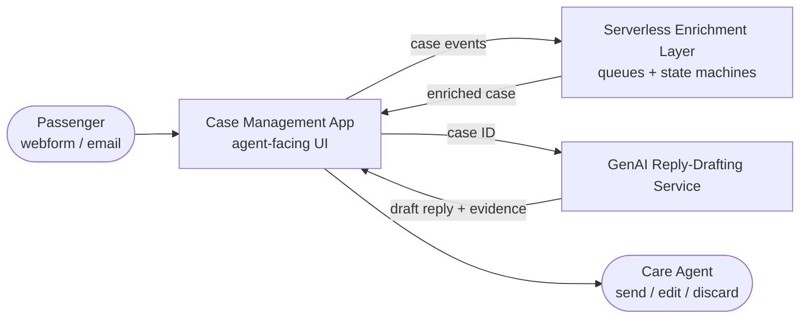

# Airline Customer Care Platform — Architecture Notes

Architecture write-up of a customer care platform I worked on as a contractor for a major airline. It covers how the system is designed and the engineering patterns behind it. It is deliberately **sanitized**: no client name, hostnames, account IDs, credentials, internal product names, repository paths, proprietary business thresholds or verbatim production prompts.

## Documents

| # | Document | What it covers |
|---|----------|----------------|
| 1 | [Customer Care Platform Architecture](01-customer-care-platform.md) | The event-driven, serverless enrichment layer that assembles a complete case (customer, flight, history, AI insights) before an agent opens it. |
| 2 | [GenAI Reply-Drafting Service](02-genai-reply-service.md) | The stateless service that turns a case into a draft reply: deterministic decisioning, routing, the LLM call, PII protection, telemetry. |
| 3 | [Prompt Engineering System](03-prompt-engineering-system.md) | How prompts are structured, versioned, selected and hardened against hallucination and prompt injection. |
| 4 | [Product Ideas](04-product-ideas.md) | Running log of ideas and feedback for my own resolution platform. |
| 5 | [Data Model](05-data-model.md) | Long-term data model: collections, relationships, versioning and indexes. Example case: [case.v2.example.json](case.v2.example.json). |
| — | [Developer guides](dev/) | [Local setup](dev/local-setup.md), [codebase guide](dev/codebase-guide.md), [database guide](dev/database-guide.md). |

For the product built in this repository (Local CRM), start with the [main README](../README.md) and the handbooks: [business](handbooks/business-handbook.md) · [integration](handbooks/integration-guide.md) · [developer](handbooks/developer-handbook.md).

## The system in one picture

## Design principles that run through all three

1. **The LLM never decides anything that matters.** Eligibility, compensation amounts and legal entitlements come from deterministic code or upstream systems. The model only handles tone and phrasing.
2. **Declining to answer is a valid outcome.** Missing data, sensitive topics, medical or accessibility matters, non-English text and regulated jurisdictions all route to a human. No draft is safer than a wrong one.
3. **The model never sees raw PII.** Personal data is masked before prompt assembly and restored afterwards.
4. **Every decision is auditable.** Each request carries a human-readable trail of why it was routed, excluded or drafted the way it was.
5. **A human stays in the loop.** Every draft is reviewed by an agent before it reaches a customer. Whether the agent edits the draft is the main quality signal.
