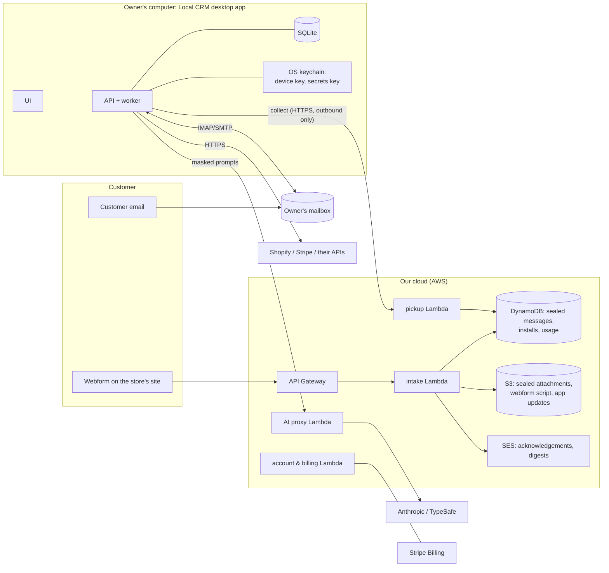
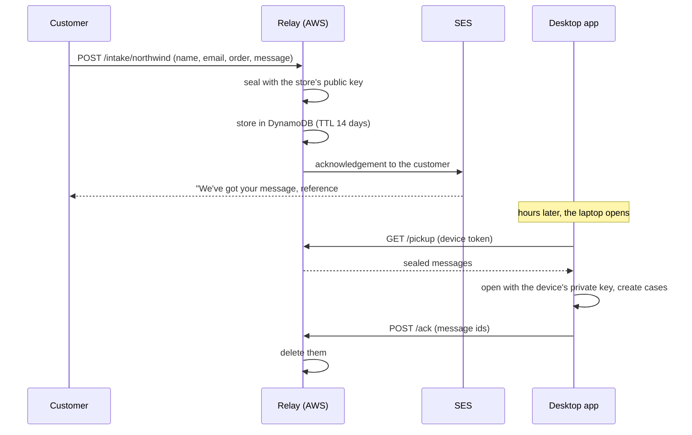

# Architecture v1: a desktop app with a thin cloud relay

Written for engineers joining the project, and for technical due diligence. It describes the architecture we're building **toward** for the first release to small retailers, what exists today, and what has to change to get there. Decided on 2026-10-08.

## Contents

1. [Who v1 is for](#1-who-v1-is-for)
2. [Decisions](#2-decisions)
3. [The picture](#3-the-picture)
4. [The desktop app](#4-the-desktop-app)
5. [The cloud relay (AWS)](#5-the-cloud-relay-aws)
6. [How data flows](#6-how-data-flows)
7. [Security model](#7-security-model)
8. [What it costs to run](#8-what-it-costs-to-run)
9. [From today's code to v1](#9-from-todays-code-to-v1)
10. [Not in v1](#10-not-in-v1)
11. [Open questions](#11-open-questions)

---

## 1. Who v1 is for

Owner-run small retailers: on Shopify, on marketplaces like SHOP.COM, on their own website, or with a shop counter. One person, usually the owner, handles every complaint. That shapes the architecture:

| Constraint | Consequence |
|---|---|
| One user, no IT person | Installs like any app; no Docker, no servers, no API keys to paste. |
| The laptop is often closed | Customers must still get an instant acknowledgement, and nothing may be lost while it's off. |
| Customer data is the owner's | It lives on the owner's machine; our cloud only ever holds it encrypted, briefly. |
| Small budgets | Our cost to serve a store must be a few dollars a month, so the price can be too. |
| Any platform | Email is the universal way in; Shopify, Stripe and connectors are optional integrations. |

## 2. Decisions

| # | Decision | Chosen | Why | Alternatives considered |
|---|---|---|---|---|
| D1 | How owners install it | **Desktop app** (Mac and Windows), built with [Tauri](https://tauri.app) | The only thing a shop owner will actually install; signed installers and automatic updates | Docker for pilots (needs hands-on support); hosted first (cost, and holds customer data) |
| D2 | Database on the owner's machine | **SQLite**, one file | Nothing to run, trivial backups, enough for one user; the test suite already runs on SQLite | Embedded Postgres (bigger install, a background server on a laptop) |
| D3 | Who pays for AI | **Included**: AI calls go through a metered proxy in our cloud, with our keys | Owners never handle API keys; a key shipped inside a desktop app could be extracted | Bring your own key (a hurdle for owners); both (later, for volume customers) |
| D4 | Where the relay runs | **AWS serverless** (CloudFront + WAF, API Gateway, Lambda, DynamoDB, S3, SES) | The founder knows AWS well; cost is about the same as Cloudflare at our scale (free tier covers early use) | Cloudflare Workers (slightly cheaper and simpler at scale); one small server (we'd operate it) |
| D5 | Email | **Stays on the desktop** (IMAP/SMTP from the owner's machine, as today) | The mailbox already stores mail while the laptop is closed; no customer email passes through us | Reading mail in the cloud (would hold customer data, needs OAuth app review) |
| D6 | Voice | **Not in v1** | Small retailers don't want an AI voice yet; costed for later | Higgs Realtime + Twilio, about $0.023 per call-minute |

## 3. The picture



**The desktop app does all the work.** It reads, enriches, decides, drafts, replies and pays out, exactly as the app does today. **The cloud is a mailbox and a toll booth.** It takes in webform messages while the app is closed, acknowledges them, and meters AI. It never sees a case in plain text.

## 4. The desktop app

### Process model

```
Tauri shell (Rust, ~10 MB)
 └─ starts the sidecar: localcrm-backend (our Python app, frozen with PyInstaller)
      ├─ FastAPI on 127.0.0.1:<random port>, serving the built React UI and /api
      ├─ worker loop in a background thread (same jobs as today)
      └─ SQLite file in the OS app-data folder (WAL mode)
 └─ webview opens http://127.0.0.1:<port>
```

- **One process** for API and worker. A laptop doesn't need separate services, and SQLite allows one writer at a time anyway.
- **The job queue stays** (`jobs` table): enrichment, reading, email, payouts and automatic replies keep working unchanged. Claiming a job uses `UPDATE … RETURNING` on SQLite, where `FOR UPDATE SKIP LOCKED` doesn't exist. With one worker thread there's no contention.
- **Starting up catches up.** The worker collects waiting webform messages from the relay, checks the inbox, then runs anything due, such as automatic replies scheduled while the laptop was closed.
- **Closing the window keeps it running** in the menu bar / system tray, so scheduled replies and payouts still go out. Quitting stops it, and nothing is lost: everything waits in the relay or the mailbox.
- **Updates**: Tauri's updater checks a signed manifest in S3 (via CloudFront) and installs on restart. Installers are code-signed (Apple notarization, Windows Authenticode).
- **Backups**: a nightly encrypted copy of the SQLite file to a folder the owner picks (iCloud Drive, Google Drive, Dropbox). Restoring means picking the file.

### Local sign-in

The UI is only on `127.0.0.1`, but the owner still sets an **app passcode** (or uses the OS's Touch ID / Windows Hello through Tauri). This replaces today's "Acting as" box: the owner is the actor on every event.

## 5. The cloud relay (AWS)

Serverless, so there's nothing to patch and it scales to zero.

| Piece | AWS service | Job |
|---|---|---|
| Public API | CloudFront + AWS WAF in front of API Gateway (HTTP API) | `/intake/{store}`, `/pickup`, `/ack`, `/ai/*`, `/account/*`. WAF can't attach to an HTTP API directly, so CloudFront carries the rate limits and bot rules. |
| Intake | Lambda | Validate the webform (captcha, size limits), seal it to the store's public key, store it, queue the acknowledgement |
| Waiting messages | DynamoDB `relay_messages` (pk = install, sk = message id, **TTL 14 days**) | Sealed messages until collected; deleted on acknowledgement |
| Attachments | S3 `relay-attachments` (sealed objects, lifecycle 14 days) | Photos customers attach to the webform |
| Pickup | Lambda | Returns waiting messages for the calling install, deletes those it acknowledges |
| Acknowledgements and digests | SES | "We've got your message, reference #…", and the owner's daily "4 new complaints" email. Neither contains the customer's message. |
| AI proxy | Lambda (streaming) | Forwards masked prompts to Anthropic / TypeSafe with our keys; meters tokens per store; enforces a monthly budget |
| Accounts and billing | Lambda + Stripe Billing | Owner sign-up, subscription, pairing a device |
| Webform script and app updates | S3 + CloudFront | The embeddable form, and the signed update manifest and installers |
| Records | DynamoDB `installs`, `usage` | Device public keys and tokens; AI and message counts per month |

**Pickup is a poll at first**: every 30 seconds while the app is open. That's about 86k requests a month, still pennies. If needed later, an API Gateway WebSocket can push "you have mail" instead.

Infrastructure is defined as code (AWS CDK or Terraform) in a new `relay/` folder, with its own tests. The relay's Lambdas are small Python handlers, so the team stays in one language.

## 6. How data flows

### A webform message while the laptop is closed



A case is created **only once**: each message id becomes the case's intake id, so a pickup repeated after a crash is recognised. This is the same idea as the `external_id` that email import uses today.

### Email

As today: the app checks the owner's mailbox over IMAP while it's open and replies over SMTP. While the laptop is closed, emails simply wait in the mailbox. The relay's daily digest can't count them (it never sees the mailbox). It counts webform messages, and the app reports email counts when it's next online.

### AI

1. The app masks personal data and builds the prompt (exactly as today).
2. It calls `POST /ai/draft` or `/ai/read` on the relay with its device token.
3. The proxy checks the store's budget, forwards the request with our key, streams the answer back, and records tokens and cost.

**The proxy only ever sees masked text.** Names, emails and phone numbers are placeholders by the time a prompt leaves the laptop.

### Payouts and store integrations

These go directly from the desktop to Shopify, Stripe and the store's own APIs, with the owner's credentials, encrypted on the owner's machine. Our cloud is never in the money path.

## 7. Security model

| Concern | How |
|---|---|
| Our cloud reading customer messages | Each install generates a key pair on first run. The private key stays in the OS keychain; the relay seals each message to the public key (libsodium sealed boxes). Neither the relay nor we can decrypt them. |
| A stolen device token | Tokens are per device, revocable from the account page, and only let the device collect its own sealed messages (useless without the private key) and use the AI proxy (budget-capped). |
| Secrets on the laptop | Shopify, Stripe and mailbox credentials are encrypted at rest as today, but the encryption key moves from `CONNECTOR_SECRET_KEY` in `.env` to the OS keychain. |
| Abuse of the public webform | WAF rate limits per IP and per store, a captcha, size limits, and a 14-day TTL on everything stored. |
| The owner's laptop is lost | The app passcode or OS sign-in protects the UI; the SQLite file sits in the user's protected app-data folder; FileVault / BitLocker is recommended in onboarding. Backups are encrypted. |
| Calls to private networks | Unchanged: the SSRF checks on connectors, credentials and mail servers stay. |
| Customer data rights (export / delete) | It all lives in one SQLite file the owner controls; the app gets "export a customer" and "delete a customer" actions. |

## 8. What it costs to run

For one busy store (10,000 cases a month; estimates from 2026-10-07 and 2026-10-08):

| Item | Monthly |
|---|---|
| Relay: requests, storage, attachments | ≈ $0.50 (mostly inside AWS's free tier early on) |
| Acknowledgement emails (SES, about $0.10 per 1,000) | ≈ $1.00 |
| AI reading every message (Jev, measured $0.00004 each) | ≈ $0.40 |
| AI-written replies (5k Sonnet + 5k Haiku, no caching) | ≈ $52 (≈ $26 with batch drafting) |
| **Total** | **≈ $54**, about $0.005 per case; ≈ $2 if the store uses standard replies only |

A typical owner-run store has far fewer cases, so its cost is cents to a few dollars a month.

## 9. From today's code to v1

Each item is a reviewable piece of work, in roughly this order:

| # | Change | Where | Notes |
|---|---|---|---|
| 1 | ✅ Database-neutral migrations | `backend/alembic/versions/`, `app/db_types.py` | Done (#14): `JSON_DOC` / `EMPTY_JSON` instead of `JSONB` / `'{}'::jsonb`, batch mode for table changes; Postgres schema unchanged (verified with `pg_dump`); `tests/test_migrations.py` runs the round trip on SQLite. |
| 2 | SQLite job claiming | `repositories.py` (`JobRepository.claim`) | `UPDATE jobs SET status='running' … WHERE id = (SELECT … LIMIT 1) RETURNING id` on SQLite; `SKIP LOCKED` stays on Postgres. |
| 3 | Single-process runner | new `app/desktop.py` | Starts the API on 127.0.0.1 with the worker in a thread; serves `frontend/dist`. |
| 4 | Secrets key from the keychain | `security/secrets.py`, `config.py` | `keyring` on the desktop, the env var on servers. |
| 5 | Local sign-in | API middleware + UI | App passcode / OS biometrics; the actor on events becomes the owner. |
| 6 | Relay client | new `services/relay.py`, worker job `pull_relay` | Device key pair, pairing, pickup, open sealed messages, create cases idempotently, acknowledge. |
| 7 | AI through the proxy | `ai/drafter.py`, `ai/readers.py` | Base URL + device token instead of API keys; the proxy returns the same response shapes. |
| 8 | The relay itself | `relay/` (Lambdas + AWS CDK in Python) | Started: a `/health` walking skeleton with the GitHub OIDC deploy role and CI/CD ([relay/README.md](../../relay/README.md)). Next: intake, pickup, AI proxy, accounts; tests with moto / LocalStack. |
| 9 | Webform for stores' sites | `relay/` + a small embeddable script | Posts to `/intake/{store}`; replaces the test webform for real stores. |
| 10 | Packaging | new `desktop/` (Tauri), CI release workflow | PyInstaller sidecar, signed installers, updater manifest, nightly backups. |
| 11 | Billing and onboarding | relay accounts + Stripe Billing | Sign up, subscribe, pair the first device, then the in-app Setup. |

Items 1–5 make today's app run as a single local program. Items 6–9 add the cloud. Items 10–11 make it shippable.

## 10. Not in v1

- **Voice.** Costed, parked (D6).
- **Teams and several devices per store.** One owner, one machine. A hosted tier (today's Postgres stack, which already works) can come later for stores with staff.
- **Mobile app.** The daily digest email covers "is anything waiting?". Approving from a phone would need a relayed action channel later.
- **Shopify App Store install and Google / Microsoft sign-in for inboxes.** Both need OAuth callbacks and an app secret in the cloud. The relay is where they'll go, after v1.
- **Cash payouts** (PayPal, Wise, Tremendous).

## 11. Open questions

1. **Device change and recovery.** If the laptop dies, the backup restores the data, but the device key must be re-paired. The flow: sign in to the account, revoke the old device, pair the new one; messages sealed to the old key are lost unless we also escrow the private key encrypted with the owner's passcode. Decide before launch.
2. **Laptop closed for days.** The 14-day TTL covers holidays. Should the owner get an email at day 7 ("12 messages waiting")?
3. **Automatic replies while the laptop is closed.** The desktop app schedules and sends them, so a reply due during the night goes out when the app next runs. The relay can't send it for us, because it can't read the reply. This is probably acceptable, since the customer already got the instant acknowledgement, but the setting should say so.
4. **AI budgets.** The default monthly AI cap per plan, and what happens at the cap (switch to standard replies, or ask the owner).
5. **Windows first or Mac first** for pilots.
