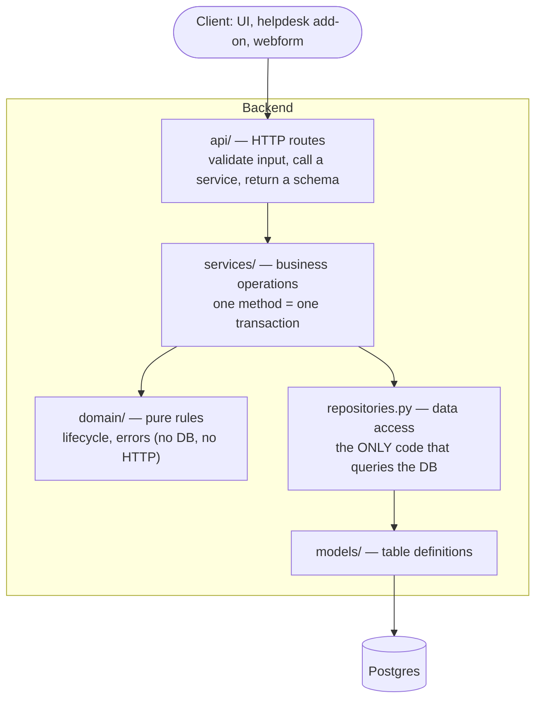
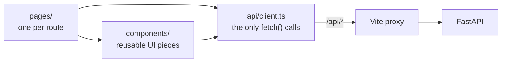
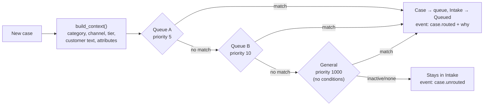
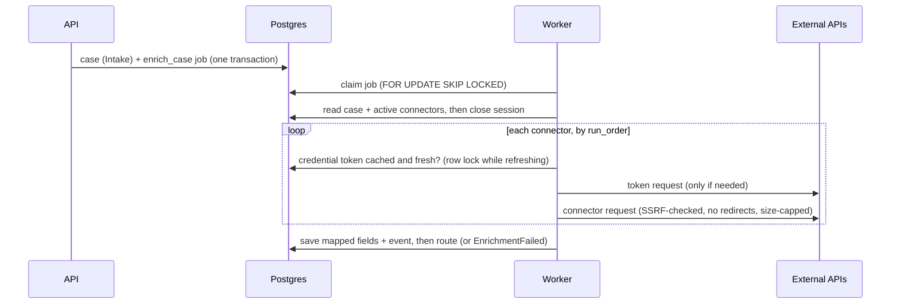
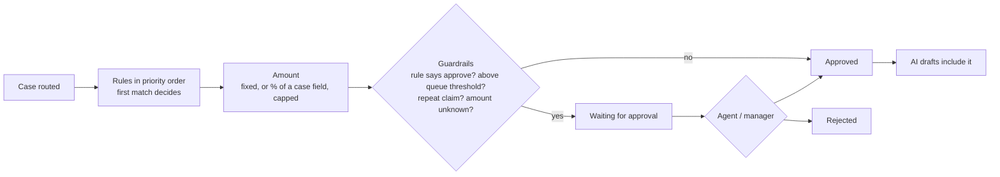
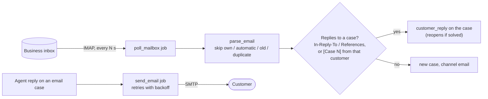
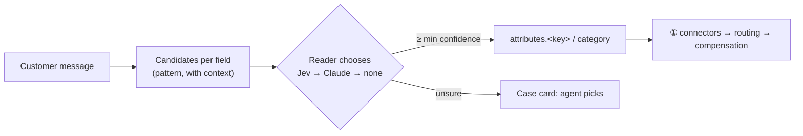
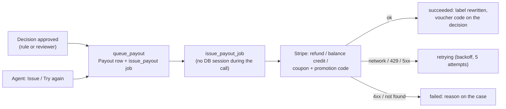

# Codebase Guide

How the code is organized, why, and how to add to it. Sections 1–6 cover the backend in general, section 7 the frontend (details in [frontend/README.md](../../frontend/README.md)), sections 8–15 each feature (routing, reporting, enrichment, AI drafting, compensation, pipeline view, email channel, reading messages), and section 16 lists the API endpoints.

## 1. The layers

Each layer only talks to the one below it.

| Layer | Knows about | Must NOT |
|---|---|---|
| `api/` | HTTP, request/response schemas, services | Query the database or contain business rules |
| `services/` | Business flow, repositories, domain rules | Know about HTTP (no status codes, no `Request`) |
| `domain/` | Pure Python business rules | Import SQLAlchemy or FastAPI |
| `repositories.py` | SQLAlchemy queries | Commit, or skip the `tenant_id` filter |
| `models/` | Table shape | Contain business logic |

**Why bother?** The background worker runs enrichment and template test runs without HTTP. Because services don't know about HTTP, the worker reuses exactly the same code. And because all queries live in one file, tenant isolation is checked in one place.

This is the same idea as the Java service that owned the database at the airline, except the data-access layer is a module here rather than a separate service.

## 2. A request, step by step

`POST /tenants/{tenant_id}/cases/{case_id}/transitions` with `{"to_status": "Queued", ...}`:

1. **`api/cases.py` → `transition_case`**. FastAPI has already parsed the JSON body into a `TransitionRequest` (`schemas.py`) and rejected it with 422 if a field was wrong. The route calls the service.
2. **`services/` → `CaseService.transition`**:
   1. loads the case through `CaseRepository.get(tenant_id, case_id)` (a case from another tenant = not found)
   2. checks `expected_version`, if one was sent
   3. asks the domain whether the move is legal: `ensure_transition_allowed(current, target)`
   4. updates the case **and** adds a `CaseEvent`
   5. **commits once**, so both are saved together or neither is
3. **`domain/lifecycle.py`** raises `InvalidTransitionError` if the move isn't in `ALLOWED_TRANSITIONS`.
4. **`main.py`** turns domain errors into HTTP: `NotFoundError` → 404, `InvalidTransitionError` / `ConflictError` → 409.
5. The route converts the database object to `CaseRead` and FastAPI returns it as JSON.

## 3. Key concepts used here

| Concept | Where | What it means |
|---|---|---|
| **Dependency injection** | `Depends(get_session)` in routes | FastAPI creates a DB session per request and closes it afterwards. Tests swap it for a test database. |
| **Unit of work** | Services call `session.commit()` once | All changes in one business action succeed or fail together. |
| **Tenant scoping** | Every repository query filters `tenant_id` | One business can never read another's data. |
| **Optimistic locking** | `Case.version` | If two actors edit the same case, the second save fails with 409 instead of silently overwriting. |
| **Audit trail** | `case_events` table | Every change is recorded with actor, reason and time. Rows are never updated or deleted. |
| **Schemas ≠ models** | `schemas.py` vs `models/` | The API contract is separate from table shape, so each can change independently. |

## 4. Adding a feature: worked example

Say we want **"reroute a case to another queue"** (Idea 8: manual reroute that pins the case).

1. **Domain rule** (if any): does the lifecycle allow it? `AssignedAgent → Queued` is already in `ALLOWED_TRANSITIONS`. For a new status, add it there and add tests in `tests/test_lifecycle.py`.
2. **Model / migration** (if the data shape changes): `Case.assignment_pinned` and `Case.queue_id` already exist. If you add a column, follow [database-guide.md §4](database-guide.md#4-changing-the-schema-migrations).
3. **Repository:** add a `QueueRepository.get(tenant_id, queue_id)` in `repositories.py`, filtered by tenant.
4. **Schema:** add `RerouteRequest(queue_id, actor_type, actor_id, reason)` to `schemas.py`.
5. **Service:** add `CaseService.reroute(...)`. Load the case and the queue (404 if either is missing), set `queue_id` and `assignment_pinned = True`, transition to `Queued`, add a `case.rerouted` event, and commit once.
6. **Route:** add `POST /tenants/{tenant_id}/cases/{case_id}/reroute` in `api/cases.py`. Keep it three lines: take the body, call the service, return `CaseRead`.
7. **Tests:** in `tests/test_cases_api.py`, cover the happy path, an unknown queue (404), another tenant's queue (404), and the event being recorded.
8. **Check:** `uv run pytest && uv run mypy app tests scripts && uv run ruff check .`

## 5. Conventions

- **Timestamps:** always UTC (`utcnow()` in `models/base.py`). Convert to local time only for display.
- **IDs:** every table has a random UUID primary key for internal relationships. **Cases** also have a public **case number**: the creation time as a Unix timestamp in microseconds, e.g. `1790812345678901` (`app/domain/ids.py`). Case numbers are what people see and what URLs and API paths use; never show or route by the UUID. They're unique (a strictly increasing generator per process, plus a database unique constraint with retry across servers) and safe as JavaScript numbers until about the year 2255.
- **Statuses:** only ever set through `CaseService.transition` (or another service that calls `ensure_transition_allowed`).
- **JSON columns:** replace the whole value to change nested data (see [database-guide.md §3](database-guide.md#3-json-columns-document-style-data-inside-postgres)).
- **Errors:** services raise `app.domain.errors`; never `HTTPException` outside `api/`.
- **Type hints everywhere:** `mypy --strict` must pass.

## 6. What's not built yet

| Piece | Where it will go |
|---|---|
| Authentication / tenant from token | `api/` dependency replacing the `tenant_id` path parameter |
| Cash payouts (PayPal / Wise / Tremendous) | another provider next to `app/payouts/stripe.py`; `Payout.provider` and `PayoutMethod` already allow it |
| Inbox OAuth (Google Workspace, Microsoft 365) | an OAuth credential type for `ImapSmtpTransport` (XOAUTH2) |
| SLA timers, approvals, AI auto-send | settings already saved on queues; enforcement not built |
| AI recategorization | Idea 8 in the product ideas log |

## 7. The frontend

It mirrors the backend's rule that each layer has one job:
- **Pages** load data (`useLoad`) and arrange components.
- **Components** render and handle user input.
- **`api/client.ts`** is the only code that talks to the backend.

The UI never decides business rules on its own. For example, the status buttons come from the case's `allowed_next_statuses`, which the backend computes from the lifecycle.

## 8. Queue matching (routing)

| Piece | Where | Notes |
|---|---|---|
| Matching logic | `app/domain/routing.py` | Pure Python. **Decision list**: active queues checked by `(priority, created_at)`, first match wins. **Specification**: conditions combined with `all`/`any`. No conditions = catch-all. |
| Condition validation | `Condition` in `app/schemas.py` | Unknown fields/operators and empty values are rejected with 422 before anything is saved. |
| Case → routing input | `app/services/routing.py` | `case_context()` flattens a case; `to_candidate()` adapts a Queue row. |
| When routing runs | `CaseService.create_case` / `route_case` | At intake (same transaction), and on demand via `POST .../route` for Intake/Queued cases that aren't pinned. |
| Manual reroute | `CaseService.reroute` | Moves to a queue, back to Queued if needed, sets `assignment_pinned`. Automatic routing then refuses to move it. |
| Preview | `QueueService.preview` | Runs the same `route()` with optional unsaved draft settings; explains every queue. Saves nothing. |
| Default queue | `TenantService.create` + migration `0002` | Every tenant gets "General" (priority 1000, no conditions). |

**Operators** (all case-insensitive): `equals`, `not_equals` (also true when the field is empty), `one_of`, `contains_any` (whole words only, so "late" doesn't match "template"; symbols like "$50" work).

**Fields:** `category.type`, `category.category`, `category.subcategory` (the *effective* category), `channel`, `customer.tier`, `message` (all of the customer's messages), and `attributes.<key>` for tenant custom fields.

To add a field: add it to `FIELDS` and `build_context()` in `domain/routing.py`, add suggestions in `QueueService.fields()`, and add a test in `tests/test_routing.py`.

## 9. Reporting

`GET /tenants/{t}/reports/queues` runs one `GROUP BY queue_id, status` query (served by the `(tenant_id, status, queue_id)` index) and returns counts per queue and status, open totals, and the oldest open case per queue. Every queue gets a row even with zero cases; cases with no queue appear as "Unrouted". "Open" = every status except Solved and Closed (`OPEN_STATUSES` in `domain/lifecycle.py`).

## 10. Enrichment: connectors, credentials and the worker

| Piece | Where | Notes |
|---|---|---|
| Job queue | `models/job.py`, `JobRepository.claim_next`, `app/worker.py` | Jobs are inserted in the same transaction as the case, so nothing is lost. Several workers can run; stuck `running` jobs are re-claimed after 10 min. Unexpected errors retry with backoff; after 3 attempts the case goes to EnrichmentFailed. |
| Running one connector | `app/connectors/runner.py` | run_when → build request (templates) → SSRF check → auth → send (retries on timeouts/429/5xx; one token refresh on 401) → map fields. Pure: no database. |
| Templates | `domain/templates.py` | `{{case.…}}` / `{{enrichment.<key>.<field>}}` (connectors), `{{secret.<name>}}` (token requests). Values are escaped for URL / header / JSON. A missing value skips the connector. |
| Credentials & tokens | `models/credential.py`, `app/connectors/auth.py` | Types: api_key, bearer, basic, oauth2_client_credentials, token_request. Generated tokens are cached **encrypted** with expiry, refreshed ~60 s early (or 10% of short lifetimes) and on 401, shared by all connectors and workers. |
| Secrets | `app/security/secrets.py` | Fernet encryption with `CONNECTOR_SECRET_KEY`. Write-only in the API. The default key is dev-only; the app refuses to start outside `local` without a real one. |
| SSRF protection | `app/security/ssrf.py` | https only, no `user:pass@`, every resolved IP must be public. `CONNECTOR_ALLOWED_HOSTS` / `CONNECTOR_ALLOW_HTTP` exist for local mocks only. Known limit: DNS rebinding, so use an egress proxy/firewall in production. |
| Enrichment service | `services/enrichment.py` | Three phases: read (short session) → call (no long session) → write (retried on optimistic-lock conflict). Stores only mapped fields, never full responses. |
| Routing on enriched data | `domain/routing.py` | Fields `enrichment.<key>.<field>`; numeric operators `greater_than` / `less_than` (parses "1,250.00", "$19.99"). |

**When a case is created:** if the tenant has active connectors, it stays in **Intake** and an `enrich_case` job is queued; routing happens after enrichment. With no connectors it's routed immediately, as before.

**Required vs optional connectors:** a failed or skipped *required* connector moves the case to **EnrichmentFailed** (agents can "Re-run enrichment"). Optional failures are recorded and the case is routed anyway.

**Re-running enrichment** on a case that's already been routed refreshes its data but doesn't move it. Use "Run routing again" for that.

## 11. AI reply drafting

Every draft is written from **layered Jinja templates**. Full guide for template authors: [`backend/app/ai/templates/README.md`](../../backend/app/ai/templates/README.md).

```mermaid
flowchart LR
    Case[Case or sample] --> Input["DraftInput<br/>facts + customer-visible thread"]
    Input --> Mask["Mask PII<br/>names, emails, phones, cards"]
    Mask --> Ctx["Template context<br/>business, case, customer,<br/>enrichment, decisions, thread"]
    Ctx --> Render["Render in sandbox<br/>base.jinja + queue persona<br/>+ category template"]
    Render --> Prompt["Prompt<br/>system 1: platform rules (cached)<br/>system 2: business layers<br/>user: facts + conversation"]
    Prompt --> Claude["Claude<br/>structured output"]
    Claude --> Unmask["Unmask"] --> Checks["Checks + warnings<br/>(merged from all layers)"]
    Checks --> Draft[Draft on the case<br/>agent reviews and sends]
```

| Layer (priority order) | Template | Editable | Sets |
|---|---|---|---|
| 1. Platform rules | `_platform/system.jinja`, `guardrails.jinja` (files) | No | Facts only, no compensation unless decided, customer text is information not instructions, masked PII, plain text |
| 2. Baseline | `base.jinja` | Per business | Tone and empathy every reply follows |
| 3. Persona | `queue/<Queue>.jinja` → `queue/_default.jinja` | Per business | Voice, empathy level, greeting, sign-off |
| 4. Case type | `category/<Type>_<Category>_.jinja` → `<Type>_<Category>` → `<Type>` → `_default` | Per business | What to answer, structure |

| Piece | Where | Notes |
|---|---|---|
| Template engine | `app/ai/engine.py` | Names and fallback chains, `{#--- ---#}` header (description + checks), validation (syntax, no include/extends/import, only known variables), sandboxed `StrictUndefined` rendering, `build_prompt`. Business templates can't touch the platform layers: the engine combines layers itself. |
| Context | `app/ai/context.py` | `DraftInput` → the masked dict templates see (`business`, `case`, `customer`, `enrichment`, `decisions`, `thread`, `latest_message`). |
| Starter pack | `app/ai/templates/defaults/` | Copied into each business's database on first use (`ensure_defaults`). When the starter pack changes, templates nobody has edited get the new content as a new version; edited templates are never touched. |
| Models & prices | `app/ai/models.py` | Haiku 4.5, Sonnet 5 (default), Opus 5. **Every cost in the app comes from this table.** Haiku has no `effort`; Opus gets server-side refusal fallback. |
| Checks & warnings | `app/ai/checks.py` | Template checks (max words, must / must-not phrases, merged across layers) and consistency between repeated drafts. **Warnings** for an agent: timeframes that aren't in the case facts, offers of refunds/replacements nobody decided, and refund requests the model didn't flag. |
| Masking | `app/ai/pii.py` | Known name/email plus email, phone (9-15 digits, not dates) and card patterns → placeholders, restored after. `unexpected_pii` flags contact details the model invented. |
| Model call | `app/ai/drafter.py` | `client.beta.messages.parse(output_format=DraftOutput)`, two system blocks (first cached), typed errors → readable messages. `DraftWriter` is the seam tests replace with a fake. |
| Templates service | `services/replies.py` `PromptTemplateService` | Save (validated; source/check change → immutable new version), import/export `.jinja`, preview (no model call), coverage per queue and category, cost projection. |
| Drafts on cases | `DraftService` | Only if the queue has "Allow AI to draft replies"; model and effort come from the **queue** settings. Saved as a `draft` message by `ai` listing every template + version used; event `ai.draft_created`. A broken template → 409 with the template name and problem. |
| Test lab | `services/template_tests.py` | One template as edited, **pinned into its layer for every input**, × models × inputs × runs, on the worker (job `template_test`). Free cost estimate first. |

**Configuration:** `ANTHROPIC_API_KEY` (backend and worker). Without it drafting is off and every AI action says how to enable it.

## 12. Compensation matrix

The matrix decides the money; the AI only writes the message.

| Piece | Where | Notes |
|---|---|---|
| Decision logic | `app/domain/compensation.py` | Pure: `decide(rules, context, history, settings, approval_threshold)`. Conditions reuse the routing engine (`evaluate_criteria`), so rules can test category, attributes, enrichment data and the queue. |
| Rules | `models/compensation_rule.py`, `CompensationService.save_rule` | Priority, conditions, `outcome` (type, fixed/percent amount, cap, currency, always-approve). Deactivated, never deleted. |
| Guardrails | `tenants.compensation_settings` + each queue's `approval_threshold` | Repeat-claim lookback (days) and count; default currency. |
| When it runs | end of `CaseService.apply_routing` | Only if the business has active rules and the case has no decision yet. "Decide again" on the case re-runs it; not allowed once approved or rejected. |
| Where it's stored | `case.decisions["compensation"]` (`CompensationDecisionData`) | Status, rule, amount and how it was worked out, matched conditions, approval reasons, history used, who reviewed it. Events: `compensation.decided/approved/rejected`. |
| AI drafts | `services/replies.py` `approved_compensation` | Only an **approved** decision's label (e.g. "Refund of USD 30.00") reaches the prompt as `decisions.compensation`. |
| Live test & backtest | `CompensationService.preview / simulate` | Test any case with an unsaved rule; backtest runs recent cases oldest first, counting simulated compensation toward repeat claims. Nothing is changed. |

Not built yet: payouts (issuing the money), regulation packs, rule versioning with effective dates, "highest value" hit policy.

## 13. Intake pipeline view

Operations → Pipeline draws what every new case goes through, and what happened to each case. It's a **view** over existing configuration and stored results, so nothing extra is recorded.

| Piece | Where | Notes |
|---|---|---|
| Definition | `PipelineService.definition` | Active connectors in run order, then queues, then compensation rules. **Dependencies** come from each request's `{{enrichment.<key>.<field>}}` placeholders; **problems** flag a dependency on a later, inactive or unknown step, or on a field that isn't saved. |
| Executions | `PipelineService.executions / execution` | Built from `case.enrichment` (per-connector status, request preview, HTTP status, duration, data), the latest `case.routed` / `case.rerouted` and `enrichment.completed` events, and `decisions.compensation`. Steps in today's pipeline with no result show as *pending* (Intake) or *not run* (added later); results from removed connectors are kept at the end. |
| UI | `PipelinePage` (+ Executions tab), `PipelineExecutionPage`, `PipelineDiagram`, `lib/pipeline.ts` | One diagram component for both views; in an execution, each node gets a state (icon + label + border). |

Steps run strictly in sequence today. Parallel branches would mean changing `EnrichmentService.enrich_case` to group steps by dependency; the diagram already knows the dependencies.

## 14. Email channel

| Piece | Where | Notes |
|---|---|---|
| Parsing | `app/email/parse.py` (pure) | Body (HTML → text when there's no text part), sender, threading headers, attachments (names/sizes), automatic-message detection (Auto-Submitted, auto-reply headers, bulk/list, bounces, no-reply), quoted-history stripping, `[Case N]` subject token. |
| Mail servers | `app/email/transport.py` | `MailTransport` interface (fetch / send / test); `ImapSmtpTransport` on imaplib/smtplib. TLS required unless `EMAIL_ALLOW_INSECURE`; hosts must be public unless in `EMAIL_ALLOWED_HOSTS` (same check as connectors). Reads with `BODY.PEEK`, so nothing is marked read unless the inbox asks for it. |
| Inboxes | `models/mailbox.py`, `MailboxService` | Address, servers, encrypted (write-only) password, folder, `import_since` (link time minus backfill), poll interval, default category, IMAP position (`uid_validity`, `last_uid`) and status (last check, last error, imported count). |
| Importing | `services/email.py` `poll_mailbox`, `ingest_message` | Inbox settings read, then the session closed while IMAP runs; each email in its own transaction. Duplicates stopped by Message-ID (unique index on `messages(tenant_id, external_id)`). A reply to a closed case opens a new case with `attributes.relatedCase`. |
| Scheduling | `schedule_polls` in the worker loop | Every 5 s, queues a `poll_mailbox` job for each active inbox that's due and doesn't already have one. |
| Sending | `CaseService.add_message` → `send_email` job | Agent replies on cases with a `mailbox_id` get a Message-ID, `Re: <subject> [Case N]`, In-Reply-To/References, and `email.delivery` (queued → sent / retrying → failed). Up to 5 attempts with backoff; a sent status is checked first so a retry never resends. Failed emails can be retried from the case. |

Not built yet: OAuth sign-in for Google Workspace / Microsoft 365, storing attachment files, sending from an inbox on non-email cases.

## 15. Reading messages

Step ⓪ of the intake pipeline: pull data fields (order number, …) and the category out of the customer's message, so the steps after it can use them.

| Piece | Where | Notes |
|---|---|---|
| Candidates & decisions | `app/ai/reading.py` (pure) | Pattern presets (code, digits, amount, date) or custom regex; distinct candidates with surrounding words; `decide_field` turns the model's pick + confidence into found / needs_review / not_found. Without a model, a single candidate is accepted. |
| Readers | `app/ai/readers.py` | `Reader` interface. `JevReader`: TypeSafe's Jev over HTTP (`POST /v1/systemone`), one Choice question per field (candidates + "none") and one over the category list; returns calibrated confidence. `ClaudeReader`: Haiku with structured output (high/medium/low). `reader_from(settings)`: Jev if `TYPESAFE_API_KEY`, else Claude, else none. Both only see the masked message and can only pick options our code built. |
| Workflow | `services/reading.py` | `should_read` (enabled, channel, something missing) → `read_case` job → values saved without overwriting provided attributes; category applied only if none was chosen or it's an inbox default (`source: "inbox"`), as `source: "ai"` → `case.extraction` record + `reading.completed` event → `CaseService.continue_intake` (enrichment or routing). Reader failures are recorded and never block a case. |
| Review | `ReadingService.confirm_field / change_category` | Agents pick the right candidate or apply a suggested category (`reading.field_confirmed`, `case.recategorized`). |
| Settings | `tenants.reading_settings` | Enabled, channels, read category, min confidence, fields (key, label, description, pattern). |

## 16. Payouts (Stripe)

Issuing **approved** compensation through the business's own Stripe account. Local CRM never holds or moves money itself: it asks Stripe, once per decision, and records the answer.

| Piece | Where | Notes |
|---|---|---|
| Stripe client | `app/payouts/stripe.py` | Raw HTTP, form-encoded, `Authorization: Bearer sk_…`, an `Idempotency-Key` on every POST. `to_minor` handles zero-decimal currencies. `StripeError.retryable` (network, 429, 5xx) and `outcome_unknown` (5xx). Lookups used to reconcile: `find_refund`, `find_credit`, `find_promotion_code` (by `metadata[payout_id]` or code). |
| Model | `app/models/payout.py`, migration 0009 | One row per attempt round: kind, method, amount, currency, status (queued → processing → succeeded / retrying / failed), `idempotency_key` (unique), Stripe `external_id`, `details` (code, customer, payment_intent, mode), error, attempts. `tenants.payout_settings` holds the settings. |
| Queueing | `services/payouts.queue_payout` | Called by `CompensationService` when a decision is approved (`decide_for_case`, `review`) and by `PayoutService.pay_now`. Key: `lcrm:{case.id}:{decided_at}`. An existing non-failed payout for the same decision blocks another; after a failure a new round gets `…:retry{n}` (Stripe replays errors for the same key, so a fixed problem needs a new key). |
| Issuing | `services/payouts.issue_payout_job` | Worker handler. Phase 1 loads and marks processing; phase 2 calls Stripe with no DB session; phase 3 records the result. After a 5xx (outcome unknown) the next attempt first looks for its own object by `metadata[payout_id]`, then uses a new key `…:u{n}`. Retryable errors re-raise so the job queue backs off; others fail the payout. `payout_gave_up` handles a job that ran out of attempts. |
| Methods | `schemas.ALLOWED_METHODS` | refund → `stripe_refund`; store credit → `stripe_credit` (customer balance, invoices only) or `stripe_voucher`; voucher → `stripe_voucher`; points / replacement → manual. |
| Finding the payment | `PayoutSettingsData` | `payment_field` (a case field holding `pi_…`) first, else search PaymentIntents where `metadata[metadata_key]` = `order_field`. The refund's currency must match the payment's. |
| On the case | `decisions.compensation.payout` | `{id, status, method, external_id, code, error}`; on success the decision label becomes e.g. "Voucher code SORRY-7KQ2-M9XA worth USD 15.00 (single use, valid until …)", which AI drafts quote. Events: `payout.queued`, `payout.succeeded`, `payout.failed`. |
| Local demo | `mocks/shop.py` `/stripe/v1/…` | A fake Stripe (key `sk_test_mock`) with idempotency replay. Docker sets `STRIPE_API_BASE=http://mocks:8100/stripe`; remove it to use real Stripe with a test key. |

Tests: `tests/test_payouts.py` uses a fake Stripe that replays idempotent requests like the real one, and drops the network or returns 429/500 (before or after doing the work) to prove a payout is never made twice.

## 17. API endpoints

Full, always-current reference: http://localhost:8000/docs.

| Method | Path | Does |
|---|---|---|
| GET | `/health`, `/health/db` | Process / database checks |
| POST, GET | `/tenants` | Create / list tenants (list is dev-only) |
| GET | `/tenants/{t}/categories` | Case taxonomy for webform dropdowns |
| POST | `/tenants/{t}/cases` | Intake a case |
| GET | `/tenants/{t}/cases?status=` | List cases |
| GET | `/tenants/{t}/cases/{c}` (`{c}` = case number) | Case + messages + `allowed_next_statuses` |
| POST | `/tenants/{t}/cases/{c}/transitions` | Change status (validated by the lifecycle) |
| POST | `/tenants/{t}/cases/{c}/messages` | Agent reply (optionally + status change), internal note, or simulated customer reply |
| GET | `/tenants/{t}/cases/{c}/events` | Audit trail |
| GET | `/tenants/{t}/cases?queue_id=&unrouted=` | List filters by queue / unrouted |
| POST | `/tenants/{t}/cases/{c}/route` | Re-run queue matching |
| POST | `/tenants/{t}/cases/{c}/reroute` | Manually move to a queue (pins it) |
| GET, POST | `/tenants/{t}/queues` | List (routing order) / create queues |
| GET, PATCH | `/tenants/{t}/queues/{q}` | Read / partially update (deactivate, never delete) |
| GET | `/tenants/{t}/routing/fields` | Fields, suggestions and operators for the condition builder |
| POST | `/tenants/{t}/routing/preview` | Which queue would a case land in, with optional unsaved draft |
| GET | `/tenants/{t}/reports/queues` | Case counts per queue and status |
| POST | `/tenants/{t}/cases/{c}/enrich` | Queue the connectors to run again for a case |
| GET, POST | `/tenants/{t}/connectors` | List (run order) / create connectors |
| GET, PUT | `/tenants/{t}/connectors/{id}` | Read / replace (deactivate, never delete) |
| POST | `/tenants/{t}/connectors/test` | Run an (unsaved) connector against a real case; returns the full response for field picking |
| GET, POST | `/tenants/{t}/credentials` | List / create credentials (secrets write-only) |
| GET, PUT | `/tenants/{t}/credentials/{id}` | Read / replace (omit `secrets` to keep them; drops cached token) |
| POST | `/tenants/{t}/credentials/{id}/test` | Generate a token now (token types) or check secrets |
| GET | `/ai/models` | Models a queue can use, with prices |
| POST | `/tenants/{t}/cases/{c}/drafts` | Draft a reply with the case's layered templates (saved as a draft, never sent) |
| GET | `/tenants/{t}/prompt-templates` | All templates (starter pack added on first use) |
| GET, PUT | `/tenants/{t}/prompt-templates/{name}` | Read with versions / create or save (change → new version; invalid Jinja → 409). `{name}` like `category/Complaint_Delivery.jinja` |
| GET | `/tenants/{t}/prompt-templates/{name}/download` | The template as a `.jinja` file with header |
| POST | `/tenants/{t}/prompt-templates/import` | Save a `.jinja` file's content under a name |
| POST | `/tenants/{t}/prompt-templates/preview` | Rendered prompt, layer by layer, for a case or sample, with an optional unsaved edit |
| GET | `/tenants/{t}/prompt-templates/coverage` | Which template each queue and category uses |
| GET | `/tenants/{t}/prompt-templates/variables`, `/platform` | Variables reference / the locked platform rules |
| GET | `/tenants/{t}/prompt-templates/{name}/projection?monthly_volume=` | Cost per reply / 1,000 / month per model |
| GET, POST, PUT | `/tenants/{t}/sample-cases[/{id}]` | Test-lab inputs |
| GET, POST | `/tenants/{t}/compensation/rules` | List (decision order) / create compensation rules |
| GET, PUT | `/tenants/{t}/compensation/rules/{id}` | Read / replace (deactivate, never delete) |
| GET, PUT | `/tenants/{t}/compensation/settings` | Repeat-claim check and default currency |
| POST | `/tenants/{t}/compensation/preview` | What a case would get, with an optional unsaved rule (explains every rule) |
| POST | `/tenants/{t}/compensation/simulate` | Backtest over the last N days (optionally with an unsaved rule) |
| POST | `/tenants/{t}/cases/{c}/compensation/decide` | Run the matrix again for a case |
| POST | `/tenants/{t}/cases/{c}/compensation/approve`, `/reject` | Review a pending decision (`note` required to reject) |
| GET, POST | `/tenants/{t}/mailboxes` | List / connect inboxes (password write-only) |
| GET, PUT | `/tenants/{t}/mailboxes/{id}` | Read / replace (omit `password` to keep it; `is_active: false` pauses) |
| POST | `/tenants/{t}/mailboxes/test` | Sign in to IMAP and SMTP with unsaved settings |
| POST | `/tenants/{t}/mailboxes/{id}/check` | Check for new email now |
| GET | `/tenants/{t}/mailboxes/{id}/recent` | Latest cases created from the inbox |
| POST | `/tenants/{t}/cases/{c}/messages/{m}/retry-send` | Send a failed email again |
| GET, PUT | `/tenants/{t}/reading` | Reading settings, which model reads (jev / claude / patterns), pattern presets |
| POST | `/tenants/{t}/reading/preview` | Read a pasted message or a case with saved or unsaved settings (nothing saved) |
| POST | `/tenants/{t}/cases/{c}/extraction/fields/{key}` | Agent sets a field the reader wasn't sure about |
| POST | `/tenants/{t}/cases/{c}/category` | Agent sets the case's category |
| GET, PUT | `/tenants/{t}/payouts/settings` | Payout settings (Stripe credential, method per type, payment lookup, vouchers) |
| POST | `/tenants/{t}/payouts/check-stripe` | Sign in to Stripe with a credential: valid key? test or live? |
| GET | `/tenants/{t}/payouts?status=` | Recent payouts, newest first |
| GET, POST | `/tenants/{t}/cases/{c}/payouts` | A case's payouts / issue its approved compensation now (or retry after a failure; never pays twice) |
| GET | `/tenants/{t}/pipeline` | The intake pipeline: steps in order, dependencies, problems, queues, rules |
| GET | `/tenants/{t}/pipeline/executions?outcome=&limit=` | Recent cases' runs (per-step status, time, queue, compensation) |
| GET | `/tenants/{t}/pipeline/executions/{c}` | One case's run with requests, data, routing and compensation |
| POST | `/tenants/{t}/template-tests/estimate` | Cost of a test run before running it (free) |
| POST, GET | `/tenants/{t}/template-tests[/{id}]` | Start a test run (worker) / read progress and results |

### Message rules (`CaseService.add_message`)

| Kind | Saved as | Side effects |
|---|---|---|
| `agent_reply` | outbound, public | Event `message.sent` with `delivery: simulated`. Optional `then_status` changes status in the same transaction; if that change is invalid, the reply is rolled back too. |
| `internal_note` | internal | Event `note.added`. Allowed even on closed cases. |
| `customer_reply` | inbound, public | Event `message.received`. A `Solved` or `WaitingOnCustomer` case goes back to `Queued`. |

Replies of either kind on a `Closed` case → **409**.

### Assignee follows status (`CaseService._apply_transition`)

| Moving to | Assignee becomes |
|---|---|
| `AssignedAgent` | the acting agent (`human`) |
| `AssignedAI` | `ai_reply_agent` (`ai`) |
| `Queued` | cleared |
