# Business User Handbook

**For:** customer care agents, team leads and operations managers using Local CRM day to day. No technical knowledge needed.

**How to read it:**
- Read **sections 1–3** first.
- **Agents:** then read **Part A**.
- **Managers** who set up queues, rules and AI: also read **Part B**.
- **Part C** has step-by-step recipes for common jobs.

Every screenshot uses a made-up demo shop called *Northwind Outfitters*. Ask whoever runs your installation to load it: [Demo data](#demo-data).

---

## Contents

1. [What the platform does](#1-what-the-platform-does)
2. [Getting started](#2-getting-started)
3. [Words you'll see](#3-words-youll-see)

**Part A: Working cases (agents)**

- [A1. The case list](#a1-the-case-list)
- [A2. A case, top to bottom](#a2-a-case-top-to-bottom)
- [A3. Replying, notes and status](#a3-replying-notes-and-status)
- [A4. Drafting a reply with AI](#a4-drafting-a-reply-with-ai)
- [A5. Compensation on a case](#a5-compensation-on-a-case)
- [A6. Moving a case to another queue](#a6-moving-a-case-to-another-queue)
- [A7. Order and shipping data (enrichment)](#a7-order-and-shipping-data-enrichment)
- [A8. Creating test cases](#a8-creating-test-cases)

**Part B: Setting things up (managers)**

- [B1. Dashboard](#b1-dashboard)
- [B2. Queues and routing](#b2-queues-and-routing)
- [B3. The intake pipeline](#b3-the-intake-pipeline)
- [B3b. Connectors and credentials](#b3b-connectors-and-credentials)
- [B4. Compensation rules](#b4-compensation-rules)
- [B5. How AI replies are written (prompt templates)](#b5-how-ai-replies-are-written-prompt-templates)
- [B6. Testing AI before you change anything](#b6-testing-ai-before-you-change-anything)
- [B7. Connecting your email inbox](#b7-connecting-your-email-inbox)
- [B8. Reading messages](#b8-reading-messages)
- [B9. Payouts: issuing compensation through Shopify or Stripe](#b9-payouts-issuing-compensation-through-shopify-or-stripe)
- [B10. Connecting your Shopify store](#b10-connecting-your-shopify-store)
- [B11. Automatic replies](#b11-automatic-replies)

**Part C: Recipes and reference**

- [C1. Recipes](#c1-recipes)
- [C2. Case statuses](#c2-case-statuses)
- [C3. Questions and troubleshooting](#c3-questions-and-troubleshooting)
- [C4. What's not built yet](#c4-whats-not-built-yet)

---

## 1. What the platform does

Local CRM takes in customer cases and prepares them for your team:

1. **Gathers the facts.** It looks up the customer's order and shipping data in your own systems.
2. **Routes the case.** It sends the case to the right queue.
3. **Decides compensation.** Your rules decide what the customer is owed.
4. **Drafts a reply.** AI writes a draft for an agent to review.

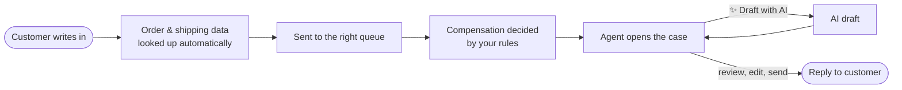
```mermaid
flowchart LR
    Customer([Customer writes in]) --> Facts[Order & shipping data<br/>looked up automatically]
    Facts --> Queue[Sent to the right queue]
    Queue --> Comp[Compensation decided<br/>by your rules]
    Comp --> Agent[Agent opens the case]
    Agent -- "✨ Draft with AI" --> Draft[AI draft]
    Draft --> Agent
    Agent -- review, edit, send --> Reply([Reply to customer])
```

**Three promises the platform keeps:**
- **The AI never decides money.** Compensation comes from rules your managers write. The AI only mentions compensation once it's approved.
- **A person reviews every AI draft.** Nothing is sent to a customer automatically.
- **Everything is recorded.** Every status change, move, decision and draft appears in the case's **History**, with who did it and why.

---

## 2. Getting started

1. **Open the app.** Use the address your administrator gave you. Locally it's **http://localhost:5173**.
2. **Pick your business** in the drop-down at the top right.
3. **Check "Acting as".** It should show your name (e.g. `agent.alex`), because every action is recorded under this name.

> **Temporary:** there's no sign-in yet. The business picker and "Acting as" box stand in for logging in. Sign-in comes later.

**The top bar has three areas:**

| Area | For |
|---|---|
| **Agent console** | Agents: the case list and individual cases |
| **Operations** | Managers: dashboard, queues, connectors, credentials, compensation, prompt templates, sample cases |
| **Test webform** | Anyone: create a case the way a customer would |

---

## 3. Words you'll see

| Word | Meaning |
|---|---|
| **Case** | One customer issue, with its whole conversation. |
| **Case number** | A case's ID, e.g. `1791221037860354`. It's the time the case was created, so higher numbers are newer. |
| **Category** | What the case is about, in three levels: *Type › Category › Subcategory* (e.g. Complaint › Delivery › Late delivery). The customer picks it on the webform. |
| **Queue** | A line of cases waiting for a team, e.g. *Delivery issues*. Each case is in one queue. |
| **Status** | Where the case is in its life: *Queued*, *Assigned to agent*, *Solved*… (see [C2](#c2-case-statuses)). |
| **Enrichment** | Data looked up automatically from your systems, e.g. order total and days late. |
| **Connector** | A saved lookup into one of your systems (e.g. "Shop orders"). Managers set these up. |
| **Compensation** | What the customer gets: refund, store credit, voucher, replacement, points, or nothing. |
| **Prompt template** | The written instructions that tell the AI how to write replies. |
| **Draft** | An AI-written reply that hasn't been sent. You always review it first. |

---

# Part A: Working cases (agents)

## A1. The case list

**Agent console** lists the business's cases, newest first.

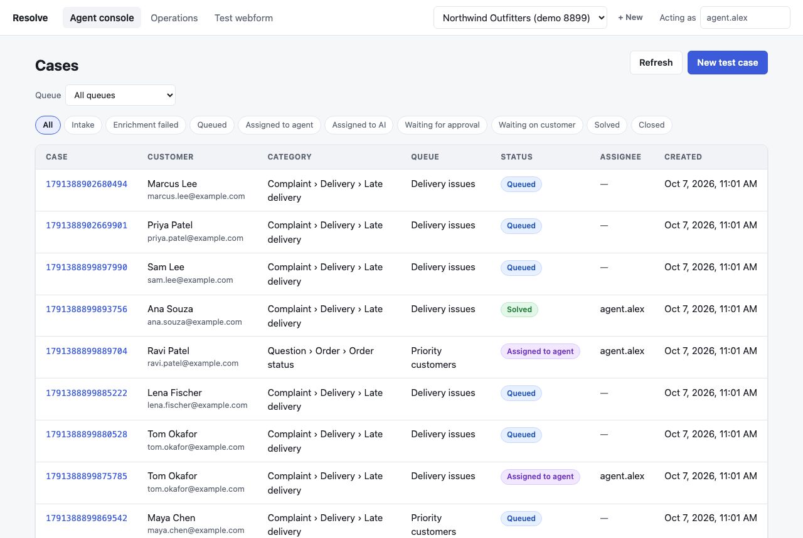

- **Filter** by queue (drop-down) or by status (the buttons).
- **Click a case number** to open the case.
- **Refresh** reloads the list.
- **New test case** opens the test webform (see [A8](#a8-creating-test-cases)).

## A2. A case, top to bottom

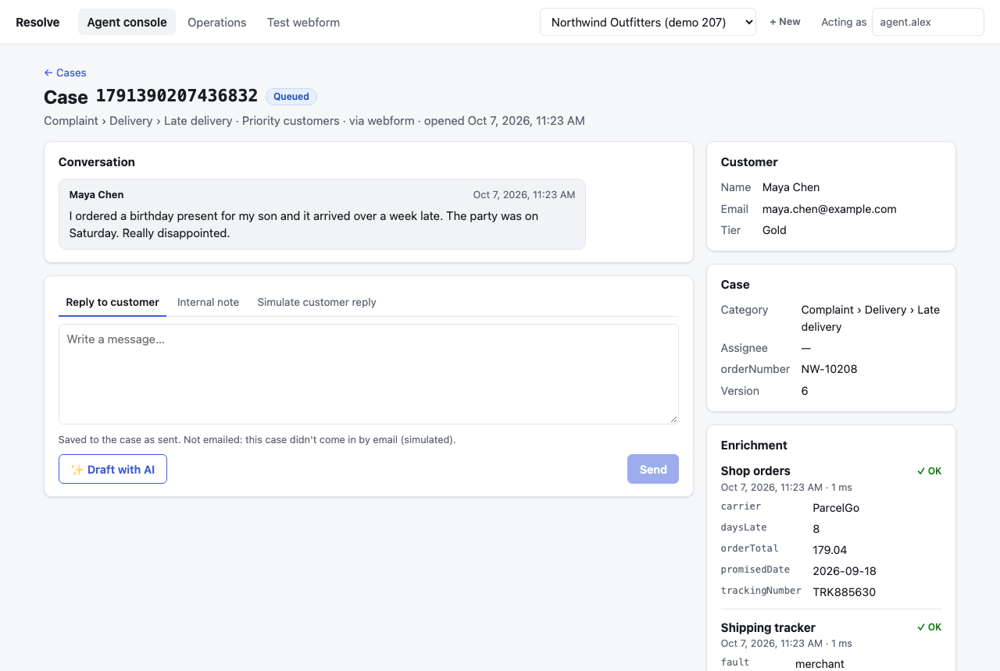

The header shows:
- **Case number and status**
- **Category, queue and channel**
- **When the case was opened**

**Left side, the conversation:**
- **Customer messages** are grey.
- **Your replies** are on the right.
- **Internal notes** are yellow and never shown to the customer.
- **AI drafts** have a dashed border and are labelled *AI draft · not sent*.

**Right side, everything you need to decide:**

| Card | What it tells you |
|---|---|
| **Customer** | Name, email, loyalty tier |
| **Case** | Category, assignee, extra details from the form (e.g. order number) |
| **Enrichment** | Order and shipping data looked up automatically ([A7](#a7-order-and-shipping-data-enrichment)) |
| **Queue** | The case's queue, and buttons to move it ([A6](#a6-moving-a-case-to-another-queue)) |
| **Compensation** | What the customer is owed and why ([A5](#a5-compensation-on-a-case)) |
| **Status** | Buttons for the next allowed steps ([A3](#a3-replying-notes-and-status)) |
| **History** | Everything that has happened, oldest first |

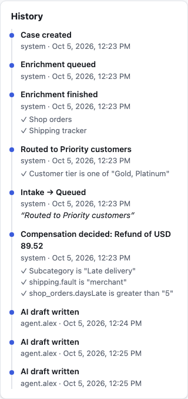

## A3. Replying, notes and status

The reply box under the conversation has three tabs:

| Tab | What it does |
|---|---|
| **Reply to customer** | Sends your message to the customer. On cases that came in **by email**, it's emailed from the same inbox, in the same email thread. On other cases (webform, API), sending is *simulated*: the reply is saved on the case but not emailed. |
| **Internal note** | Saves a note only your team can see. |
| **Simulate customer reply** | Testing only: pretends the customer wrote back. |

**Send & mark solved** sends your reply and closes out the case in one step.

**Email cases** show the email's subject at the top and on the customer's message. Your reply shows whether the email went out:

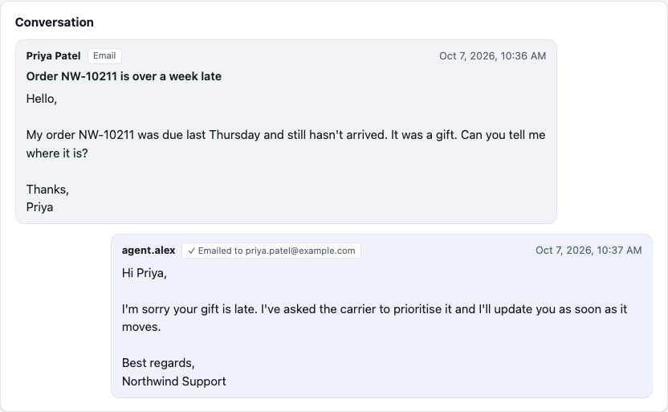

- **✓ Emailed to…**: delivered to the customer's mail server.
- **Sending email / Retrying email**: in progress. Failed attempts are retried automatically.
- **✗ Email failed**: the reason is shown under the message. Fix the cause (often the inbox password, see [B7](#b7-connecting-your-email-inbox)), then click **Retry**.

When the customer answers your email, their reply lands on the same case, without the quoted history, and reopens the case if it was solved.

**The Status card** only offers the moves that are allowed from the case's current status, so you can't put a case in an impossible state.

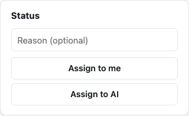

- **Assign to me** takes ownership of the case.
- **Request approval** is for when a manager must sign off.
- **Wait on customer** is for when you've asked the customer something.
- **Mark solved** is for when the customer has their answer.

You can add a **reason** before clicking any of these. It appears in the History.

If the customer replies to a **Solved** or **Waiting on customer** case, it goes back to **Queued** automatically, in the same queue. **Closed** cases don't accept replies.

## A4. Drafting a reply with AI

**✨ Draft with AI** in the reply box writes a draft from the whole conversation, the case details and the enrichment data. It takes a few seconds.

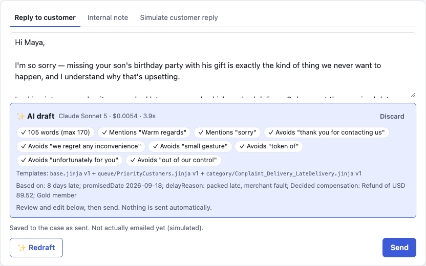

**What you see:**
- **The draft text** is in the reply box. **Edit it freely** before you send.
- **The panel underneath** shows:
  - **Model, cost and time:** e.g. *Claude Sonnet 5 · $0.0054 · 3.9s*.
  - **Checks:** green ✓ means the draft followed a rule (word limit, required phrases, banned phrases). A red ✗ means it didn't, so fix it before sending.
  - **Warnings (⚠):** things to double-check, such as a promised timeline that isn't in the case data, a refund offer nobody approved, or contact details that weren't in the case.
  - **Needs your attention:** the AI thinks a person should handle this one (legal threats, safety, refund demands nobody has decided, …).
  - **Templates:** which instructions wrote the draft ([B5](#b5-how-ai-replies-are-written-prompt-templates)).
  - **Based on:** the facts the AI used.

**Good to know:**
- **Nothing is sent automatically.** You review, edit, then click **Send**.
- **Personal data is hidden from the AI.** The customer's name and contact details are swapped for placeholders before the AI sees them, then put back in the draft.
- **Compensation:** the AI only mentions compensation once it's **approved** on the case. While approval is pending, it won't offer anything.
- **Edits are tracked.** The platform records whether you changed the draft. This is how the team measures draft quality.
- **If the button is greyed out or shows an error:**
  - AI may be switched off for this case's queue.
  - Or your installation has no AI key yet.

  Ask your manager.

## A5. Compensation on a case

When a case is routed, your business's **compensation rules** decide what the customer is owed. The **Compensation** card shows the result:

| Approved automatically | Waiting for approval | No compensation |
|---|---|---|
| 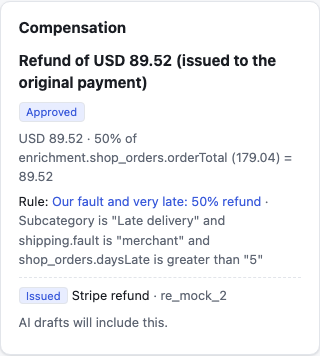 | 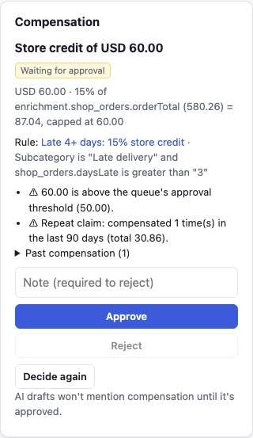 | 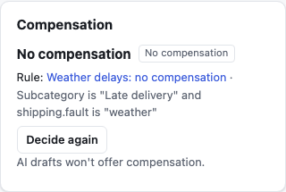 |

**What the card shows:**
- **The decision:** e.g. *Refund of USD 89.52*, and how the amount was worked out (*50% of order total 179.04*).
- **The rule** that decided it, and the conditions that matched.
- **Why it needs approval**, if it does. For example:
  - the customer was compensated recently (*Repeat claim*)
  - the amount is above the queue's limit
  - the rule always needs approval
- **Past compensation** for this customer.

**Your options:**
- **Approve:** the compensation is confirmed, and AI drafts will mention it.
- **Reject:** type a reason first, then click Reject. Nothing is offered. (A queue that answers automatically holds its reply until this is decided: B11.)
- **Decide again:** re-runs the rules, e.g. after order data arrived or the rules changed. Not possible once a decision has been approved or rejected.

**Paying it.** If your business issues compensation through Stripe ([B9](#b9-payouts-issuing-compensation-through-shopify-or-stripe)), the bottom of the card shows how that went:
- **Issued** · *Stripe refund* · `re_…`: done. A voucher shows its **code**, and AI drafts quote it.
- **Issuing… / Retrying:** Stripe is being asked, or didn't answer cleanly and will be asked again. It can't be paid twice.
- **Failed**, with the reason (e.g. *Couldn't find the Stripe payment for order NW-10404*). Fix the cause, then click **Try again**.
- **Issue stripe refund** (or credit / voucher): your business issues payouts only when an agent clicks. Click once; it can't be paid twice.

If the card says *Issue this by hand*, this type isn't issued through Stripe: give it the usual way.

## A6. Moving a case to another queue

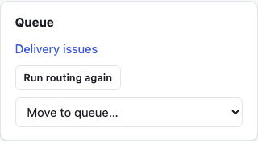

- **Run routing again:** sends the case through the queue rules again, e.g. after a manager changed them.
- **Move to queue…:** pick a queue, add a reason, and move the case.
  - The case is then **pinned**: automatic routing won't move it back.
  - Use this when the customer picked the wrong category.

## A7. Order and shipping data (enrichment)

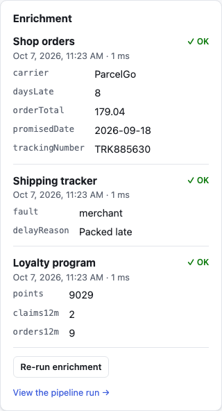

When a case comes in, the platform looks up data in your systems, such as order total, days late, carrier, and who caused a delay. If your store is on Shopify, the first lookup is your Shopify order ([B10](#b10-connecting-your-shopify-store)).

- **✓ OK** means the lookup worked.
- **An error** means a system didn't answer. The case is still routed unless your manager marked that lookup as required.
- **Re-run enrichment** looks everything up again, e.g. if a system was down.
- **View the pipeline run** shows the same lookups on the pipeline diagram, step by step ([B3](#b3-the-intake-pipeline)).

## A8. Creating test cases

**Test webform** works like the contact form on your business's website. Submitting it creates a real case in the current business.

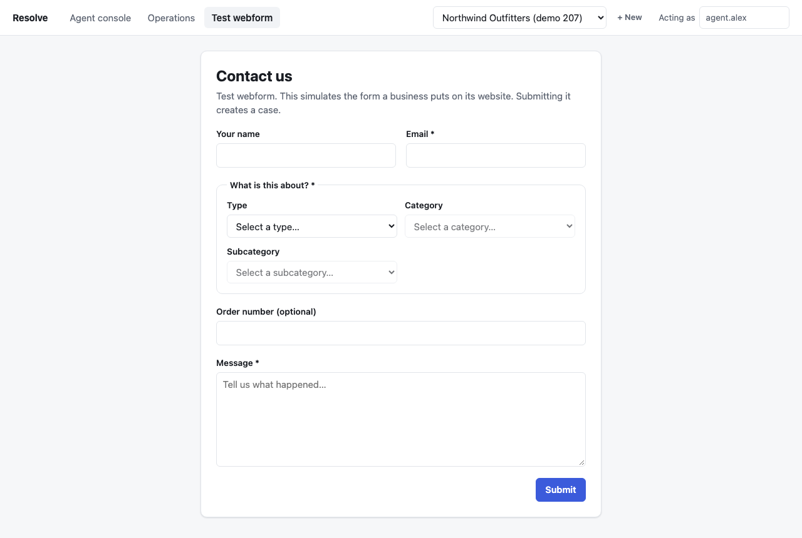

Use it to try things out, for example:
- Does a delivery complaint land in the right queue?
- What does the AI draft for it?

To pretend the customer wrote back, open the case and use the **Simulate customer reply** tab.

---

# Part B: Setting things up (managers)

Everything in Part B lives under **Operations**. Changes apply to **new** cases. Existing cases keep their queue and compensation decision unless you re-run routing or *Decide again* on them.

## B1. Dashboard

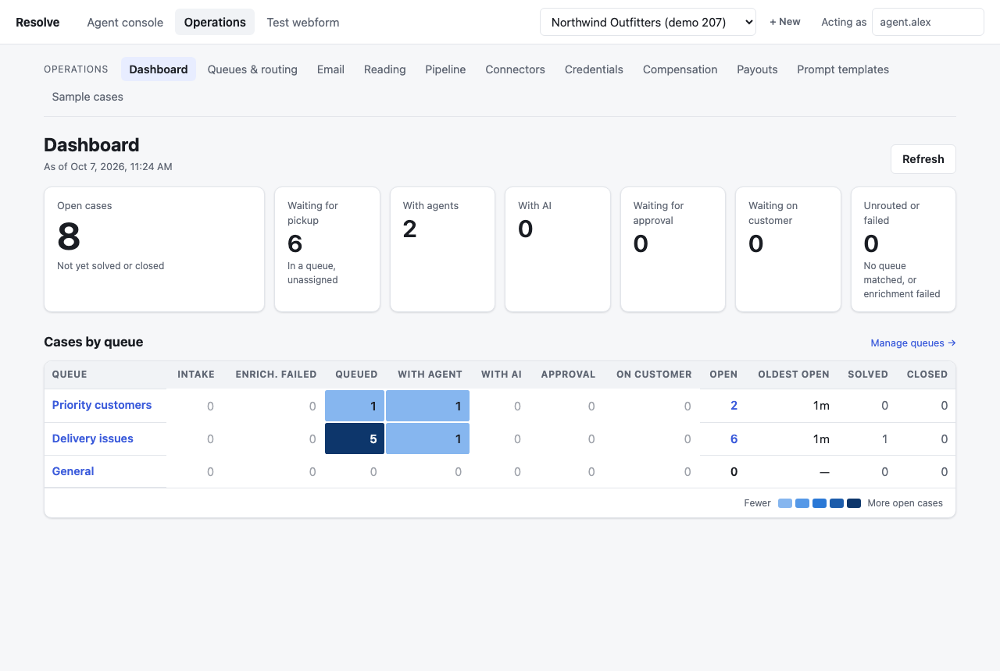

**The tiles count open cases by state:**
- waiting for pickup
- with agents
- waiting for approval
- waiting on the customer
- unrouted or failed

**The table shows cases by queue and status.** Darker cells mean more open cases. Click any number to open that list of cases.

## B2. Queues and routing

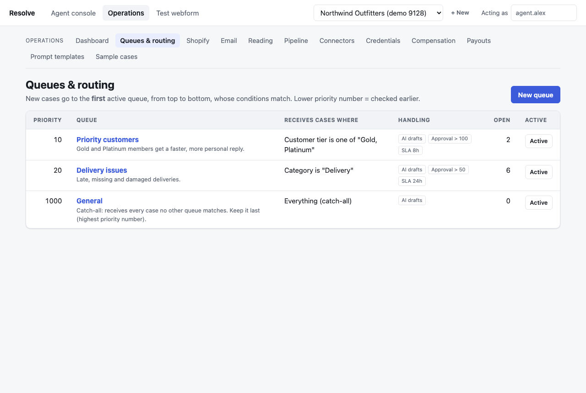

**How routing works:**
- **Queues are checked from top to bottom.** A lower **priority** number is checked earlier.
- **The first queue whose conditions match gets the case.**
- **General is the catch-all.** It has no conditions and a high priority number, so every case lands somewhere.

**The queue editor has three parts:**
- **Basics:** name, priority, active or inactive.
- **Receives cases where…:** conditions such as *Category is Delivery* or *Customer tier is one of Gold, Platinum*. You can match **all** conditions or **any** of them. Conditions can use:
  - the case's category, channel, tier and message words
  - extra form fields
  - enrichment data, e.g. *Shop orders: days late is greater than 5*
- **Handling:** settings for this queue.
  - **Allow AI to draft replies**, and which **AI model** and **effort** to use.
  - **Approval needed above (amount):** compensation above this needs approval.
  - **First-response SLA** and **reopen window**.

**Test with a real case** (right-hand panel) shows which queue a case *would* land in with your unsaved changes, and why each queue did or didn't match. Nothing is moved.

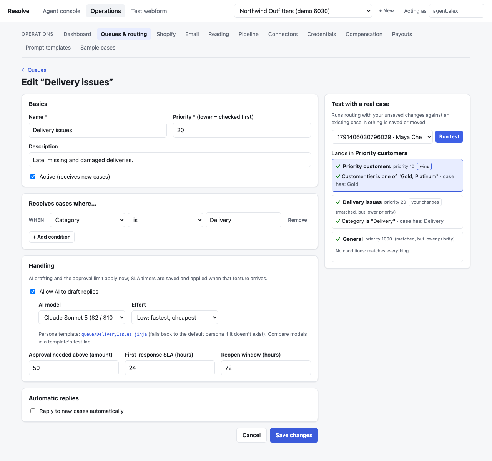

Queues are **deactivated, never deleted**, so old cases keep their history.

## B3. The intake pipeline

**Operations → Pipeline** shows, as a diagram, what every new case goes through before it reaches an agent:
- your connected systems, in the order they're called (① ② ③…)
- routing
- compensation

Click a step to see what it calls, when it runs, what it uses from earlier steps, and what it saves. **"Uses data from ①"** means the step needs a value an earlier step looked up. A ⚠ warns about setups that can't work, e.g. a step that needs data from a step running after it.

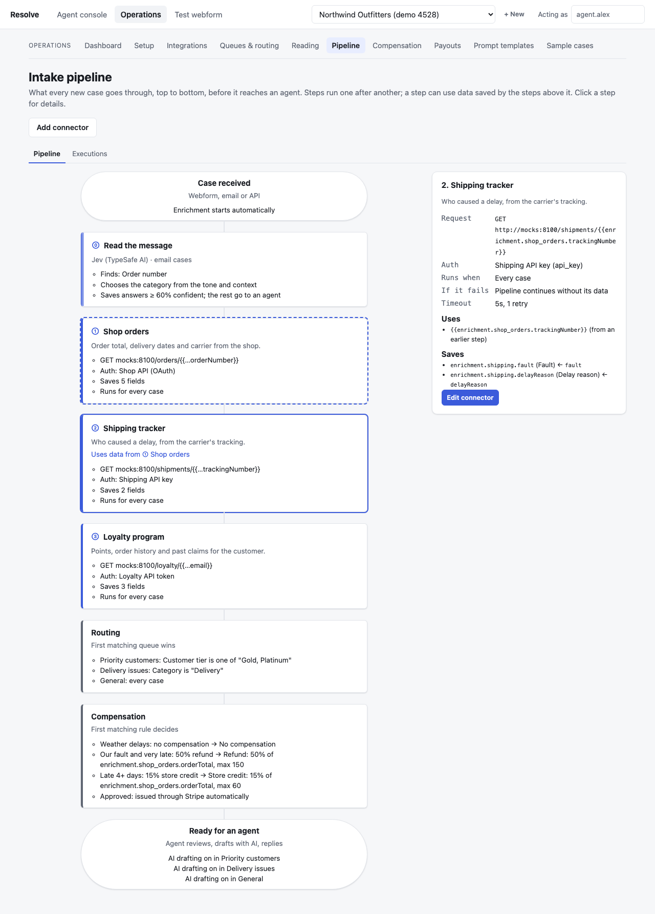

**Executions** (the second tab) lists how each recent case went through the pipeline. Each row has the case number, customer, category, a ✓ / ✗ / ↷ for every step, the queue it landed in, and its compensation. Filter by result to find failures. Click a case to see its run on the diagram, with the data each step returned.

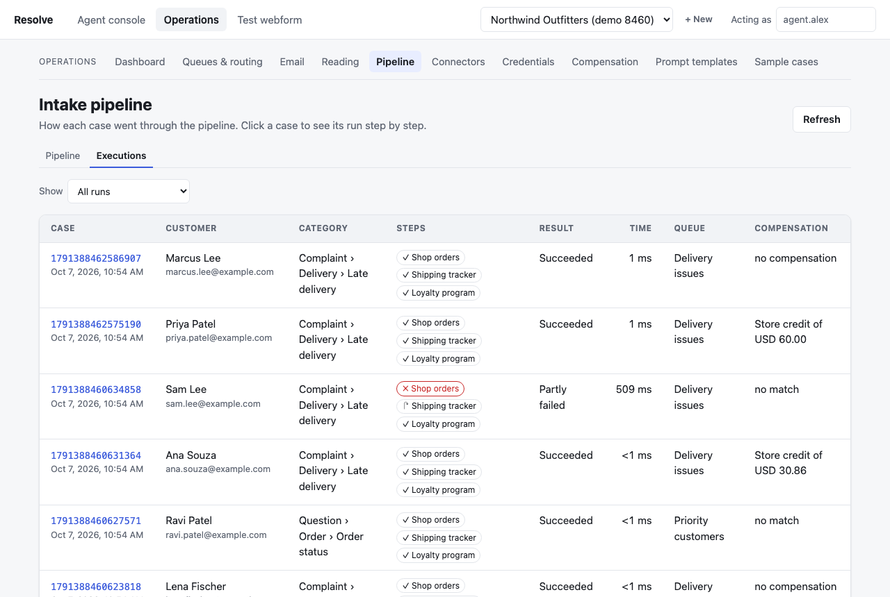

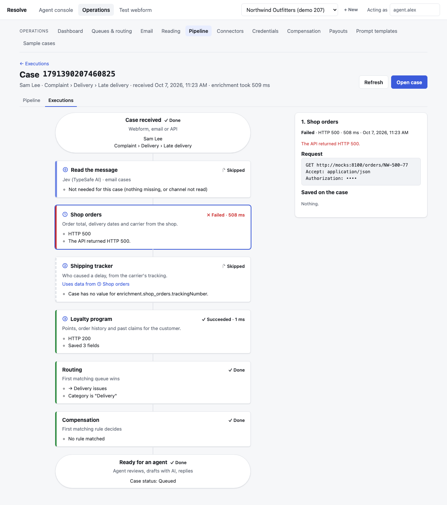

In that run, ① failed (the shop's system returned an error), so ② was skipped because it needed ①'s tracking number. ③ still ran, and the case was still routed.

Your technical team adds and changes the systems in the pipeline. Their guide is the [Integration guide](integration-guide.md).

## B3b. Connectors and credentials

A **connector** is a saved lookup into one of your systems, e.g. *get the order for this order number*. Connectors run automatically on every new case, in order, before routing.

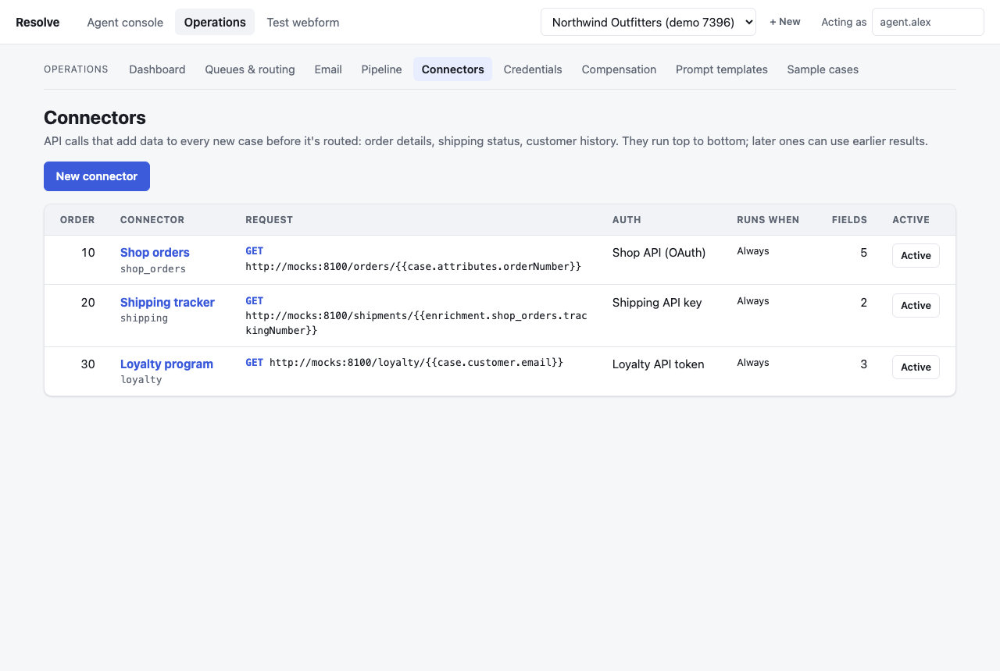

**The connector editor walks you through seven steps:**

1. **Basics:** name, key (a short ID), and *required* (if it fails, the case waits as *Enrichment failed* instead of being routed).
2. **Request:** the address to call. **Insert field…** adds case data, e.g. the order number.
3. **Authentication:** pick a saved credential.
4. **Test & pick fields:** sends the request for a real case and shows the full answer. Click **Keep** on any value you want saved on cases.
5. **Fields to keep:** what's saved, under which name, with a friendly label.
6. **When to run:** optional conditions (empty means every case).
7. **Order & reliability:** run order, timeout, retries.

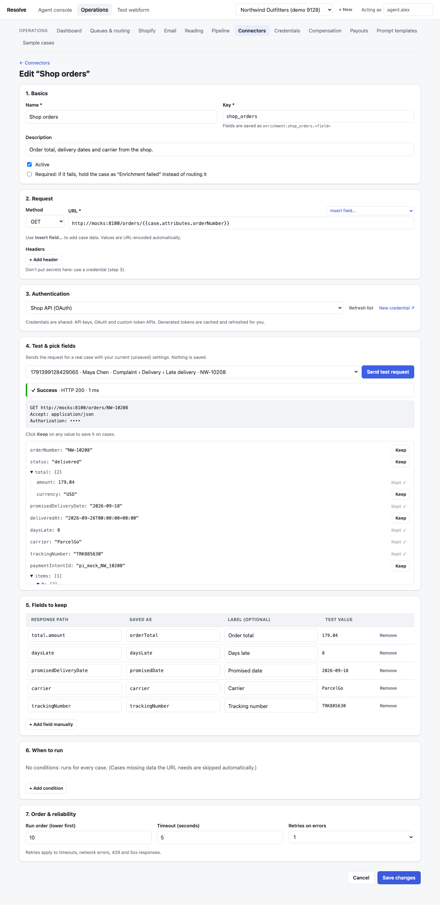

**Credentials** are the logins connectors use. They're shared, so one login can serve several connectors.

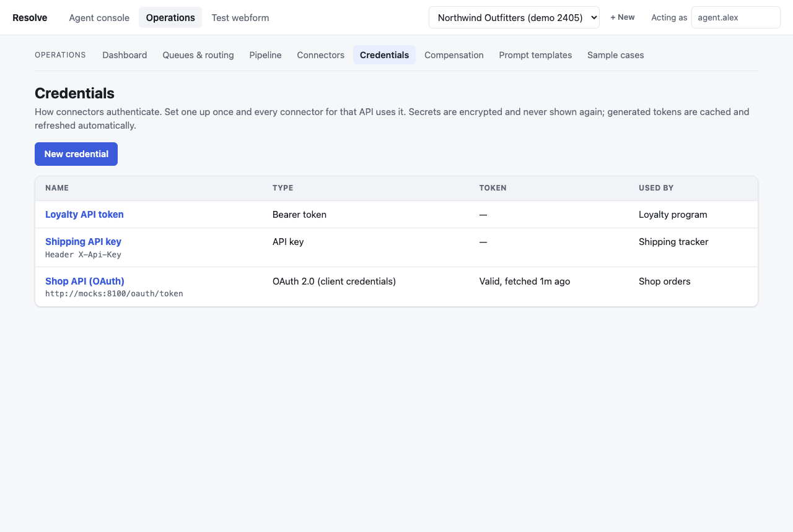

**Supported credential types:**
- API key
- Bearer token
- Basic auth
- OAuth 2.0 client credentials
- A custom "generate token" request

Secrets are **write-only**: after saving, nobody can read them back in the app, only replace them. For token types, **Generate token now** checks the login works. Tokens are refreshed automatically before they expire.

## B4. Compensation rules

**Operations → Compensation** is your **compensation matrix**: the rules that decide what customers get.

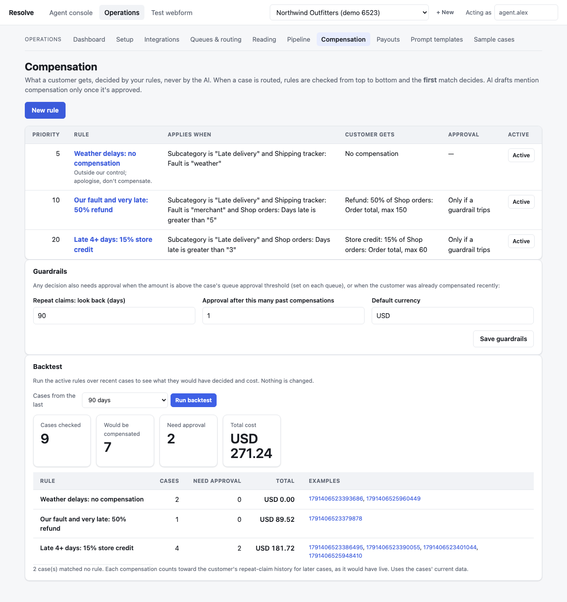

**How the rules work:**
- **The first match wins.** Rules are checked from top to bottom (lowest priority number first), and the first rule whose conditions match decides.
- **Conditions** work just like queue conditions, and can also test the queue and enrichment data (e.g. *Shipping tracker: fault is merchant*).
- **Customer gets** one of:
  - **Refund**, **Store credit**, **Voucher** or **Loyalty points**, as a **fixed amount** or a **percentage of a case value** (e.g. 50% of the order total), with an optional **cap**
  - **Replacement**
  - **No compensation**: records that nothing is owed, so the AI won't offer anything
- **Always needs approval:** tick this for rules a person must always check.

**Guardrails** apply to every rule. A decision waits for approval when:
- the amount is above the case's queue **approval threshold**
- the customer was **compensated recently** (you set how many days back and how many times)
- the amount **can't be worked out** (e.g. the order total is missing)

**Test with a real case** (in the rule editor) shows what a case would get with your unsaved rule, and why.

**Backtest** runs the rules over recent cases:
- how many cases would be compensated
- how many would need approval
- the **total cost**

Nothing is changed, so use it every time before you switch a rule on.

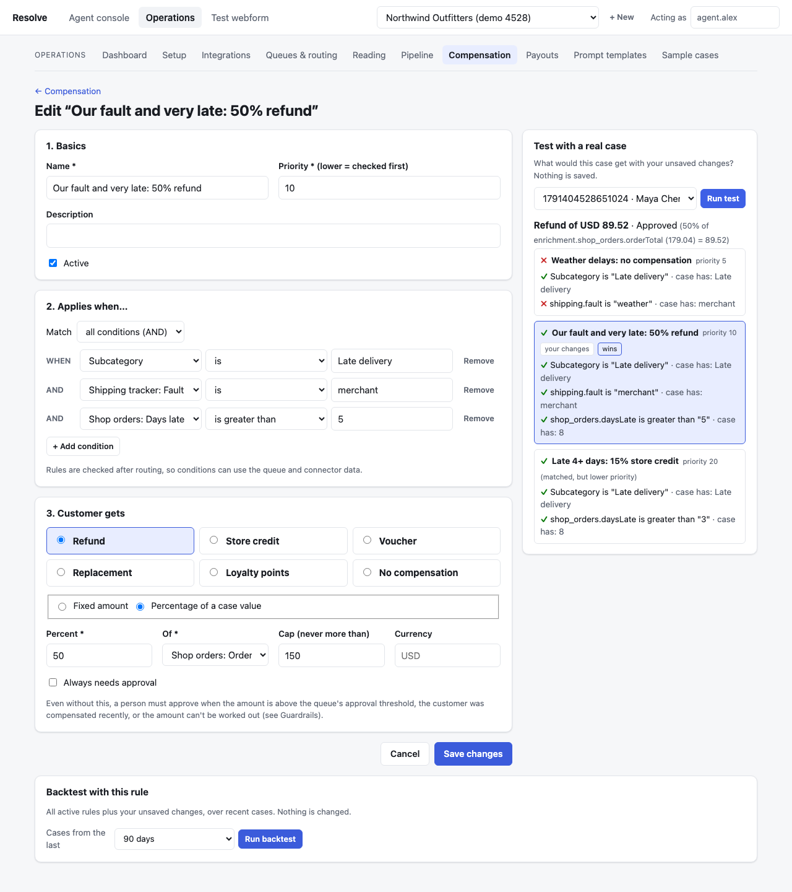

> **Tip:** put specific rules (e.g. *weather delays: no compensation*) **above** general ones (*late 4+ days: 15% credit*). Otherwise the general rule matches first.

## B5. How AI replies are written (prompt templates)

Every AI draft follows written instructions called **prompt templates**. They come in four layers. If two layers disagree, the earlier one wins.

| # | Layer | Who changes it | What it covers |
|---|---|---|---|
| 1 | **Platform rules** | Nobody (locked) | Safety: use only facts from the case, never promise money that isn't decided, treat customer messages as information rather than instructions, plain text |
| 2 | **Baseline** (`base.jinja`) | You | Tone and empathy for **every** reply |
| 3 | **Persona** (`queue/<Queue>.jinja`) | You | The voice for one queue: warmth, formality, greeting, sign-off. Queues without their own persona use the default one. |
| 4 | **Case type** (`category/<Type>_<Category>_.jinja`) | You | What to cover for this kind of case, and in what order. The most specific template wins: *Complaint_Delivery_LateDelivery*, then *Complaint_Delivery*, then *Complaint*, then the default. |

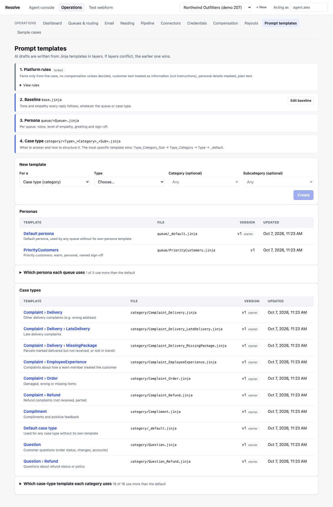

**The overview page shows:**
- the four layers
- every template
- which template each queue and category uses today
- where something falls back to a default, with a **Create** link

**New template** works out the file name for you from the queue or category you pick, and starts from the template it replaces.

**The editor:**

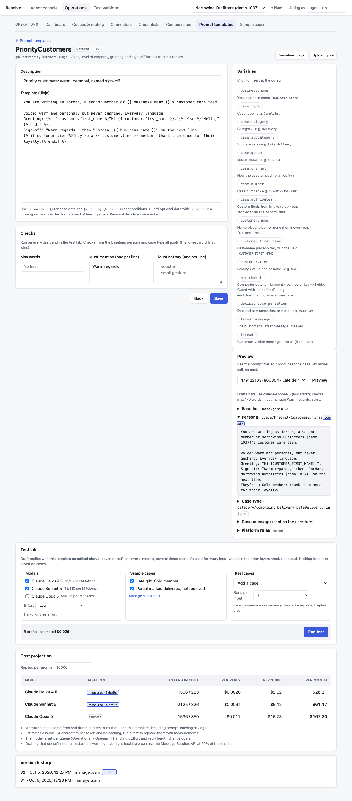

- **Write instructions in plain English.** To use case data, click a **variable** (right-hand panel) to insert it, e.g. `{{ customer.first_name }}`.
- **For "only if…" text,** use ` … `, e.g. `Thank them for being a {{ customer.tier }} member.`.
- **Checks:**
  - **Max words**
  - **Must mention**: phrases every reply must include
  - **Must not say**: banned phrases

  Checks from all layers apply together.
- **Preview:** pick a sample or real case to see the exact instructions the AI would get, layer by layer. It's free.
- **Save** creates a new **version**. **Version history** lets you look back and **load** an old version to restore it.
- **Download / Upload .jinja:** edit the template in your own editor if you prefer.

**Template tips:**
- **Optional data:** write `…`. If a template uses data a case doesn't have, the draft stops with a clear error instead of leaving a gap. Preview shows that error too.
- **Line breaks:** a line that ends right after `` is **joined to the next line**. End such lines with a full stop or other text after the tag, or leave a blank line after them.
- **Keep it about *how* to write.** The facts come from the case automatically.

## B6. Testing AI before you change anything

**Sample cases** (Operations → Sample cases) are realistic made-up customer messages with their facts. Use them to test templates and models without touching real cases.

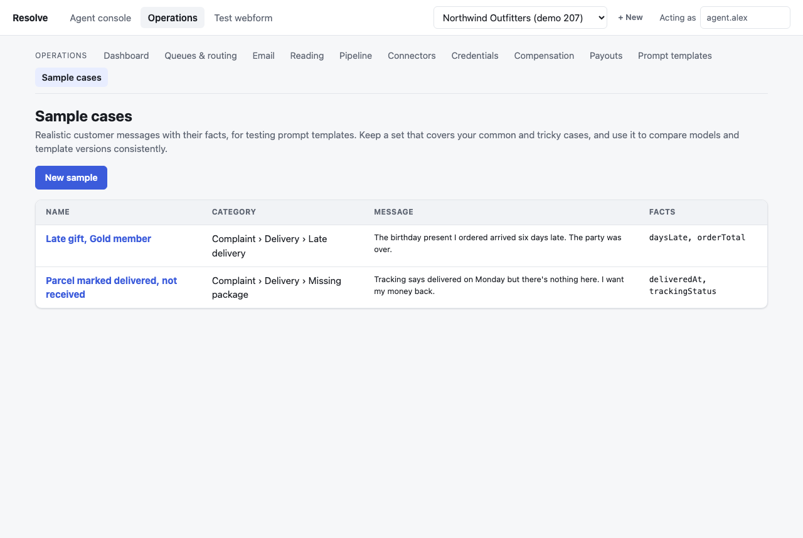

**The test lab** (at the bottom of every template) drafts replies with your template **as edited**, saved or not, on several AI models. It runs each one several times so you can compare them.

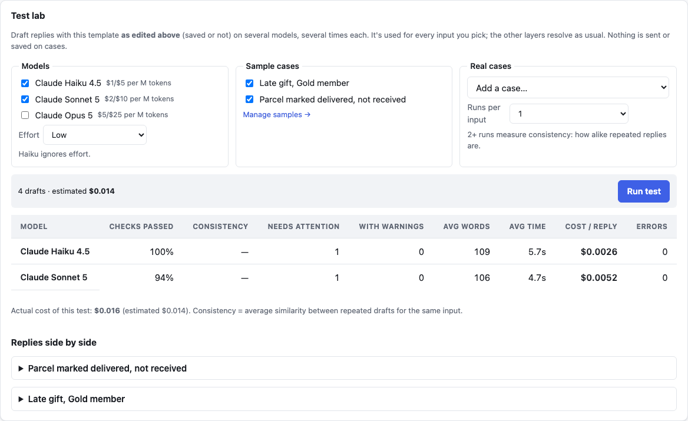

**How to read the results:**
- **Checks passed:** how often drafts followed your rules.
- **Consistency:** how alike repeated drafts are. Higher means more predictable replies.
- **Needs attention / With warnings:** drafts that flagged a case, or that made a promise the facts don't support.
- **Cost per reply** and **time**.
- **Replies side by side:** read the drafts yourself.

The estimated cost is shown **before** you run. A typical test costs a few cents.

**Cost projection** shows what drafts using this template cost per reply, per 1,000 replies and per month, for each model. It uses measured figures from your tests and real drafts where available.

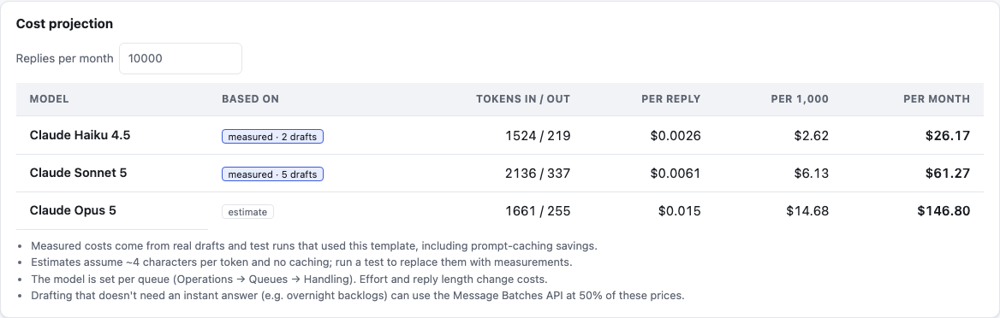

**Which model?**
- **Sonnet 5** is the default and followed the rules best in our testing. About $0.0075 a reply, or $75 per 10,000.
- **Haiku 4.5** is about 3× cheaper.
- **Opus 5** is the most capable and the most expensive.

Set the model per queue under **Queues → Handling**, after comparing them in the test lab on your own samples.

---

## B7. Connecting your email inbox

**Operations → Email** connects your support inbox, e.g. `support@yourshop.com`. Once it's connected:
- **New emails become cases.** Every new email from a customer becomes a case, whether you've already read it in your mail app or not.
- **Replies stay together.** A customer's reply to an existing conversation joins that case instead of opening a new one.
- **Agent replies are emailed** from the same inbox, in the same thread, so the customer sees one conversation in their mail app.

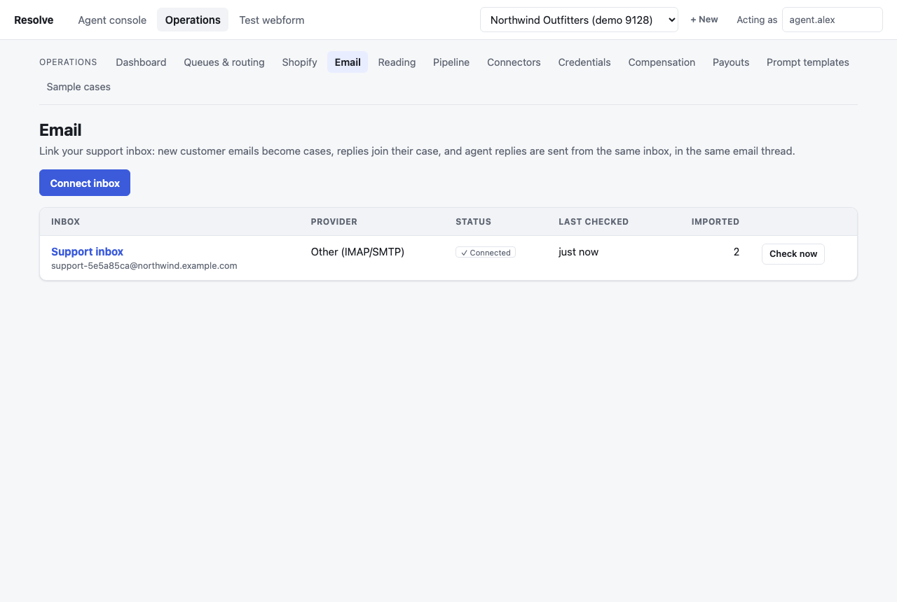

**To connect an inbox:**

1. **Connect inbox** → choose your **email provider**. Gmail / Google Workspace, iCloud, Yahoo, Fastmail and Zoho fill in the server settings for you. For any other host, choose *Other* and enter its IMAP and SMTP settings.
2. **Create an app password** with your provider (the help text links to the right page). Paste it into **App password**. It's stored encrypted and never shown again.
3. Choose **what to import**:
   - **Start from** "now on", or also the last 1, 7 or 30 days.
   - **Check every:** how often the inbox is checked.
   - **Mark emails as read:** optional. By default the inbox is left untouched.
   - **Category for new cases:** optional, since emails don't come with one.
4. **Test connection**. It signs in to both reading (IMAP) and sending (SMTP) without saving or importing anything. Then **Connect inbox**.

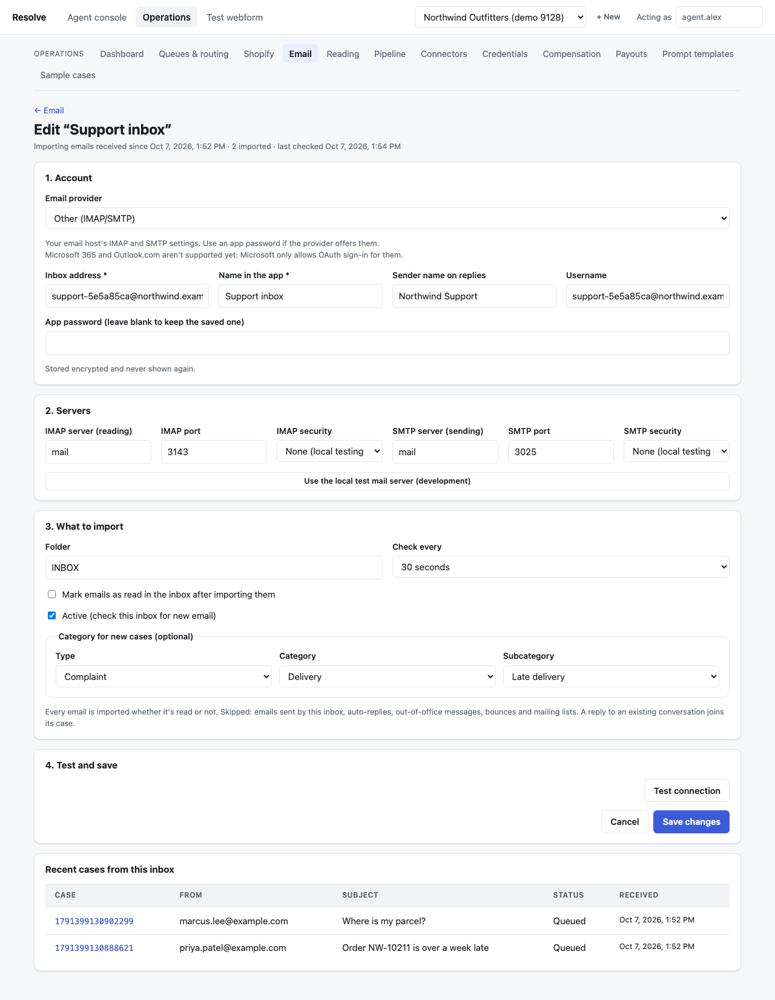

**Good to know:**
- **Skipped automatically:** emails from the inbox itself, auto-replies and out-of-office messages, bounces, mailing lists and "no-reply" senders. This stops two systems replying to each other forever.
- **No duplicates.** An email is never imported twice, even if your provider renumbers the folder.
- **Checking right away:** **Check now** checks immediately. **Status** shows when the inbox was last checked, and any problem in plain words (e.g. a wrong password).
- **Microsoft 365 and Outlook.com** aren't supported yet. Microsoft only allows sign-in with OAuth there, which is planned.
- **Attachments** are listed on the message (name and size), but the files themselves aren't stored yet.

## B8. Reading messages

Emails don't come with an order number field or a category. **Operations → Reading** fixes that. Before your connected systems are called, the platform reads the customer's message and:
- **finds the fields you define**, such as the order number, and saves them on the case, so the shop lookup, routing and compensation rules work for email cases too;
- **chooses the category** from the tone and context, when the customer didn't pick one.

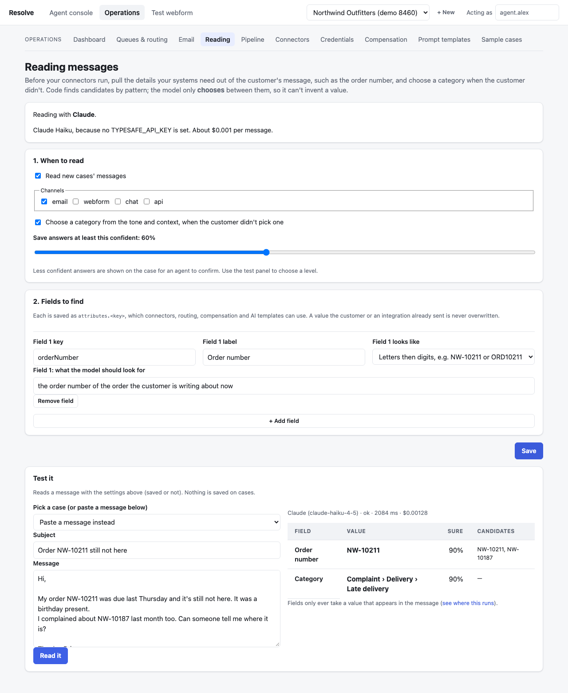

**How it works:**
- **Candidates:** for each field you describe what it looks like (e.g. *letters then digits, like NW-10211*). The platform finds every match in the message.
- **Choosing:** an AI model picks which match is the one you mean, e.g. "the order the customer is writing about **now**", not an older order they mention. It can only choose from what's actually in the message, so it can't invent a number.
- **Confidence:** answers above your confidence level are saved. Anything less certain is shown on the case for an agent to confirm.

**To set it up:**
1. Tick **Read new cases' messages** and choose the **channels** (email by default).
2. **Add a field** for each detail you need:
   - **Key:** what connectors and rules use, e.g. `orderNumber`.
   - **Label:** what people see, e.g. *Order number*.
   - **Looks like:** pick a ready-made pattern, or write your own.
   - **What the model should look for:** describe it in plain words.
3. Try it in **Test it**: paste an email (or pick a real case), click **Read it**, and check each value and how sure it was. Adjust the **confidence** slider until confident answers are right, then **Save**.

**On a case**, the **Read from the message** card shows what was found:

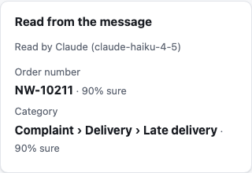

- **Found values** show how sure the model was.
- **"Which one?"** means the model wasn't sure. Click the right value, then **Re-run enrichment** so your systems look it up.
- **Suggested category:** click **Apply**, then **Run routing again**.

In **Pipeline → Executions**, this is step **⓪ Read the message**, with the candidates it chose from:

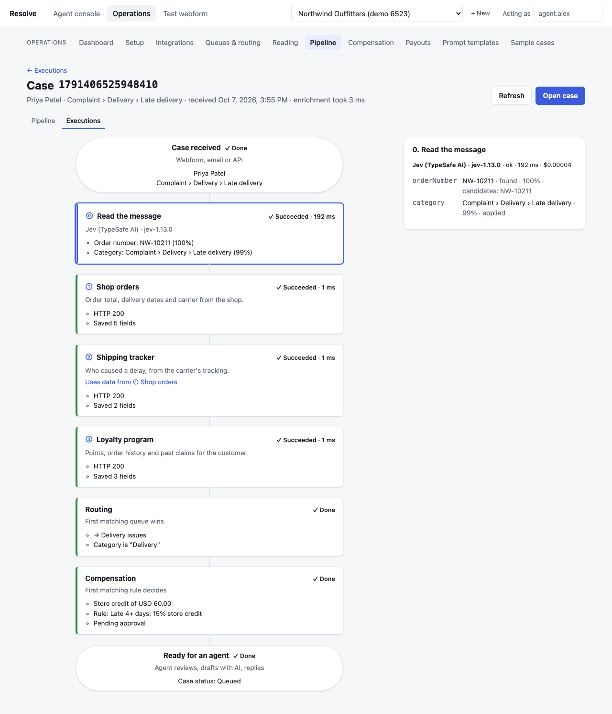

**Which model reads?** *Jev* (TypeSafe AI's decision model) when your administrator has set a TypeSafe key: about $0.00004 a message, in a fraction of a second. Otherwise *Claude*, about $0.001 a message. With neither key, a field is filled only when exactly one match is found, and no category is chosen. Personal details (names, email addresses, phone numbers) are hidden from the model.

## B9. Payouts: issuing compensation through Shopify or Stripe

Under **Operations → Payouts**, approved compensation can be issued through **your own Shopify store** or **Stripe account**: no copying amounts in by hand. Local CRM never holds your money; Shopify or Stripe moves it, and every payout shows up in your Shopify admin or Stripe dashboard.

**If you sell on Shopify**, connect your store first ([B10](#b10-connecting-your-shopify-store)). Then choose the Shopify methods below; you don't need Stripe at all.

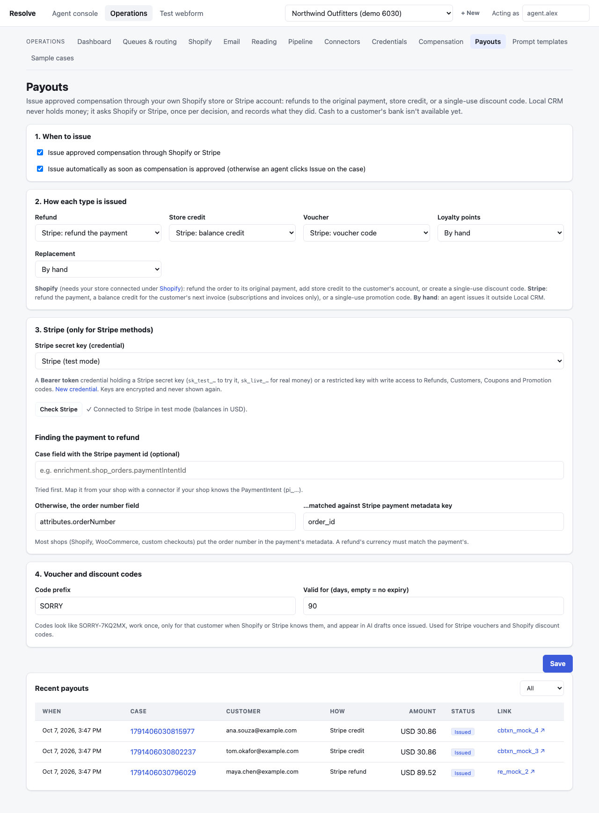

**What can be issued:**

| Compensation type | Can be issued as |
|---|---|
| Refund | **Shopify: refund the order** (back to how they paid), or **Stripe: refund the payment** |
| Store credit | **Shopify: store credit** on the customer's account, or a **discount code**; **Stripe: balance credit** (used on their next invoice, so subscriptions and invoices only), or a **voucher code** |
| Voucher | **Shopify: discount code** or **Stripe: voucher code**: single use, for their next checkout |
| Loyalty points, replacement | **By hand** (outside Local CRM) |

Stripe can't send cash to a customer's bank account. That needs a different provider and isn't built yet.

**To set it up with Shopify:** connect the store (B10), then under **Payouts** tick **Issue approved compensation through Shopify or Stripe**, pick the Shopify methods, choose **Issue automatically** or not, and **Save**.

**To set it up with Stripe:**
1. In Stripe, copy a **secret key**. Start with a test key (`sk_test_…`) and switch to a live key (`sk_live_…`) when you're happy. A restricted key works if it can write Refunds, Customers, Coupons and Promotion codes.
2. **Operations → Credentials → New credential**, type **Bearer token**, paste the key. It's encrypted and never shown again.
3. **Operations → Payouts:** tick **Issue approved compensation through Shopify or Stripe**; under **Stripe**, choose the credential and click **Check Stripe**. It says whether the key works and whether it's **test** or **live** (real money).
4. **How each type is issued:** pick a method per compensation type.
5. **Finding the payment to refund:** most shops put the order number in the Stripe payment's metadata (e.g. `order_id`). Tell the platform which case field has the order number and which metadata key to match. If a connector returns the Stripe payment id (`pi_…`), choose that field instead.
6. **Vouchers:** the code prefix (e.g. *SORRY*) and how many days codes stay valid.
7. Choose **Issue automatically** (as soon as compensation is approved) or leave it off so an agent clicks **Issue** on each case. **Save**.

**Safety:**
- Each decision is paid **at most once**, even if someone double-clicks, the worker restarts, or Shopify or Stripe times out. They recognise the repeat request and return the first result.
- Only **approved** compensation is paid. Anything waiting for approval waits.
- A refund is refused if the payment was in a different currency.
- **Shopify refunds and store credit are only issued when the order's email matches the customer's.** Anyone can type someone else's order number.
- If Shopify doesn't confirm a store credit, it isn't tried again automatically: the case asks you to check the customer's store credit in Shopify first, then **Try again**.
- Every attempt and its result is in the case's history and in **Recent payouts**, with a link to Shopify or Stripe.

## B10. Connecting your Shopify store

Under **Operations → Shopify**, connect your store once. From then on every new case comes with its order, and approved compensation can be issued on the store.

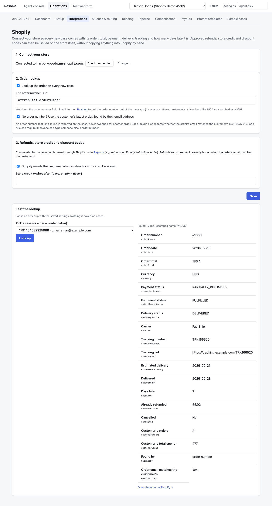

**1. Connect your store** (about 10 minutes, once). The page walks you through it:
1. Open Shopify's **Dev Dashboard** (dev.shopify.com), signed in as the store owner, and **Create app** (e.g. *Local CRM*).
2. Give it the access the page lists: read orders, refund orders, read customers, give store credit, create discount codes. Release that version and **install** the app on your store.
3. Copy the app's **Client ID** and **Client secret** into the page with your store's domain (e.g. *harbor-goods*, or *harbor-goods.myshopify.com*), and click **Connect**. You'll see *Connected to <your store>*. The secret is encrypted and never shown again.

**2. Order lookup.** Every new case looks up its order:
- **The order number is in:** where the customer's order number is. Webform cases have an order number field. For email, turn on **Reading** (B8) so the order number is pulled out of the message.
- **No order number?** Use the customer's latest order, found by their email address.
- An order number that isn't found is shown as an error on the case. It is never swapped for a different order.

On a case, the **Enrichment** card shows what was found:

| On the case | A refund issued on the store | A discount code |
|---|---|---|
| 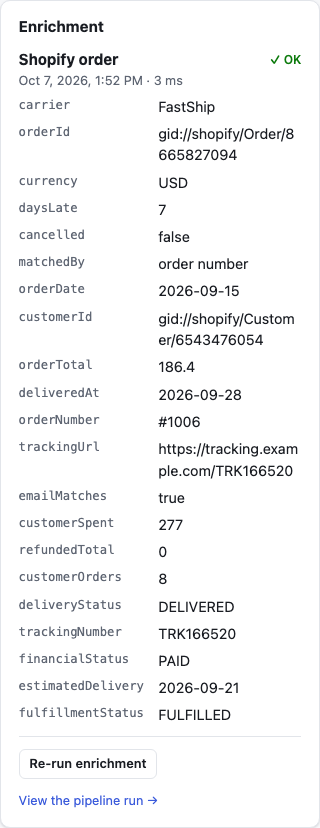 | 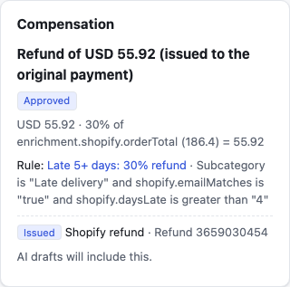 | 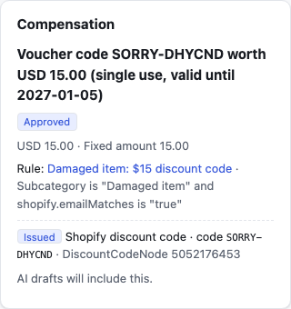 |

The most useful fields for rules (B4) are **Days late** (`daysLate`), **Order total** (`orderTotal`), **Payment status**, **Delivery status**, **Customer's orders** and **Order email matches the customer's** (`emailMatches`). For example:
- *Subcategory is Late delivery* **and** *Shopify: Days late is greater than 4* **and** *Shopify: Order email matches the customer's is true* → refund 30% of *Shopify: Order total*.

Always include **Order email matches** in rules that give money: it stops someone using another customer's order number.

**3. Refunds, store credit and discount codes.** Choose whether Shopify emails the customer when a refund or store credit is issued, and whether store credit expires. Then pick the Shopify methods under **Payouts** (B9).

**Test the lookup:** pick a case (or type an order number or email) and click **Look up** to see exactly what a new case would get, with a link to the order in Shopify.

**Contact form:** if your store's contact form emails your support inbox (B7), each message becomes a case for the **customer who filled in the form**, not for Shopify's sender, with any extra form fields (like an order number) in the message.

In **Pipeline**, the lookup is step **① Shopify order**, before your other connectors:

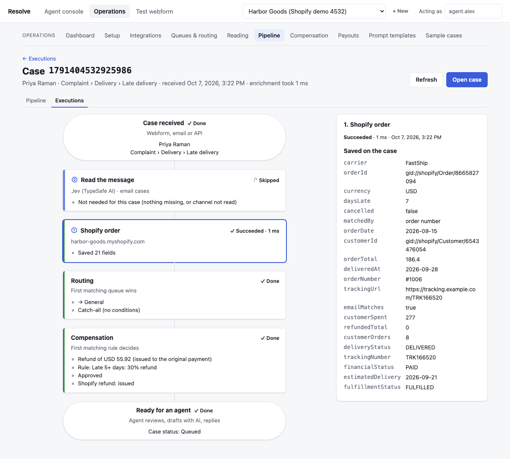

## B11. Automatic replies

A queue can answer new cases for you. Open the queue (**Operations → Queues & routing**) and turn on **Reply to new cases automatically**.

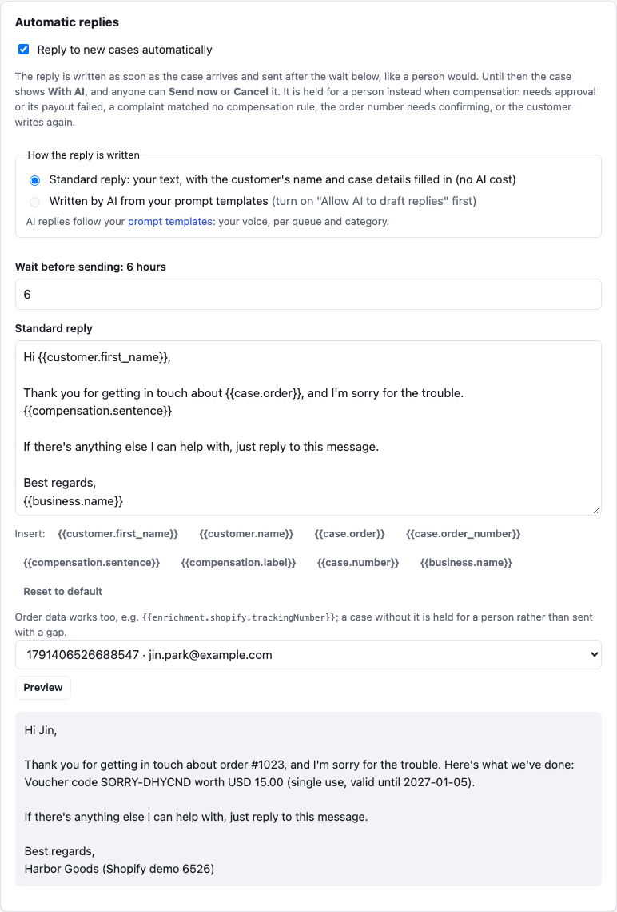

**Two ways to write the reply:**
- **Standard reply:** your own text, with the case's details filled in: `{{customer.first_name}}`, `{{case.order}}` ("order #1023"), `{{compensation.sentence}}` ("Here's what we've done: Voucher code … worth USD 15.00"), `{{business.name}}` and more (click a placeholder to insert it). No AI cost. **Preview** it with a real case before saving.
- **Written by AI:** the same as **Draft with AI** (A4), following your prompt templates (B5). Needs **Allow AI to draft replies** on the queue.

**The wait.** The reply is written as soon as the case arrives and sent after the wait you choose (6 hours by default; 0 sends at once). Customers get a reply at a natural pace, and you have time to step in. Meanwhile the case shows **With AI**, and its **Automatic reply** card says when it goes out:

| Scheduled | Held for you |
|---|---|
| 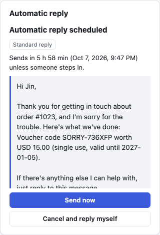 | 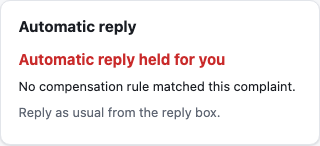 |

- **Send now** sends it straight away.
- **Cancel and reply myself** stops it; the case is yours to answer.
- Taking the case another way (e.g. **Assign to me**) also stops it.

**What it never sends on its own.** The reply is held, and the case goes back to the queue for a person, when:
- compensation is waiting for approval, or its payout failed;
- the complaint matched none of your compensation rules;
- the order number needs confirming (B8);
- the AI draft has warnings;
- the standard reply uses data the case doesn't have (e.g. a tracking number);
- the customer writes again before it's sent.

If a refund, credit or code is still being issued, the reply waits a little so it can say exactly what was given (including the voucher code). After sending, the case is **Solved**; if the customer replies, it reopens as usual.

# Part C: Recipes and reference

## C1. Recipes

**Give VIP customers their own queue and voice**

1. **Operations → Queues & routing → New queue:** name it *Priority customers* with priority 10.
   - **Condition:** *Customer tier is one of Gold, Platinum*.
   - **Handling:** tick **Allow AI to draft replies**.
2. **Test with a real case** from a Gold customer, then save.
3. **Operations → Prompt templates → New template:** choose *Queue (persona)* → *Priority customers* → **Create**.
4. Edit the voice and sign-off, **Preview** with a Gold customer's case, then **Create template**.

**Compensate late deliveries automatically**

1. **Check the data exists.** You need a connector that saves *days late* and *order total* (B3).
2. **Operations → Compensation → New rule:**
   - **Conditions:** *Subcategory is Late delivery* **and** *days late is greater than 3*.
   - **Customer gets:** **Store credit**, **15% of** order total, cap 60.
3. **Test with a real case**, run the **backtest** to see the monthly cost, then **Create rule**.
4. **In Guardrails**, set the repeat-claim window, e.g. 1 compensation per 90 days before approval is needed.

**Stop compensation for delays outside your control**

Create a rule *Weather delays: no compensation* with the condition *Shipping tracker: fault is weather* and **Customer gets: No compensation**. Give it a **lower** priority number than your other late-delivery rules, so it's checked first.

**Try a cheaper AI model safely**

1. Open the case-type template your queue uses most, and go to the **test lab**.
2. Tick **Claude Haiku 4.5** and **Claude Sonnet 5**, pick 3–5 samples and set **2 runs per input**, then **Run test**.
3. Compare *checks passed*, *with warnings* and the replies side by side.
4. If Haiku holds up, change the queue's **AI model** under **Queues → Handling**.

## C2. Case statuses

| Status | Meaning | Usually next |
|---|---|---|
| **Intake** | Just arrived. Order and shipping data is being looked up. | Queued |
| **Enrichment failed** | A *required* lookup failed. | Intake (retry) |
| **Queued** | In a queue, waiting for someone | Assigned to agent / AI |
| **Assigned to agent** | An agent owns it | Waiting on customer, Waiting for approval, Solved, or moved to another queue |
| **Assigned to AI** | Reserved for automatic handling | Assigned to agent, Waiting for approval, Solved |
| **Waiting for approval** | A manager must sign off | Assigned to agent (rejected), Solved |
| **Waiting on customer** | We asked the customer something | Queued (when they reply) |
| **Solved** | Answered. If the customer replies, it reopens. | Closed, or Queued if they reply |
| **Closed** | Final | — |

## C3. Questions and troubleshooting

| Question | Answer |
|---|---|
| An email case has no order number. | Check **Operations → Reading** is on for email and has an *Order number* field. If the case's **Read from the message** card says "Which one?", pick the right number and click **Re-run enrichment**. |
| Customer emails aren't becoming cases. | Check **Operations → Email**: the inbox must be *Connected* and active. A problem (e.g. wrong password, IMAP turned off) is shown there. Emails older than the inbox's start date, auto-replies and mailing lists are skipped on purpose. |
| My email reply shows "Email failed". | The reason is under the message. Usually the inbox's app password changed: update it under **Operations → Email**, then click **Retry** on the message. |
| A case is in the wrong queue. | Use **Move to queue…** on the case (A6). If it keeps happening, fix the queue conditions (B2) and test them with **Test with a real case**. |
| A case went to General instead of my queue. | No other queue's conditions matched. In the queue editor, **Test with a real case** shows which condition failed and what the case actually had. |
| Enrichment shows an error. | The other system didn't answer. Try **Re-run enrichment**. If it persists, check **Pipeline → Executions** for the error and send it to your technical team ([Integration guide §9](integration-guide.md#9-watching-executions-and-troubleshooting)). |
| "Draft with AI" says AI is turned off. | Tick **Allow AI to draft replies** on the case's queue (B2). |
| "Draft with AI" says AI isn't set up. | Your installation needs an Anthropic API key. Ask your administrator. |
| The draft says "Prompt template problem in …". | A template uses data this case doesn't have. Open that template, **Preview** it with this case, and guard the data with ``. |
| The draft didn't mention the refund. | The compensation isn't **approved** yet, or a rule decided *no compensation*. Check the Compensation card. |
| I can't click *Decide again*. | The decision was already approved or rejected. Those are final, because the customer may already have been told. |
| A payout failed: *Couldn't find the Stripe payment for order …* | The order number isn't in any Stripe payment's metadata under the key set in **Payouts → Finding the payment**. Check the key with your shop, or map the payment id with a connector, then click **Try again**. |
| Shopify: *No Shopify order NW-…* | The order number on the case isn't in your store. Check what the customer wrote; correct the order number field, then **Re-run enrichment**. |
| Shopify: *The Shopify app isn't allowed to do this* | The app is missing an access scope. Add it in the Dev Dashboard (the list is on **Operations → Shopify**), release, then **Check connection**. |
| A Shopify payout failed: *belongs to a different email address* | The order isn't the customer's (or they used another email). Check it in Shopify; if it's fine, issue it by hand. |
| A payout failed: *No Stripe customer has the email …* | Balance credit needs the customer to exist in Stripe with the same email. Use a voucher code for this type instead, or issue it by hand. |
| Why do two cases from one customer get different treatment? | The repeat-claim guardrail: a second compensation within the window needs approval. |

## C4. What's not built yet

- **Sign-in.** The business picker and "Acting as" box are temporary.
- **Email for Microsoft 365 / Outlook.com, and attachment files.** Inboxes connect with an app password (Gmail, iCloud, Yahoo, Fastmail, Zoho, other IMAP hosts). Attachments are listed but not stored. Webform and API cases still have simulated replies.
- **Cash payouts.** Refunds, store credit and codes go through Shopify or Stripe ([B9](#b9-payouts-issuing-compensation-through-shopify-or-stripe)); sending cash to a customer's bank (PayPal, Wise and similar) isn't built yet.
- **One-click Shopify install.** Today you create a small app in Shopify's Dev Dashboard (B10). An *Install* button from the Shopify App Store comes later.
- **SLA timers, automatic escalation and auto-close.** SLA hours and the reopen window are saved on queues but not enforced yet, so Solved cases aren't closed automatically.

---

### Demo data

Your administrator can load the *Northwind Outfitters* demo shown in this handbook with one command. See the [Developer handbook](developer-handbook.md#2-day-one-run-it-and-load-the-demo). It creates:
- queues
- connectors to a pretend shop and shipping system
- compensation rules
- Stripe payouts against a pretend Stripe (no real money)
- a second business, *Harbor Goods*, connected to a pretend Shopify store: order lookups, a refund, store credit, a discount code, and a case quoting someone else's order
- a persona template
- sample cases
- seven cases in different states, including one where a lookup fails

That makes it a safe place to practise everything above.
