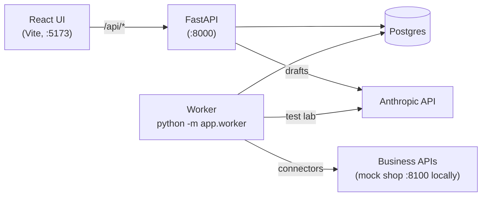
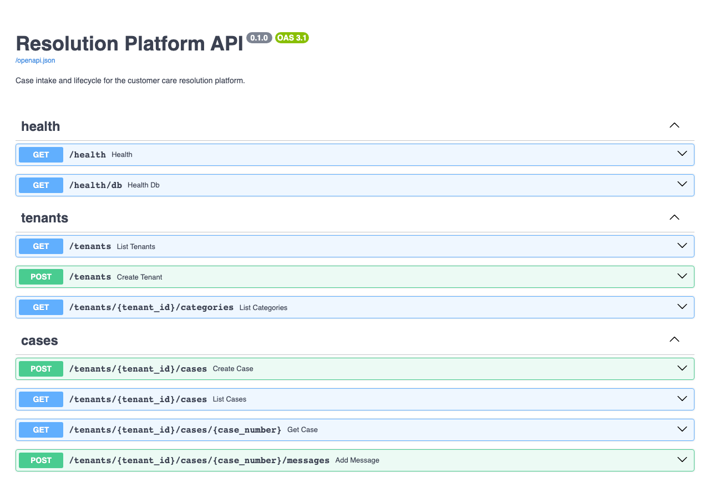
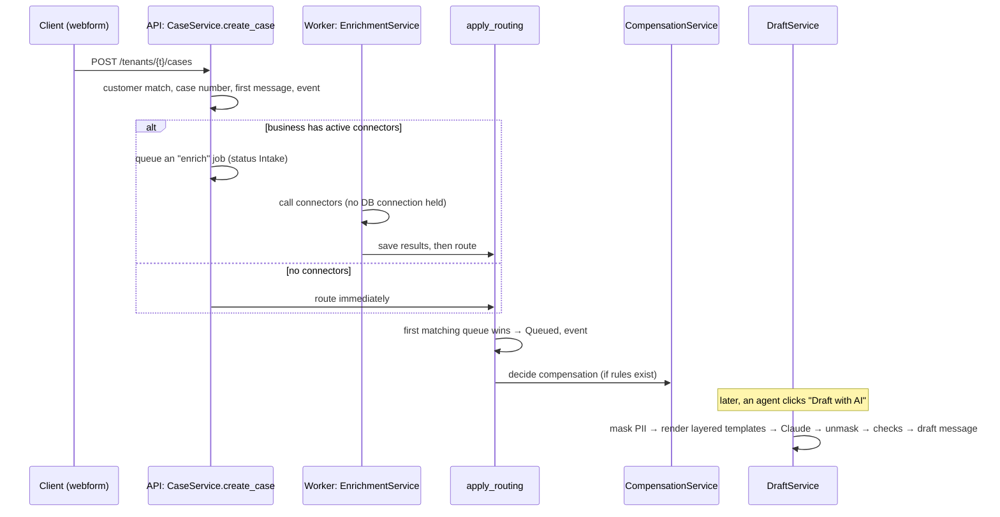

# Developer Handbook

**For:** engineers joining Local CRM. It takes you from a fresh laptop to shipping your first feature.

**How it fits with the other docs:** this handbook is the **path**. The detailed guides are the **reference**, and the handbook links to them instead of repeating them:

| When you need… | Read |
|---|---|
| Setup options, walkthroughs, troubleshooting | [dev/local-setup.md](../dev/local-setup.md) |
| How the code is layered; each feature's internals; every API endpoint | [dev/codebase-guide.md](../dev/codebase-guide.md) |
| Tables, JSON columns, migrations, transactions | [dev/database-guide.md](../dev/database-guide.md) |
| Backend / frontend folder maps and commands | [backend/README.md](../../backend/README.md), [frontend/README.md](../../frontend/README.md) |
| What the product does, from the user's side | [Business handbook](business-handbook.md) |
| How *customers'* engineers connect their APIs (connectors, auth, chaining, executions) | [Integration guide](integration-guide.md) |

---

## Contents

1. [The system in five minutes](#1-the-system-in-five-minutes)
2. [Day one: run it and load the demo](#2-day-one-run-it-and-load-the-demo)
3. [How a case flows through the code](#3-how-a-case-flows-through-the-code)
4. [Feature map: where everything lives](#4-feature-map-where-everything-lives)
5. [Rules you must not break](#5-rules-you-must-not-break)
6. [How we work](#6-how-we-work)
7. [Recipes](#7-recipes)
8. [Testing](#8-testing)
9. [Debugging](#9-debugging)
10. [Keeping docs and screenshots current](#10-keeping-docs-and-screenshots-current)
11. [Your first week](#11-your-first-week)

---

## 1. The system in five minutes



| Part | Tech | Job |
|---|---|---|
| **UI** | React 19, TypeScript, Vite, React Router | Agent console, Operations Portal, test webform |
| **API** | Python 3.12, FastAPI, Pydantic v2, SQLAlchemy 2, Alembic | Every business operation; maps domain errors to HTTP |
| **Worker** | Same codebase, `python -m app.worker` | Background jobs from a Postgres queue (`FOR UPDATE SKIP LOCKED`): enrichment, template test runs |
| **Database** | Postgres 17 | Relational columns for anything we filter on; JSONB for per-business data |
| **AI** | Anthropic SDK, Jinja2 sandbox, TypeSafe Jev (HTTP) | Layered prompt templates → structured draft output; Jev (or Claude) reads incoming messages |

**Backend layers.** Each layer only calls the one below it:

```
api/  →  services/  →  domain/ (pure rules)  +  repositories.py (all queries)  →  models/
```

See [Codebase guide §1](../dev/codebase-guide.md#1-the-layers) for why.

---

## 2. Day one: run it and load the demo

```bash
# 1. Start everything (Postgres, API, worker, mock shop API, UI)
docker compose up --build -d

# 2. Optional: AI drafting. Key from console.anthropic.com
cp .env.example .env            # set ANTHROPIC_API_KEY=sk-ant-...
docker compose up -d            # restarts api + worker with the key

# 3. Load the demo business ("Northwind Outfitters")
cd backend
uv run python scripts/seed_demo.py              # free
uv run python scripts/seed_demo.py --with-ai    # + 2 AI drafts (~$0.02)
```

Open **http://localhost:5173**, pick *Northwind Outfitters (demo …)* in the top bar, and click around using the [Business handbook](business-handbook.md).

| URL | What |
|---|---|
| http://localhost:5173 | The app |
| http://localhost:8000/docs | Interactive API docs (try any endpoint) |
| http://localhost:8100/docs | Mock shop/shipping API used by the demo connectors |



`scripts/seed_demo.py` drives the **public API** like a client would. That makes it a quick end-to-end smoke test after big changes: if it finishes, intake, enrichment, routing and compensation all work.

**Run the tests** (no database or API key needed):

```bash
cd backend  && uv run pytest && uv run mypy app tests scripts && uv run ruff check .
cd frontend && npm test && npm run typecheck
```

Setup without Docker, debugger setup, and troubleshooting are in [local-setup.md](../dev/local-setup.md).

---

## 3. How a case flows through the code



| Step | Code | Notes |
|---|---|---|
| Intake | `services/cases.py` `create_case` | One transaction: customer, case, message, event. Case number = Unix microseconds (`domain/ids.py`). |
| Enrichment | `services/enrichment.py`, `connectors/` | Three phases: read → call (session closed) → write. SSRF checks, retries, cached tokens. |
| Routing | `domain/routing.py` (pure), `CaseService.apply_routing` | Decision list + specifications; records *why* in `case.routed`. |
| Compensation | `domain/compensation.py` (pure), `services/compensation.py` | Runs at the end of `apply_routing`. Stored on `case.decisions["compensation"]`. |
| Drafting | `services/replies.py`, `ai/` | `engine.py` builds the layered prompt; `drafter.py` calls Claude; `checks.py` adds checks and warnings. |
| Every change | `case_events` | Append-only audit trail with actor and reason. |

---

## 4. Feature map: where everything lives

| Feature | Backend | Frontend | Tests | Deep dive |
|---|---|---|---|---|
| Cases, lifecycle, messages | `services/cases.py`, `domain/lifecycle.py`, `api/cases.py` | `pages/CaseListPage`, `CaseDetailPage`, `ReplyComposer`, `StatusActions` | `test_cases_api`, `test_lifecycle`, `test_messages_api` | [Codebase §2](../dev/codebase-guide.md#2-a-request-step-by-step) |
| Queue routing | `domain/routing.py`, `services/queues.py` | `QueueEditorPage`, `ConditionBuilder`, `RoutingPreviewPanel`, `EvaluationList` | `test_routing`, `test_queues_api` | [§8](../dev/codebase-guide.md#8-queue-matching-routing) |
| Dashboard | `services/reports.py` | `OpsDashboardPage`, `QueueHeatTable` | `QueueHeatTable.test` | [§9](../dev/codebase-guide.md#9-reporting) |
| Enrichment | `connectors/`, `services/enrichment.py`, `services/connectors.py`, `services/credentials.py`, `security/`, `worker.py` | `ConnectorEditorPage`, `CredentialEditorPage`, `JsonTree`, `EnrichmentCard` | `test_enrichment`, `test_connectors_api`, `test_credentials`, `test_ssrf` | [§10](../dev/codebase-guide.md#10-enrichment-connectors-credentials-and-the-worker) |
| AI drafting | `ai/` (engine, context, pii, drafter, checks, models), `services/replies.py`, `services/template_tests.py` | `PromptTemplate*Page`, `TemplateTestLab`, `CostProjectionPanel`, `DraftPanel` | `test_ai_units`, `test_ai_drafting` | [§11](../dev/codebase-guide.md#11-ai-reply-drafting), [template guide](../../backend/app/ai/templates/README.md) |
| Compensation | `domain/compensation.py`, `services/compensation.py`, `api/compensation.py` | `Compensation*Page`, `CompensationCard`, `SimulationPanel` | `test_compensation`, `CompensationCard.test` | [§12](../dev/codebase-guide.md#12-compensation-matrix) |
| Intake pipeline view | `services/pipeline.py` (definition, dependencies from placeholders, executions from stored results), `api/pipeline.py` | `PipelinePage` (+ Executions), `PipelineExecutionPage`, `PipelineDiagram`, `lib/pipeline.ts` | `test_pipeline`, `lib/pipeline.test.ts` | [§13](../dev/codebase-guide.md#13-intake-pipeline-view), [Integration guide](integration-guide.md) |
| Email channel | `app/email/` (parse, transport), `services/email.py`, `api/mailboxes.py`, `models/mailbox.py`, worker jobs `poll_mailbox` / `send_email` | `MailboxListPage`, `MailboxEditorPage`, `MessageThread` (subject, delivery, Retry), `lib/mailProviders.ts` | `test_email`, `MessageThread.test` | [§14](../dev/codebase-guide.md#14-email-channel) |
| Reading messages | `app/ai/reading.py`, `app/ai/readers.py` (Jev, Claude), `services/reading.py`, `api/reading.py`, worker job `read_case` | `ReadingPage`, `ReadingCard`, pipeline step ⓪ | `test_reading`, `ReadingCard.test` | [§15](../dev/codebase-guide.md#15-reading-messages) |
| Payouts (Stripe) | `app/payouts/stripe.py`, `services/payouts.py`, `api/payouts.py`, `models/payout.py`, worker job `issue_payout` | `PayoutsPage`, `CompensationCard` (payout line), `lib/payouts.ts` | `test_payouts`, `CompensationCard.test`, `lib/payouts.test.ts` | [§16](../dev/codebase-guide.md#16-payouts-stripe-and-shopify) |
| Shopify | `app/shopify/` (client, orders), `services/shopify.py`, `api/shopify.py`, credential kind `shopify` in `connectors/auth.py`, `_call_shopify` in `services/payouts.py`, `email/parse.contact_form` | `ShopifyPage`, Shopify methods on `PayoutsPage`, step ① in `lib/pipeline.ts` | `test_shopify`, `test_email` (contact forms), `ShopifyPage.test` | [§17](../dev/codebase-guide.md#17-shopify) |
| Setup & integrations | `services/setup.py`, `api/setup.py`, `tenants.profile` | `SetupPage` (+ dashboard `SetupBanner`), `IntegrationsPage`, `OpsLayout` | `test_setup`, `SetupPage.test` | [§18](../dev/codebase-guide.md#18-setup-and-integrations) |
| Demo data | `scripts/seed_demo.py`, `mocks/shop.py` (orders, shipments, loyalty, fake Stripe), `mocks/shopify.py` (fake Shopify) | — | (runs the whole flow) | this handbook |

---

## 5. Rules you must not break

These rules protect customer data and money.

| Rule | How it's enforced | What to do |
|---|---|---|
| **Tenant isolation:** one business never sees another's data. | Every repository method takes `tenant_id` and filters by it. | Never query outside `repositories.py`. Always pass `tenant_id`. Add a test that another tenant gets a 404. |
| **The AI never decides money.** | Compensation comes from `domain/compensation.py`; drafts only see *approved* compensation (`approved_compensation`). | Don't let model output change decisions, amounts or statuses. |
| **The model never sees raw PII.** | `ai/pii.py` masks before rendering and unmasks after. Templates only receive the masked context. | New template variables go through `ai/context.py` and `_mask`. |
| **Customer text is data, not instructions.** | Locked platform rules (`ai/templates/_platform/`); templates are rendered in a sandbox and can't include other files. | Never let business templates or customer text change the platform layer. |
| **Never pay twice; never hold money.** | Each approved decision gets one idempotency key (`queue_payout`); Stripe replays repeated requests; after a 5xx we look for our own object before using a new key. Money moves only inside the business's Stripe account. | Never call Stripe or Shopify's payment mutations outside `services/payouts.py`. Never retry a call without an idempotency key (Shopify store credit) when its outcome is unknown. Never reuse a key with different parameters. Add a retry test in `test_payouts.py` for any new method. |
| **Secrets stay secret.** | Credentials are encrypted with Fernet and write-only through the API. Keys come from the environment. | Never log secrets. Never put keys in code, `docker-compose.yml` or anything committed. `.env` is git-ignored. |
| **No calls to internal networks.** | `security/ssrf.py` checks every connector and credential URL. | Use the connector runner; don't make raw HTTP calls to user-supplied URLs. |
| **Every change is auditable.** | Services write a `CaseEvent` in the same transaction. | New case operations need an event with actor and reason. |
| **One business action = one commit.** | Services commit once; the API layer never commits. | Don't commit in repositories or routes. |

---

## 6. How we work

- **Branches and pull requests:**
  - Never commit straight to `main`.
  - Use `feature/…`, `ai/…`, `docs/…` branches, one pull request per change.
  - Merge on green CI.
- **CI** (`.github/workflows/ci.yml`) runs on every pull request:
  - **backend:** format, lint, strict types, tests
  - **migrations:** upgrade on real Postgres, then check models and migrations agree
  - **frontend:** types, tests, build
- **Before you push:**
  ```bash
  cd backend  && uv run ruff format . && uv run ruff check . && uv run mypy app tests scripts && uv run pytest
  cd frontend && npm run typecheck && npm test && npm run build
  ```
- **Definition of done:**
  - [ ] Tests for the happy path, the main failure, and tenant isolation.
  - [ ] `mypy --strict` passes, with no `type: ignore` unless explained.
  - [ ] Any schema change has a migration, and you've **read** the generated file ([database guide §4](../dev/database-guide.md#4-changing-the-schema-migrations)).
  - [ ] Docs are updated: the feature's deep-dive section, the master [README](../../README.md) status and features, this handbook's feature map, and the [Business handbook](business-handbook.md) if users will notice. Refresh screenshots if the UI changed ([§10](#10-keeping-docs-and-screenshots-current)).
  - [ ] You clicked through it in the browser with the demo data.
- **Conventions:** see [Codebase guide §5](../dev/codebase-guide.md#5-conventions) and [frontend conventions](../../frontend/README.md#conventions).
  - **Errors:** services raise `app.domain.errors`, never `HTTPException`.
  - **Time:** timestamps are UTC.
  - **Backend calls:** the UI calls the backend only through `api/client.ts`.
  - **Styling:** colors come from CSS variables, so dark mode keeps working.

---

## 7. Recipes

### Add an API endpoint

1. **Schema:** add request/response models in `schemas.py`.
2. **Service:** add a method that loads through repositories, applies domain rules, writes data **and** its event, and commits once.
3. **Route:** add it in `api/<area>.py`. Keep it to about three lines: parse, call the service, return.
4. **New router?** Include it in `main.py`. New error type? Add it to `domain/errors.py` and `ERROR_STATUS_CODES`.
5. **Tests:** cover the happy path, a 404 for another tenant, and validation (422).
6. **Docs:** add a row to the endpoint table ([Codebase §19](../dev/codebase-guide.md#19-api-endpoints)).

The full worked example is in [Codebase §4](../dev/codebase-guide.md#4-adding-a-feature-worked-example).

### Change the database

1. **Model:** edit or add it in `app/models/`, and import new models in `app/models/__init__.py`.
2. **Generate the migration:**
   ```bash
   docker compose up -d db
   uv run alembic revision --autogenerate -m "describe change"
   ```
3. **Read the generated file.**
   - Renames show up as drop + add, which loses data. Fix them by hand.
   - New `NOT NULL` columns need a default or a backfill.
4. **Apply and check:**
   ```bash
   uv run alembic upgrade head && uv run alembic check
   ```
   The Docker API also applies migrations on start.

### Add a field that routing and compensation conditions can use

Conditions read a flat context built in `domain/routing.py` `build_context`:
- Add the key there and to `FIELDS` (with a label).
- If the UI should suggest values, extend `QueueService.fields`.

Queues, connectors' *When to run*, and compensation rules all pick it up automatically.

### Add a variable for prompt templates

1. **Context:** add it to `ai/context.py` `build_context`, masked if it could hold personal data.
2. **Top-level name?** Add it to `VARIABLES` in `ai/engine.py`.
3. **Variables panel:** document it in `VARIABLE_REFERENCE` (`services/replies.py`) so it shows in the editor's Variables panel.
4. **Tests:** add a case to `test_ai_units.py`.

### Change the starter prompt templates

Edit the files in `backend/app/ai/templates/defaults/`.
- **Who gets the change:** businesses whose copy nobody has edited get it as a new version automatically. Edited copies are never touched.
- **Check it:** run `uv run pytest tests/test_ai_units.py`. It validates every starter template.
- **Line-break trap:** Jinja removes the newline straight after a `` tag. A line ending in `` is joined to the next line, so end such lines with text or follow them with a blank line.

### Add a compensation type, credential type or AI model

| Adding | Backend | Frontend |
|---|---|---|
| Compensation type | `domain/compensation.py` (`TYPE_LABELS`, `MONETARY`); the `CompensationTypeName` literal in `schemas.py` | `lib/compensation.ts`, `CompensationType` in `api/types.ts` |
| Credential type | `CONFIG_MODELS` / `REQUIRED_SECRETS` in `schemas.py`; auth logic in `connectors/auth.py` | `lib/credentials.ts` (the editor form is built from it) |
| AI model | `ai/models.py` `MODELS` (prices drive **every** cost in the app) | `ModelId` in `api/types.ts`, `MODEL_LABELS` in `DraftPanel.tsx` |

### Add a page

1. Create `pages/…Page.tsx`. Load data with `useLoad`, and call the backend only via `api` in `api/client.ts`.
2. Add a route in `App.tsx`, plus a nav link in `OpsLayout.tsx` for Operations pages.
3. Use `<Field>` for labelled inputs, existing CSS classes, and colors from CSS variables.
4. Add a Vitest + Testing Library test that mocks `api`.

---

## 8. Testing

| Layer | How | Where |
|---|---|---|
| Domain rules | Plain unit tests: pure functions, no database | `test_routing`, `test_lifecycle`, `test_compensation` (`TestDecide`), `test_ai_units` |
| API + services | `TestClient` against in-memory SQLite. Outside HTTP is faked with `httpx.MockTransport` (`tests/conftest.py`). | `test_*_api.py`, `test_enrichment.py` |
| AI | `FakeWriter` replaces Claude (no cost); `ClaudeDraftWriter` is tested against a fake client | `test_ai_drafting.py` |
| Frontend | Vitest + Testing Library, `api` mocked with `vi.mock` | `*.test.tsx`, `lib/*.test.ts` |
| Migrations | CI upgrades a real Postgres and runs `alembic check` | `.github/workflows/ci.yml` |
| End to end | `scripts/seed_demo.py` against the running stack | manual / before releases |

**Real AI calls cost money.** Tests never call Anthropic. For a deliberate live check, use the test lab in the UI: it shows the estimated cost first, and a typical run costs a few cents. Current prices and measured costs are in the [README](../../README.md#ai-costs).

---

## 9. Debugging

| Problem | Look at |
|---|---|
| API errors | `docker compose logs -f api`. The API docs at :8000/docs let you replay requests. |
| Case stuck in **Intake** | The worker: `docker compose logs -f worker`. Check jobs with `docker compose exec db psql -U resolve -c "select kind,status,attempts,last_error from jobs order by created_at desc limit 10"` |
| Connector fails | Connector editor → **Test & pick fields** shows the exact request and response. The mock API's special order numbers (`404`, `500`, `SLOW`) reproduce failures. |
| AI draft fails | The error message names the cause (key, credit, rate limit, template). Template problems: open the template → **Preview** with that case. |
| Emails not becoming cases | **Operations → Integrations → Email inboxes** shows the inbox's last error. Locally, GreenMail (`mail` service) accepts any password: send a test email with `swaks`/Python `smtplib` to `localhost:3025`, read any mailbox over IMAP on `localhost:3143`. Worker logs show `poll_mailbox` / `send_email` jobs. |
| Wrong queue or compensation | The editors' **Test with a real case** panels explain every condition with the case's actual values. |
| Data | `docker compose exec db psql -U resolve`, or connect a DB client to `localhost:5432` (user/password/db `resolve`, local only). See [database guide §7](../dev/database-guide.md#7-looking-at-the-data). |
| Start over | `docker compose down -v` deletes all local data. Then `docker compose up -d` and reseed. |

---

## 10. Keeping docs and screenshots current

- **Master README:** the [README](../../README.md) is the entry point (status, features, costs, documentation map). Update it whenever a feature ships.
- **Handbook screenshots** are generated from the demo data by a script, so they're cheap to refresh:

  ```bash
  docker compose up -d
  cd backend && uv run python scripts/seed_demo.py --with-ai && cd ..
  cd docs/handbooks/tools && npm install && npx playwright install chromium
  node capture.mjs            # all screenshots (~6 AI drafts, about $0.05)
  node capture.mjs --no-ai    # everything except the AI draft and test lab shots (free)
  ```

  Images land in `docs/handbooks/images/`. To add one, add a step in `capture.mjs`, then reference the image from the handbook. Everything shown is made-up demo data. **Never** capture real customer data for docs.

---

## 11. Your first week

| Day | Do | Done when |
|---|---|---|
| 1 | Run the stack, load the demo, read the [Business handbook](business-handbook.md) Parts A–B while clicking through | You can explain why Maya's case got a refund and Tom's second case needs approval |
| 2 | Read [Codebase guide](../dev/codebase-guide.md) §1–5 and this handbook's §3–5. Run all tests. | You can trace `POST /cases` to the `compensation.decided` event |
| 3 | Pick a feature from §4, read its deep-dive section and its tests | You can change one condition operator or check and see a test fail |
| 4 | Ship something small: a docs fix, a test gap, a UI label | Pull request merged with green CI |
| 5 | Pair on the next roadmap item (README status table) | You know what's next and why |
