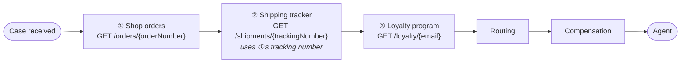
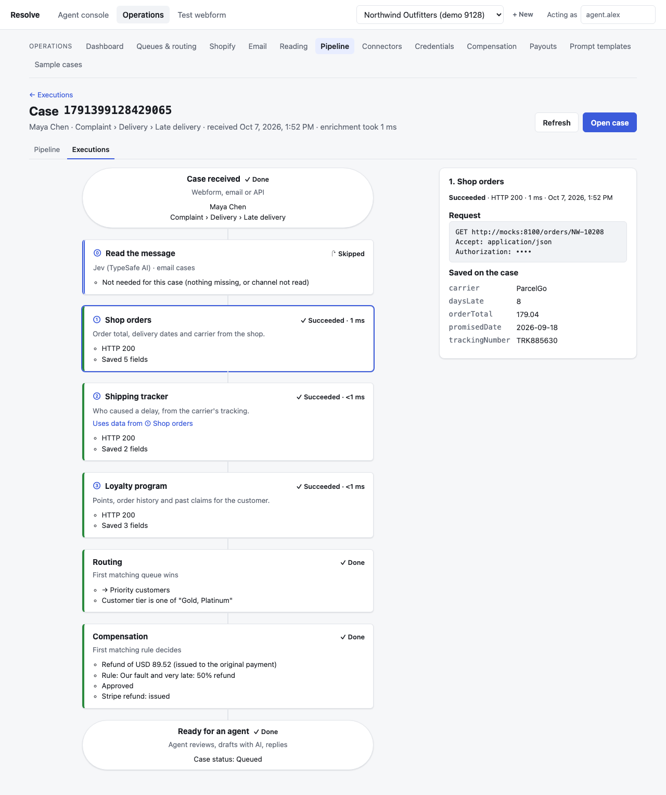

# Integration Guide: Connecting Your APIs

**For:** the engineering team at a business using Local CRM, who want to connect their own systems (orders, shipping, loyalty, billing, CRM…) so every case arrives with the data an agent needs.

**You'll learn how to:**
- add an API as a step in the intake pipeline
- authenticate it
- choose which data to keep
- chain steps together
- test before going live
- see exactly what happened for every case

Everything here can be done in the browser (**Operations** area) or through the REST API ([§10](#10-automating-setup-with-the-api)).

---

## Contents

1. [How enrichment works](#1-how-enrichment-works)
2. [See your pipeline](#2-see-your-pipeline)
3. [Add your first API, step by step](#3-add-your-first-api-step-by-step)
4. [Request templates: putting case data in requests](#4-request-templates-putting-case-data-in-requests)
5. [Authentication](#5-authentication)
6. [Choosing the data to keep](#6-choosing-the-data-to-keep)
7. [Chaining steps](#7-chaining-steps)
8. [Conditions, failures and retries](#8-conditions-failures-and-retries)
9. [Watching executions and troubleshooting](#9-watching-executions-and-troubleshooting)
10. [Automating setup with the API](#10-automating-setup-with-the-api)
11. [Security and limits](#11-security-and-limits)
12. [Designing an endpoint for enrichment](#12-designing-an-endpoint-for-enrichment)
13. [Checklist before going live](#13-checklist-before-going-live)

---

> **On Shopify?** You don't need a connector for orders: connect the store under **Operations → Shopify** and every case gets its order as step ① (`enrichment.shopify.*`, see the [Business handbook B10](business-handbook.md#b10-connecting-your-shopify-store)). Connectors after it can use those fields, e.g. `{{enrichment.shopify.trackingNumber}}` for a carrier's API. The connector key `shopify` is reserved.

## 1. How enrichment works

**What happens to a new case:**
- **Your APIs run first.** The platform calls each of your connected APIs ("connectors") **one after another, in run order**.
- **Only chosen fields are kept.** It saves the fields you picked from each response on the case.
- **Then the case is routed and compensated.** It's routed to a queue and given a compensation decision, both of which can use that data.
- **Then it reaches an agent.**



**Key facts:**
- **Order:** steps run in sequence (lowest **run order** first). A step can use data saved by any step **above** it.
- **What's stored:** only the fields you pick, never the full response.
- **When a step fails, you choose what happens:**
  - by default the pipeline continues without that step's data
  - a **required** step stops the case at *Enrichment failed*, so nobody works it with missing data
- **Credentials** are stored encrypted, shared between connectors, and never shown again after saving.
- **Every run is recorded per case:** request, status, timing and the data saved. You can see it in [Executions](#9-watching-executions-and-troubleshooting).

---

## 2. See your pipeline

**Operations → Pipeline** draws the flow every new case follows, top to bottom. Click any step to see:
- its request and authentication
- when it runs
- what it uses from earlier steps
- what it saves


**How to read the diagram:**
- **Numbers (① ② ③):** the order steps run in.
- **"Uses data from ①…":** this step's request needs a value saved by an earlier step. When you select a step, the steps it depends on are **outlined with a dashed line**.
- **⚠ problems:** setups that can't work. For example:
  - a step uses data from a step that runs **after** it (fix: change the run order)
  - a step uses a field the earlier step doesn't save
  - a step depends on a connector that's inactive
- **Routing, Compensation and Ready for an agent:** what happens after your APIs. Click them for the queue order and rules.

The **Executions** tab shows how each real case went through this flow ([§9](#9-watching-executions-and-troubleshooting)).

---

## 3. Add your first API, step by step

**Operations → Connectors → New connector** (or **Add connector** on the Pipeline page). The editor is laid out in seven steps:


| Step | What to fill in |
|---|---|
| **1. Basics** | **Name** (shown to agents), **Key** (a short ID like `shop_orders`; saved data is reachable as `enrichment.shop_orders.<field>`), **Required** (stop the case if this fails). |
| **2. Request** | Method (GET or POST) and URL. Use **Insert field…** to add case data, e.g. `https://api.yourshop.com/orders/{{case.attributes.orderNumber}}`. Add non-secret headers. For POST, write a JSON body with placeholders. |
| **3. Authentication** | Pick a saved credential, or create one ([§5](#5-authentication)). |
| **4. Test & pick fields** | Choose a real case and **Send test request**. You see the exact request (secrets hidden) and the full response. Click **Keep** on any value. |
| **5. Fields to keep** | What's saved, under which name, with a friendly label. |
| **6. When to run** | Optional conditions, e.g. only for *Category is Delivery*. Empty means every case. |
| **7. Order & reliability** | **Run order** (lower runs first), **timeout**, **retries**. |

**Save**, then check **Operations → Pipeline**: your step appears in its place.

> **Existing cases** aren't re-enriched automatically. Open a case and click **Re-run enrichment**, or call `POST /tenants/{t}/cases/{c}/enrich`.

---

## 4. Request templates: putting case data in requests

Placeholders `{{…}}` work in the URL, headers and body. They're filled in for each case.

| Placeholder | Value |
|---|---|
| `{{case.case_number}}` | The case number, e.g. `1791222405223230` |
| `{{case.channel}}` | `webform`, `email`, `chat` or `api` |
| `{{case.language}}` | The case language |
| `{{case.category.type}}`, `.category`, `.subcategory` | What the customer picked |
| `{{case.customer.email}}`, `.display_name`, `.tier` | The customer |
| `{{case.attributes.<field>}}` | Any field from your webform or intake API, e.g. `orderNumber`, or one **read from the message** (Operations → Reading) for channels like email |
| `{{enrichment.<key>.<field>}}` | A field saved by an **earlier** step ([§7](#7-chaining-steps)) |

**Rules:**
- **Escaping is automatic.** Values are URL-encoded in URLs, escaped for JSON in bodies, and kept on one line in headers. You don't need to escape anything yourself.
- **JSON bodies:** put placeholders **inside quoted strings**, e.g. `{"email": "{{case.customer.email}}"}`. The body must be valid JSON.
- **Missing values:** if a placeholder has no value for a case (e.g. no order number), that step is **skipped** for that case with the reason *"Case has no value for …"*. Nothing is sent with a blank in it.
- **Secrets** never go in placeholders or headers. Use a credential.

---

## 5. Authentication

**Operations → Credentials.** Create a credential once and use it in as many connectors as you like.


| Type | Sends | Use when |
|---|---|---|
| **API key** | Your key in a header you name (default `X-Api-Key`) | Static keys |
| **Bearer token** | `Authorization: Bearer <token>` | Long-lived tokens |
| **Basic auth** | `Authorization: Basic …` | Username/password APIs |
| **OAuth 2.0 client credentials** | Fetches a token from your token URL with client ID/secret (optional scope/audience), then sends `Authorization: Bearer <token>` | Standard machine-to-machine OAuth |
| **Custom token request** | Calls *your* "generate token" endpoint (GET or POST, JSON or form body using `{{secret.<name>}}`), reads the token from `token_path` and the expiry from `expires_in_path`, then sends it in the header and prefix you choose | Non-standard token APIs |

**Generated tokens** (OAuth and custom):
- **Reuse:** a token is cached and reused until shortly before it expires, then refreshed automatically. If your API doesn't say when the token expires, the default lifetime you set is used.
- **401 handling:** if your API rejects a cached token with **401**, the platform gets a fresh token and retries **once**.
- **Busy times:** only one refresh happens at a time, even when many cases are being enriched at once.
- **Testing:** **Generate token now** (in the credential editor) tests the login and shows when the token expires.

**Secrets are write-only.** After saving, they can be replaced but never read back, in the UI or the API. Request previews show `••••` in their place.

---

## 6. Choosing the data to keep

Each kept field is a **response path → saved name** pair:

| Response path | Means | Example response | Saved value |
|---|---|---|---|
| `daysLate` | Top-level field | `{"daysLate": 8}` | `8` |
| `total.amount` | Nested field | `{"total": {"amount": 179.04}}` | `179.04` |
| `items.0.sku` | First item of a list | `{"items": [{"sku": "A1"}]}` | `"A1"` |

**How saved fields behave:**
- **Names:** saved names start with a letter and use letters, digits and `_`, e.g. `orderTotal`. They become `enrichment.<connector key>.<name>`.
- **Labels** (optional) are what agents and managers see, e.g. *Order total*.
- **Types are kept.** Numbers stay numbers, so rules like *order total greater than 100* or *15% of order total* work.
- **Missing paths:** if a path is missing from a response, that field is listed as missing for the case. The rest are still saved.

**Where saved fields can be used:**
- queue routing conditions
- compensation rules (conditions and percentage amounts)
- later steps' requests
- AI reply templates
- the agent's case page

---

## 7. Chaining steps

A step can use a field saved by an earlier step. For example, the shipping tracker needs the tracking number that the shop API returned:

```
① Shop orders      GET https://api.yourshop.com/orders/{{case.attributes.orderNumber}}
                   keeps trackingNumber  →  enrichment.shop_orders.trackingNumber
② Shipping tracker GET https://api.carrier.com/shipments/{{enrichment.shop_orders.trackingNumber}}
```

**Rules:**
- **Order:** the step providing the data must have a **lower run order**. The Pipeline page warns you otherwise.
- **The field must be kept** by the earlier step (§6).
- **If the earlier step fails or is skipped**, the later step is **skipped** with "Case has no value for enrichment.shop_orders.trackingNumber". The rest of the pipeline continues.

---

## 8. Conditions, failures and retries

**When to run.** Conditions decide whether a step runs for a case, e.g. *Category is Delivery* or *Customer tier is one of Gold, Platinum*.
- They can also test data saved by earlier steps.
- A case that doesn't match is **skipped** for that step: "Case doesn't match 'run when'".
- Use conditions to avoid calling APIs that can't help, e.g. don't call the shipping API for billing questions.

**Retries.** Up to 3 retries, with a short wait between them, for:
- network errors and timeouts
- `429 Too Many Requests`
- `500`, `502`, `503`, `504`

Other `4xx` responses aren't retried, because retrying a 404 won't help.

**Timeouts:** 1–30 seconds per attempt (default 5).

**Redirects aren't followed.** A `3xx` response counts as a failure. Point the connector at the final URL.

**Required vs optional:**

| Setting | If the step fails | Use for |
|---|---|---|
| Optional (default) | The pipeline continues; later steps that need its data are skipped; the case is routed normally | Nice-to-have data |
| **Required** | The case stops at **Enrichment failed** and isn't routed until enrichment is retried | Data agents or rules can't work without (e.g. the order itself) |

---

## 9. Watching executions and troubleshooting

**Operations → Pipeline → Executions** lists every recent case's run. Each row shows:
- case number and when it was received
- customer and category
- each step's result: ✓ succeeded, ✗ failed, ↷ skipped, – didn't run
- the total time
- the queue the case landed in and its compensation

Filter by result (e.g. **Failed** or **Partly failed**) to find problems quickly.


**Click a case** to see its run on the pipeline diagram. Each step shows what happened, and clicking a step shows:
- the exact request sent, with secrets hidden
- the HTTP status and timing
- the error, if any
- the data saved on the case

| A successful run | A run where the shop API failed |
|---|---|
|  |  |

In the failed run:
- **① Shop orders** returned HTTP 500.
- **② Shipping tracker** was skipped, because it needs ①'s tracking number.
- **③ Loyalty program** still ran.
- The case was still routed, because ① isn't required.

Agents can open the same view from a case (**Enrichment → View the pipeline run**).

| Symptom in Executions | Likely cause | Fix |
|---|---|---|
| ✗ HTTP 401 / 403 | Wrong or expired credential | Credential editor → **Generate token now** / replace the secret |
| ✗ HTTP 404 | Wrong URL, or the record doesn't exist | Check the URL template; test with that case |
| ✗ "redirects aren't followed" | URL changed or needs `https` | Use the final URL |
| ✗ timeout | Slow API | Raise the timeout (max 30s) or speed up the endpoint |
| ↷ "Case has no value for …" | The case (or an earlier step) lacks that data | Make the field required on the form, or fix the earlier step |
| ↷ "doesn't match 'run when'" | The condition excluded this case | Expected; adjust conditions if not |
| Fields listed as missing | The response didn't contain those paths | Check paths against a real response (step 4 in the editor) |
| – didn't run | The connector was added after this case arrived | **Re-run enrichment** on the case |

---

## 10. Automating setup with the API

Everything in the UI is available over HTTP. The interactive reference is at `/docs` on your API host (e.g. `http://localhost:8000/docs`).

| Do | Call |
|---|---|
| Create a credential | `POST /tenants/{t}/credentials` |
| Test a credential (generate a token) | `POST /tenants/{t}/credentials/{id}/test` |
| Create / replace a connector | `POST /tenants/{t}/connectors`, `PUT /tenants/{t}/connectors/{id}` |
| Test an unsaved connector on a real case | `POST /tenants/{t}/connectors/test` with `{"case_number": …, "draft": {…}}` |
| See the pipeline (with dependencies and problems) | `GET /tenants/{t}/pipeline` |
| See runs | `GET /tenants/{t}/pipeline/executions?outcome=failed`, `GET …/executions/{case_number}` |
| Re-run enrichment for a case | `POST /tenants/{t}/cases/{c}/enrich` |
| Create cases from your systems | `POST /tenants/{t}/cases` (put your IDs in `attributes`, e.g. `orderNumber`) |

**Example: a chained pair of connectors**

```bash
API=http://localhost:8000/tenants/$TENANT

# 1. Credential (secrets are write-only)
CRED=$(curl -s -X POST $API/credentials -H 'content-type: application/json' -d '{
  "name": "Shop API (OAuth)", "kind": "oauth2_client_credentials",
  "config": {"token_url": "https://auth.yourshop.com/oauth/token", "scope": "orders.read"},
  "secrets": {"client_id": "…", "client_secret": "…"}}' | jq -r .id)

# 2. Step ①: the order
curl -s -X POST $API/connectors -H 'content-type: application/json' -d '{
  "key": "shop_orders", "name": "Shop orders", "run_order": 10,
  "url_template": "https://api.yourshop.com/orders/{{case.attributes.orderNumber}}",
  "credential_id": "'$CRED'", "timeout_seconds": 5, "max_retries": 1,
  "field_mappings": [
    {"path": "total.amount", "target": "orderTotal", "label": "Order total"},
    {"path": "trackingNumber", "target": "trackingNumber"}]}'

# 3. Step ②: uses step ①'s tracking number
curl -s -X POST $API/connectors -H 'content-type: application/json' -d '{
  "key": "shipping", "name": "Shipping tracker", "run_order": 20,
  "url_template": "https://api.carrier.com/v2/shipments/{{enrichment.shop_orders.trackingNumber}}",
  "field_mappings": [{"path": "delay.reason", "target": "delayReason"}]}'

# 4. Check the result: no problems listed means the chain is valid
curl -s $API/pipeline | jq '.connectors[] | {position, name, uses: [.uses[].path], problems}'
```

Keep these scripts in your own version control, so you can rebuild a business's setup or copy it between environments.

---

## 11. Security and limits

| Rule | Detail |
|---|---|
| **HTTPS only** | Plain `http://` is allowed only in local development. |
| **No internal addresses** | Requests to private, loopback and link-local networks (e.g. `10.x`, `192.168.x`, `127.0.0.1`, cloud metadata) are blocked, for connectors and token URLs alike. Your APIs must be reachable on the public internet. |
| **Secrets** | Encrypted at rest; write-only; masked in request previews and logs. |
| **Response size** | Up to 1 MB per response. Larger responses fail, so return only what's needed. |
| **Timeout** | 1–30 s per attempt; up to 3 retries. |
| **Stored data** | Only the fields you keep; the full response isn't stored. |
| **Personal data and AI** | Data sent to the AI for drafting is masked (names, emails, phone numbers, card numbers) and restored afterwards. |

---

## 12. Designing an endpoint for enrichment

If you're building or adapting an API for this, these choices make it fast and reliable:

- **Look up by an ID the case has.** Order number, email or customer ID, passed in the URL (`/orders/{id}`) or a small JSON body.
- **Return small, flat JSON with stable field names**, e.g. `{"orderTotal": 179.04, "daysLate": 8, "carrier": "ParcelGo"}`. Return numbers as numbers and dates as ISO 8601.
- **Answer in under a second.** Steps run one after another, so slow APIs delay every case.
- **Use clear status codes:**
  - `404` when the record doesn't exist (not `200` with an error body)
  - `429` with sensible limits
  - `5xx` only for real server errors (these are retried)
- **Make it read-only.** Enrichment only reads. Don't change state on a GET.
- **Use machine credentials** (an API key or OAuth client credentials) scoped to read-only access for this purpose.
- **Expect repeat calls.** Re-running enrichment calls your API again for the same case, so the same request should give the same answer.

---

## 13. Checklist before going live

- [ ] Each connector **tested on a real case** in the editor (step 4), and the kept fields look right.
- [ ] **Pipeline** page shows the steps in the right order with **no ⚠ problems**.
- [ ] **Required** set only on steps the business can't work without.
- [ ] **Conditions** stop calls that can't help (e.g. shipping lookups for non-delivery cases).
- [ ] Credentials use **read-only** accounts. **Generate token now** works for token types.
- [ ] Queues and compensation rules that use your fields tested with **Test with a real case** (see the [Business handbook](business-handbook.md), B2 and B4).
- [ ] Paying through Stripe? Your checkout puts the order number in the Stripe payment's metadata (e.g. `metadata[order_id]`), or a connector returns the PaymentIntent id (`pi_…`) so refunds find the payment ([Business handbook B9](business-handbook.md#b9-payouts-issuing-compensation-through-shopify-or-stripe)).
- [ ] A few test cases submitted, and **Executions** shows ✓ for every step.
- [ ] Someone knows to check **Executions → Failed** regularly.
